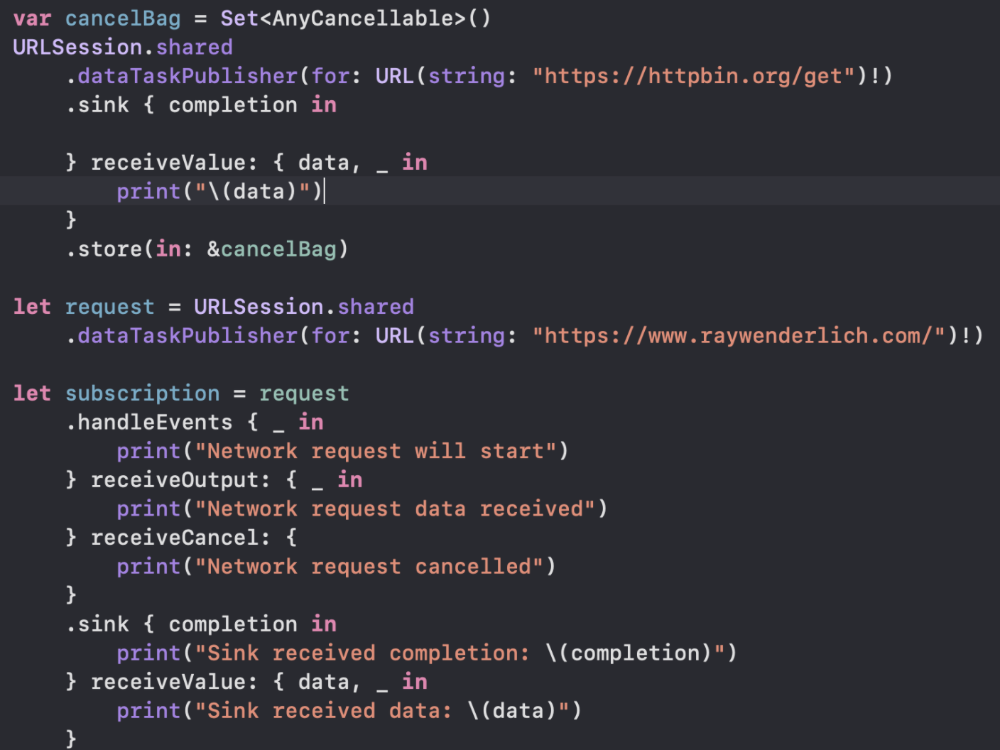

# 10. Debugging

> 참고 문헌/웹
>
> * https://www.raywenderlich.com/books/combine-asynchronous-programming-with-swift
> * https://cozzin.tistory.com/35?category=830801

Combine에는 print를 이용해서 이벤트를 출력할 수 있음.

```swift
let subscription = (1...3).publisher
    .print("publisher")
    .sink { _ in }
```

결과

```swift
publisher: receive subscription: (1...3)
publisher: request unlimited
publisher: receive value: (1)
publisher: receive value: (2)
publisher: receive value: (3)
publisher: receive finished
```

- 구독을 수신할 때 인쇄하고 업스트림 게시자에 대한 설명을 표시합니다.
- 얼마나 많은 항목이 요청되고 있는지 볼 수 있도록 가입자의 수요 요청을 인쇄합니다.
- 업스트림 게시자가 내보내는 모든 값을 인쇄합니다.
- 마지막으로 완료 이벤트를 인쇄합니다.

Combine과는 별개로 print 메서드에는 to 파라미터에 `TextOutputStream` 타입을 전달할 수 있음.

이를 활용해 반복적인 출력을 만들어 놓을 수 있음.

```swift
class TimeLogger: TextOutputStream{
    private var previous = Date()
    private let formatter = NumberFormatter()
    
    init(){
        formatter.maximumFractionDigits = 5
        formatter.minimumFractionDigits = 5
    }
    
    func write(_ string: String) {
        let trimmed = string.trimmingCharacters(in: .whitespacesAndNewlines)
        guard !trimmed.isEmpty else {return}
        let now = Date()
        print("+\\(formatter.string(for: now.timeIntervalSince(previous))!)s: \\(string)")
        previous = now
    }
}

let subscription = (1...3).publisher
    .print("publisher", to: TimeLogger())
    .sink { _ in }
```

출력 결과

```swift
+0.00022s: publisher: receive subscription: (1...3)
+0.01023s: publisher: request unlimited
+0.00036s: publisher: receive value: (1)
+0.00017s: publisher: receive value: (2)
+0.00016s: publisher: receive value: (3)
+0.00015s: publisher: receive finished
```

## handleEvents

publisher의 라이프 사이클에 있는 모든 이벤트를 받을 수 있다.

publisher가 네트워크 요청을 수행한 다음 일부 데이터를 내보내야 하는 문제를 추적하고 있다고 상상해보자. 실행하면 데이터가 수신되지 않는다. what happen?

다음과 같은 코드를 생각해보자

```swift
let request = URLSession.shared
    .dataTaskPublisher(for: URL(string: "<https://www.raywenderlich.com/>")!)

request
    .sink { completion in
        print("Sink received completion: \\(completion)")
    } receiveValue: { data, _ in
        print("Sink received data: \\(data)")
    }
```

어떠한 이벤트도 수신이 안된다. 무슨일인지 알 수 있는 방법이 없다.

request와 sink 사이에 `handleEvent` 를 넣어보자

```swift
let subscription = request
    .handleEvents { _ in
        print("Network request will start")
    } receiveOutput: { _ in
        print("Network request data received")
    } receiveCancel: {
        print("Network request cancelled")
    }
    .sink { completion in
        print("Sink received completion: \\(completion)")
    } receiveValue: { data, _ in
        print("Sink received data: \\(data)")
    }
```

출력 결과

```swift
Network request will start
Network request cancelled
```

구독이 시작되지만 즉시 취소되는 중이다.

Q)`Cancellable` around를 유지시키지 못해서라는데 무슨말인지..?

A) 알아냈다.

> 참고: 모든 Cancelable은 저장해야한다. 그렇지 않으면 현재 코드 범위를 벗어날 때 deallocated  및 취소된다.

뭔 말이냐면 지금 Playground는 해당 코드를 함수에 넣어서 호출하고 있다. 함수가 종료되면서 모두 deallocated및 취소되고 있는 거임.

```swift
example("handleEvent") {
    var cancelBag = Set<AnyCancellable>()
    URLSession.shared
        .dataTaskPublisher(for: URL(string: "<https://httpbin.org/get>")!)
        .sink { completion in
            
        } receiveValue: { data, _ in
            print("\\(data)")
        }
        .store(in: &cancelBag)

    let request = URLSession.shared
        .dataTaskPublisher(for: URL(string: "<https://www.raywenderlich.com/>")!)
    
    let subscription = request
        .handleEvents { _ in
            print("Network request will start")
        } receiveOutput: { _ in
            print("Network request data received")
        } receiveCancel: {
            print("Network request cancelled")
        }
        .sink { completion in
            print("Sink received completion: \\(completion)")
        } receiveValue: { data, _ in
            print("Sink received data: \\(data)")
        }
}
```

이런식으로 example 함수 호출하면서 수행되고 있는 거였음.

example 함수 원문이 아래 처럼 되어 있는데 escaping은 클로저를 함수가 끝나도 잡아주는 역할을 하는데 cancel되는 거 까지는 못잡아주나봄

```swift
func example(_ title: String, completion: @escaping () -> ()){
    print("============== "+title+" ==============")
    completion()
}
```



이런식으로 함수밖에다 선언하니 제대로 동작한다.

출력 결과

```swift
Network request will start
378 bytes
Network request data received
Sink received data: 307902 bytes
Sink received completion: finished
```