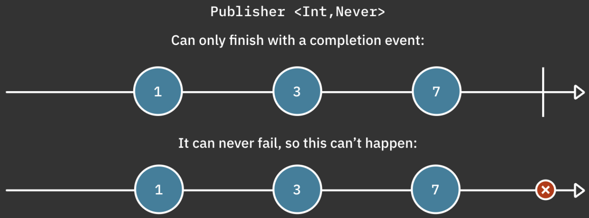
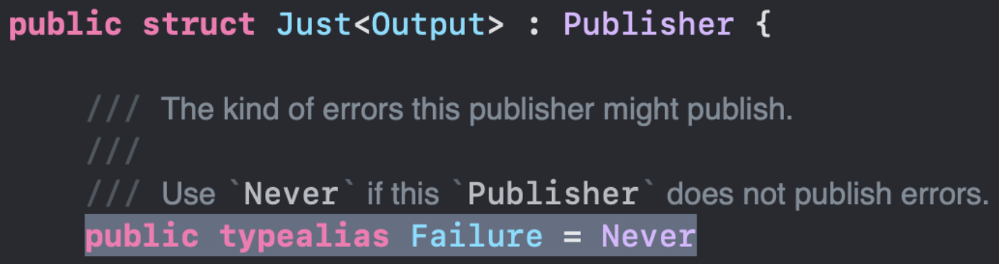
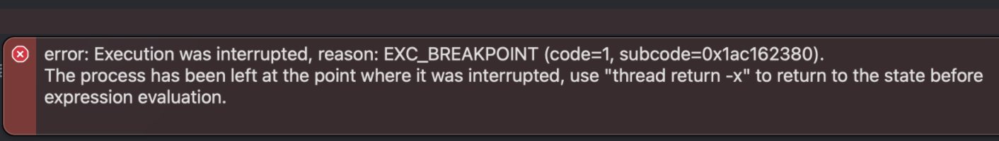

# 16.Error Handling

Combine을 살펴보면 내보내는 값 중 성공시에는 `Output` , 실패시에는 `Failure` 를 내보낸다.

이번장에서는 `Failure` 에 대해 공부할 것이고, 이 `Failure` 를 어떻게 처리를 하는지 보도록 한다.

## Never

`Never` 는 절대 실패할 수 없음을 나타낸다.

`Failure` 부분에 `Never` 를 선언하면 해당 publisher는 Error를 발생시키지 않는다.



```swift
Just("hello")
    .sink(receiveValue: {print($0)})
    .store(in: &subscriptions)
```

위 예제에서 Just를 `Command-클릭` 하고 `Jump to Definition` 를 선택해서 보면 `Just` 의 `Failure` 는 `Never` 로 되어 있다.



### setFailureType

오류가 없는 publisher를 오류가 있는 publisher로 만들어 준다.

`setFailureType` 은 `Failure` 가 `Never` 인 publisher에서만 사용할 수 있다.

아래 예제에서는 더이상 `sink(receiveValue:)` 를 사용할 수 없다. 오류를 처리해야 하기 때문에 `sink(receiveCompletion:receiveValue:)` 를 사용해야만 한다.

Failure는 `MyError` 타입이기 때문에 sink내부에서 별도의 캐스팅없이 바로 `.ohNo` 로 지정할 수 있다.

```swift
enum MyError: Error{
    case ohNo
}

Just("Hello")
    .setFailureType(to: MyError.self)
    .eraseToAnyPublisher()
    .sink { completion in
        switch completion{
        case .failure(.ohNo):
            print("Finished with Oh No!")
        case .finished:
            print("Finished successfully!")
        }
    } receiveValue: { value in
        print("Got value: \\(value)")
    }
    .store(in: &subscriptions)
```

물론 원래 publisher가 `Just` 이기 때문에 위 코드는 Error가 발생하지는 않는다.

### assign(to:on:)

이전에 배운 `assign` 은 `setFailureType` 처럼 실패할 수없는 publisher에서만 작동한다.

제공된 key path 에 오류를 보내면 system exceptio이 발생하기 때문

아래 예제를 통해 확인해볼 수 있다.

`Just` 밑에 `setFailureType` 주석을 풀면 컴파일 에러가 난다.

```swift
class Person{
        let id = UUID()
        var name = "Unknown"
    }
    
    let person = Person()
    print("1", person.name)
    
    Just("Shai")
//        .setFailureType(to: Error.self)
        .handleEvents (receiveCompletion: {_ in
            print("2", person.name)
        })
        .assign(to: \\.name, on: person)
        .store(in: &subscriptions)
```

`assign(on :)`에 대한 까다로운 부분이 있다. on: 파라미터에 제공된 객체를 강력한 캡처가 일어난다는 것.

이게 왜 문제가 되는지 예제를 통해 알아보도록 한다.

```swift
class MyViewModel: ObservableObject{
        @Published
        var currentDate = Date()
        
        init(){
						// 매초 현재 날짜를 내보내는 publisher를 생성
            Timer.publish(every: 1, on: .main, in: .common)
                .autoconnect()
						// 방출값 3개만 받겠다.
                .prefix(3)
						// @Published로 선언된 프로퍼티에 할당한다.
                .assign(to: \\.currentDate, on: self)
                .store(in: &subscriptions)
        }
    }
    
    let vm = MyViewModel()
    vm.$currentDate
        .sink(receiveValue: {print($0)})
        .store(in: &subscriptions)
```

**결과**

```swift
2022-01-21 13:50:10 +0000
2022-01-21 13:50:11 +0000
2022-01-21 13:50:12 +0000
2022-01-21 13:50:13 +0000
```

겉보기에는 잘 작동하는거 같은데? 뭐가 문제?

`assign(to:on:)` 에 대한 호출은 `self`를 강하게 참조하는 구독을 생성한다.

구독은 `self` 를 참조하고 있고(assign on 파라미터에서 self를 넘기고 있다.), `self` 는 구독(self에 있는 구독을 수행하고 있음.)을 참조하고 있다. 즉, retain cycle이 일어난다.


위와 같은 문제는 `assign(to:)` 연산자를 이용해 간단하게 해결할 수 있다.

이 연산자는 현재 publisher와의 Inout 참조를 제공하여 published 값을 @publishished 속성에 재 할당한다.

```swift
.assign(to: \\.currentDate, on: self) // 3
.store(in: &subscriptions)
```

를

```swift
.assign(to: &$currentDate)
```

으로 바꿔준다.

내부적으로 구독에 대한 메모리 관리를 자동으로 처리하므로 `store(in: ...)` 을 생략할 수 있다.

### assertNoFailure

`assertNoFailure` 는 publisher가 Failure로 안전하게 이벤트를 완료하는지 확인할 경우에 유용하다.

stream에서 혹시나 있을 런타임 에러를 발생시켜서 개발자가 이를 인지하게 한다. (업스트림에서는 발생안함)

아래는 `tryMap`  연산자로 error를 throw 했다. sink에서 completion을 출력한다.

```swift
Just("Hello")
    // setFailureType을 이용해 Never 에서 MyError로 Failure를 변경
        .setFailureType(to: MyError.self)
    // tryMap으로 error 발생
        .tryMap{ _ in throw MyError.ohNo }
        .sink(receiveCompletion: { completion in
            print(completion)
        }, receiveValue: {
            print("Got vluae: \\($0)")
        })
        .store(in: &subscriptions)
```

**결과**

```swift
——— Example of: assertNoFailure ———
failure(__lldb_expr_37.MyError.ohNo)
```

결과는 당연히 completion failure에서 MyError를 출력한다.

`tryMap` 과 `sink` 사이에 `assertNoFailure()` 를 추가해보자



`fatalError` 가 발생된다. 지금은 `sink(receiveCompletion: ..)` 으로 error를 처리하고 있지만, `Failure` 가 `Never` 인 stream에서는 `receiveCompletion` 을 받을 수 없다. 개발단계에서 혹시나 있을 에러를 체크하는데 유용하다.


## 실패에 대처하기

### try 연산자

아래 코드는 names 문자열의 길이가 5보다 작으면 error를 발생시키는 예제이다.

발생된 에러는 `sink(receiveCompletion:, ...)` 에서 핸들링한다.

```swift
enum NameError: Error{
        case tooShort(String)
        case unknown
    }
    
let names = ["Marin", "Shai", "florent"].publisher

names
	.map{ value -> Int in
       let length = value.count
       guard let length >= else{ throw NameError.tooShort(value) }
       return value.count
	}
	.sink(
    	receiveCompletion: {print("Completed with \($0)")},
      receiveValue: {print("Got value: \($0)")}
   )
```

그러나 위 코드는 컴파일되지 않는다.  map은 throw를 하지 않는 연산자이므로 에러를 던질 수 없다.

error를 던질 수 있는 연산자가 `tryMap` 이다.

`map` 을 `tryMap`으로 변경하자

**결과**

```
Got value: 5
Completed with failure(__lldb_expr_16.(unknown context at $100d242f4).(unknown context at $100d24424).(unknown context at $100d2442c).NameError.tooShort("Shai"))
```


### Mapping errors

`map`과 `tryMap` 의 차이점은 단순히 `tryMap`이 오류를 허용한다는 것 말고도 있다.
`map`  은 기존 Error type을 무시하며 publisher의 Output만 핸들링한다.
`tryMap 은 실제로 Error type을 Swift Error로 erase한다.


