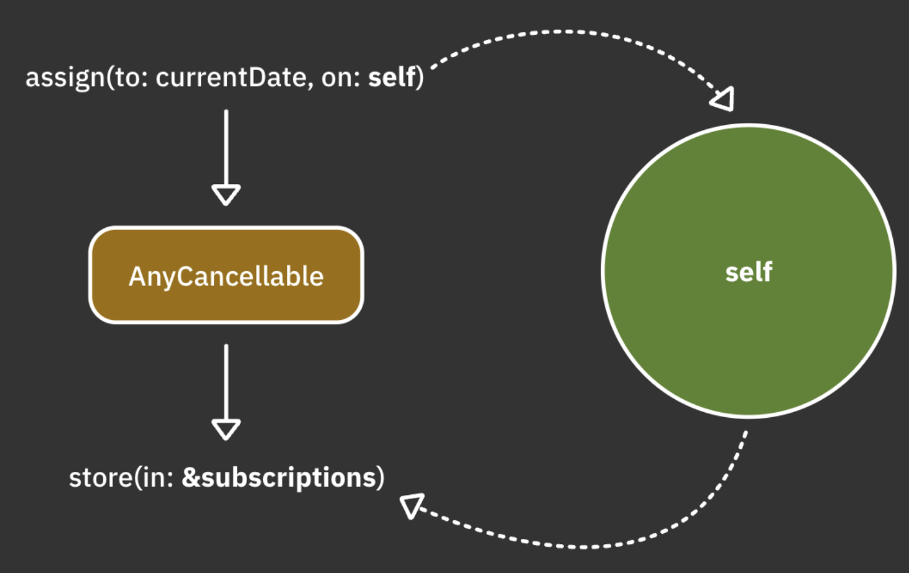

# 16.Error Handling

> **Reference**
>
> https://www.raywenderlich.com/books/combine-asynchronous-programming-with-swift/v3.0/chapters/16-error-handling

Combine을 살펴보면 내보내는 값 중 성공시에는 `Output` , 실패시에는 `Failure` 를 내보낸다.

이번장에서는 `Failure` 에 대해 공부할 것이고, 이 `Failure` 를 어떻게 처리를 하는지 보도록 한다.

## Never

`Never` 는 절대 실패할 수 없음을 나타낸다.

`Failure` 부분에 `Never` 를 선언하면 해당 publisher는 Error를 발생시키지 않는다.


```swift
Just("hello")
    .sink(receiveValue: {print($0)})
    .store(in: &subscriptions)
```

위 예제에서 Just를 `Command-클릭` 하고 `Jump to Definition` 를 선택해서 보면 `Just` 의 `Failure` 는 `Never` 로 되어 있다.


### setFailureType

오류가 없는 publisher를 오류가 있는 publisher로 만들어 준다.

`setFailureType` 은 `Failure` 가 `Never` 인 publisher에서만 사용할 수 있다.

아래 예제에서는 더이상 `sink(receiveValue:)` 를 사용할 수 없다. 오류를 처리해야 하기 때문에 `sink(receiveCompletion:receiveValue:)` 를 사용해야만 한다.

Failure는 `MyError` 타입이기 때문에 sink내부에서 별도의 캐스팅없이 바로 `.ohNo` 로 지정할 수 있다.

```swift
enum MyError: Error{
    case ohNo
}

Just("Hello")
    .setFailureType(to: MyError.self)
    .eraseToAnyPublisher()
    .sink { completion in
        switch completion{
        case .failure(.ohNo):
            print("Finished with Oh No!")
        case .finished:
            print("Finished successfully!")
        }
    } receiveValue: { value in
        print("Got value: \\(value)")
    }
    .store(in: &subscriptions)
```

물론 원래 publisher가 `Just` 이기 때문에 위 코드는 Error가 발생하지는 않는다.

### assign(to:on:)

이전에 배운 `assign` 은 `setFailureType` 처럼 실패할 수없는 publisher에서만 작동한다.

제공된 key path 에 오류를 보내면 system exceptio이 발생하기 때문

아래 예제를 통해 확인해볼 수 있다.

`Just` 밑에 `setFailureType` 주석을 풀면 컴파일 에러가 난다.

```swift
class Person{
        let id = UUID()
        var name = "Unknown"
    }
    
    let person = Person()
    print("1", person.name)
    
    Just("Shai")
//        .setFailureType(to: Error.self)
        .handleEvents (receiveCompletion: {_ in
            print("2", person.name)
        })
        .assign(to: \\.name, on: person)
        .store(in: &subscriptions)
```

`assign(on :)`에 대한 까다로운 부분이 있다. on: 파라미터에 제공된 객체를 강력한 캡처가 일어난다는 것.

이게 왜 문제가 되는지 예제를 통해 알아보도록 한다.

```swift
class MyViewModel: ObservableObject{
        @Published
        var currentDate = Date()
        
        init(){
						// 매초 현재 날짜를 내보내는 publisher를 생성
            Timer.publish(every: 1, on: .main, in: .common)
                .autoconnect()
						// 방출값 3개만 받겠다.
                .prefix(3)
						// @Published로 선언된 프로퍼티에 할당한다.
                .assign(to: \\.currentDate, on: self)
                .store(in: &subscriptions)
        }
    }
    
    let vm = MyViewModel()
    vm.$currentDate
        .sink(receiveValue: {print($0)})
        .store(in: &subscriptions)
```

**결과**

```swift
2022-01-21 13:50:10 +0000
2022-01-21 13:50:11 +0000
2022-01-21 13:50:12 +0000
2022-01-21 13:50:13 +0000
```

겉보기에는 잘 작동하는거 같은데? 뭐가 문제?

`assign(to:on:)` 에 대한 호출은 `self`를 강하게 참조하는 구독을 생성한다.

구독은 `self` 를 참조하고 있고(assign on 파라미터에서 self를 넘기고 있다.), `self` 는 구독(self에 있는 구독을 수행하고 있음.)을 참조하고 있다. 즉, retain cycle이 일어난다.



위와 같은 문제는 `assign(to:)` 연산자를 이용해 간단하게 해결할 수 있다.

이 연산자는 현재 publisher와의 Inout 참조를 제공하여 published 값을 @publishished 속성에 재 할당한다.

```swift
.assign(to: \\.currentDate, on: self) // 3
.store(in: &subscriptions)
```

를

```swift
.assign(to: &$currentDate)
```

으로 바꿔준다.

내부적으로 구독에 대한 메모리 관리를 자동으로 처리하므로 `store(in: ...)` 을 생략할 수 있다.

### assertNoFailure

`assertNoFailure` 는 publisher가 Failure로 안전하게 이벤트를 완료하는지 확인할 경우에 유용하다.

stream에서 혹시나 있을 런타임 에러를 발생시켜서 개발자가 이를 인지하게 한다. (업스트림에서는 발생안함)

아래는 `tryMap`  연산자로 error를 throw 했다. sink에서 completion을 출력한다.

```swift
Just("Hello")
    // setFailureType을 이용해 Never 에서 MyError로 Failure를 변경
        .setFailureType(to: MyError.self)
    // tryMap으로 error 발생
        .tryMap{ _ in throw MyError.ohNo }
        .sink(receiveCompletion: { completion in
            print(completion)
        }, receiveValue: {
            print("Got vluae: \\($0)")
        })
        .store(in: &subscriptions)
```

**결과**

```swift
——— Example of: assertNoFailure ———
failure(__lldb_expr_37.MyError.ohNo)
```

결과는 당연히 completion failure에서 MyError를 출력한다.

`tryMap` 과 `sink` 사이에 `assertNoFailure()` 를 추가해보자


`fatalError` 가 발생된다. 지금은 `sink(receiveCompletion: ..)` 으로 error를 처리하고 있지만, `Failure` 가 `Never` 인 stream에서는 `receiveCompletion` 을 받을 수 없다. 개발단계에서 혹시나 있을 에러를 체크하는데 유용하다.


## 실패에 대처하기

### try 연산자

아래 코드는 names 문자열의 길이가 5보다 작으면 error를 발생시키는 예제이다.

발생된 에러는 `sink(receiveCompletion:, ...)` 에서 핸들링한다.

```swift
enum NameError: Error{
        case tooShort(String)
        case unknown
    }
    
let names = ["Marin", "Shai", "florent"].publisher

names
	.map{ value -> Int in
       let length = value.count
       guard let length >= else{ throw NameError.tooShort(value) }
       return value.count
	}
	.sink(
    	receiveCompletion: {print("Completed with \($0)")},
      receiveValue: {print("Got value: \($0)")}
   )
```

그러나 위 코드는 컴파일되지 않는다.  map은 throw를 하지 않는 연산자이므로 에러를 던질 수 없다.

error를 던질 수 있는 연산자가 `tryMap` 이다.

`map` 을 `tryMap`으로 변경하자

**결과**

```
Got value: 5
Completed with failure(__lldb_expr_16.(unknown context at $100d242f4).(unknown context at $100d24424).(unknown context at $100d2442c).NameError.tooShort("Shai"))
```


### Mapping errors

`map`과 `tryMap` 의 차이점은 단순히 `tryMap`이 오류를 허용한다는 것 말고도 있다.
`map`  은 기존 Error type을 무시하며 publisher의 Output만 핸들링한다.
`tryMap 은 실제로 Error type을 Swift Error로 erase한다.

아래 코드를 작성해서 몇가지 실험을 해보도록 한다.

평범하게 Hello World string 값을 보내고 받는 코드이다.

```swift
enum NameError: Error{
  case tooShort(String)
  case unknown
}
    
Just("Hello")
.setFailureType(to: NameError.self)
.map{$0 + " World!"}
.sink { completion in
       switch completion{
         case .finished:
         print("Done!")
         case .failure(.tooShort(let name)):
         print("\(name) is too short!")
         case .failure(.unknown):
         print("An unknown name error occurred")
       }
      } receiveValue: {
  print("Got value \($0)")
}
.store(in: &subscriptions)
```

**결과**

```
Got value Hello World!
Done!
```

`sink`내부에 있는 `completion`을 option 키를 눌러 살펴보면 `completion`의 실패타입은 `NameError`이다. 


다음으로 `map` 을 `tryMap`으로 변경하면 compile error가 발생한다.
이때 `sink` 내부에 있는 `completion`을 option 키를 눌러 살펴보면 다음과 같다.


`tryMap`  은 input에서 받은 Error(NameError)를 일반 Swift.Error 타입으로 대체했다. `tryMap`에서는 Error를 throw하지 않았지만 completion의 실패타입은 `Error`이다. 왜그런걸까?

Swift는 아직 `try` 접두사가 붙은 연산자를 사용할 때 typed throws를 지원하지 않는다. 즉, `try`를 이용하면 Swift.Error 로 erase된다.

그렇다면 어떻게 해야할까? 단순하게 접근하면 `Error`를 강제로 `NameError`로 바꿔주면 된다. 그러나 이는 좋은 방법이 아니다.
Combine의 `mapError` 를 사용하도록 한다.

`tryMap`아래에 코드를 추가해준다.

```swift
.mapError{$0 as? NameError ?? .unknown}
```

completion의 타입이 `NameError`로 변경된 것을 볼 수 있다.


실행하면 당연하게도 성공된 값만 나올 것이다.
실패를 발생시켜보자
`tryMap` 부분을 아래 코드로 변경해준다.

```swift
.tryMap { throw NameError.tooShort($0) }
```

**결과**

```
Hello is too short!
```


### 오류가 발생하는 API 설계

당연하게도 API요청을 설계할 때는 항상 실패를 염두해두고 설계해야한다. 이번에는 실제 API통신에서 에러를 핸들링하는 방법에 대해 보도록한다.

https://icanhazdadjoke.com/ api를 이용한다.

아래는 API 통신을 할 수 있는 코드이다.

```swift
class DadJokes {
  	// api에서 받은 값을 디코딩할 구조체
    struct Joke: Codable {
      let id: String
      let joke: String
    }
		
  	// 실제 API요청, 성공시 Joke를 받고 실패 시 Error를 받는다.
    func getJoke(id: String) -> AnyPublisher<Joke, Error> {
      let url = URL(string: "https://icanhazdadjoke.com/j/\(id)")!
      var request = URLRequest(url: url)
      request.allHTTPHeaderFields = ["Accept": "application/json"]
      
      return URLSession.shared
        .dataTaskPublisher(for: request)
        .map(\.data)
        .decode(type: Joke.self, decoder: JSONDecoder())
        .eraseToAnyPublisher()
    }
}
```

위 API를 사용하는 코드이다.

```swift
let api = DadJokes()
// api pathValue 설정, jokeID는 성공을 위한 ID, badJokeID는 실패 용 ID
let jokeID = "9prWnjyImyd"
let badJokeID = "123456"

// api요청
api
  .getJoke(id: jokeID)
  .sink(receiveCompletion: { print($0) },
        receiveValue: { print("Got joke: \($0)") })
  .store(in: &subscriptions)
```

**결과**

```
Got joke: Joke(id: "9prWnjyImyd", joke: "Why do bears have hairy coats? Fur protection.")
finished
```

위 코드는 다행히도 api요청의 성공의 사례만을 처리하고 있다.
그러나 우리 개발자들은 어떤 오류가 발생할지 미리 예측하고 설계를 해야만 한다.

어떤 종류의 오류가 발생할 수 있을까?

* 잘못된 연결이나 잘못된 요청과 같은 이유로 `dataTaskPublisher` 가 실패할 수 있다.
* 제공된 jokeID가 없을 수 있다.
* API response가 변경되거나 struct가 잘못된 경우 JSON decoding에 실패할 수 있다.
* unknown

위 상황을 염두해두고 Error를 설계해보자

`DadJokes` class에 아래 코드를 추가한다.

[`CustomStringConvertible`](https://jiyeonlab.tistory.com/24)에 대한 정보

```swift
enum Error: Swift.Error, CustomStringConvertible {
  case network
  case jokeDoesntExist(id: String)
  case parsing
  case unknown
  
  var description: String {
    switch self {
    case .network:
      return "Request to API Server failed"
    case .parsing:
      return "Failed parsing response from server"
    case .jokeDoesntExist(let id):
      return "Joke with ID \(id) doesn't exist"
    case .unknown:
      return "An unknown error occurred"
    }
  }
}
```

그리고 `getJoke(id:)` 에서 `decode` 와 `eraseToAnyPublisher` 사이에 다음을 추가한다.

```swift
.mapError { error -> DadJokes.Error in
  switch error {
  case is URLError:
    return .network
  case is DecodingError:
    return .parsing
  default:
    return .unknown
  }
}
```

이러면 `tryMap` 에서 error가 발생하면 `DadJokes.Error`로 변환해서 우리가 원하는 Error를 return 해준다.
어디서 어떠한 원인으로 실패했는지 명확하게 알 수 있다.
또한 해당 api를 사용하는 쪽입장에서 생각해보면 내부 종속성은 딱히 생각할 필요가 없어진다.

아직 위 예제에서 우리가 다루지 않은 Error가 하나 남았다. "제공된 jokeID가 없을 수 있다." 인데,

```swift
.getJoke(id: jokeID)
```

를 아래 코드로 바꾼다.

```swift
.getJoke(id: badJokeID)
```

실행해보면 아래의 결과를 출력한다.

```
failure(Failed parsing response from server)
```

불행하게도 icanhazdadjoke api는 존재하지 않는 ID를 보낼 때 http코드 404로 실패하지 않는다.
대신에 아래와 같은 json response를 보내준다.

```json
{
    message = "Joke with id \"123456\" not found";
    status = 404;
}
```

다시 우리코드로 돌아온다. `getJoke(id:)` 에서 `map(\.data)` 를 아래 코드로 바꿔준다.

```swift
.tryMap { data, _ -> Data in
  guard let obj = try? JSONSerialization.jsonObject(with: data),
        let dict = obj as? [String: Any],
        dict["status"] as? Int == 404 else {
    // 응답받은 status 값이 404가 아니라면 data를 return한다.
    return data
  }
  
	// 404라면 jokeDoesntExist Error를 throw한다.
  throw DadJokes.Error.jokeDoesntExist(id: id)
}
```

그리고 `DadJokes.Error`는  `mapError`에서 우리가 따로 처리를 안해주고 있기 때문에 `default` case로 들어가게 된다.

```swift
return .unknown
```

을 다음 코드로 바꿔준다. 

```swift
return error as? DadJokes.Error ?? .unknown
```

`DataJokes.Error` 캐스팅에 성공하면 해당 Error를 return하고 아니라면 `.unknown`으로 return한다.

**결과**

```
failure(Joke with ID 123456 doesn't exist)
```


이 예제를 마무리하기 전에 `getJoke(id:)` 에서 할 수 있는 최적화가 하나 남았다.

jokeID는 문자와 숫자로 구성된다. badJokeID의 경우 숫자만 보냈다.
네트워크 요청을 수행하는 대신 리소스를 낭비하지 않고 ID를 먼저 확인하고 실패를 반환할 수 있다.

아래 코드를 `getJoke(id:)` 시작 부분에 추가한다.

```swift
guard id.rangeOfCharacter(from: .letters) != nil else {
  return Fail<Joke, Error>(error: .jokeDoesntExist(id: id))
  	.eraseToAnyPublisher()
}
```

위 코드는 id가 문자를 하나 이상 포함하는지 확인한다. 포함하지 않은 경우 즉시 `Fail`을 return한다.

`Fail`은 명시된 Error로 즉시 실패하게 하는 publisher이다. 특정 조건에 따라 조기에 실패하고 싶은 경우에 적합하다.


### 포착 및 재시도

우리는 raywenderlich가 미리 만들어 둔 `PhotoService` 를 이용해서 error를 catch하고 다시 시도하는 예제를 보도록 할 것이다.

* `PhotoService` 참고
  * `fetchPhoto(quality:failingTimes:)` 를 이용해 image를 요청
  * 여기서 quality가 `.high` 면 항상 실패

아래 코드를 작성한다.

```swift
let photoService = PhotoService()

photoService
        .fetchPhoto(quality: .low)
        .sink(receiveCompletion: {print("\($0)")}) { image in
            image
            print("Got image: \(image)")
        }
        .store(in: &subscriptions)
```

**결과**

```
Got image: <UIImage:0x600000790750 named(lq.jpg) {300, 300}>
finished
```

플레이 그라운드 옆에 있는 결과 표시를 누르면 사진을 볼 수 있다.


다음으로 quality를 `.high`로 변경해준다.

**결과**

```
failure(Failed fetching image with high quality)
```

앞서 말했듯이 `.high`로 요청하면 항상 실패한다.

여기서 개선할 수 있는 몇가지 사항이 있다. 실패 시 재시도한다.

많은 경우 리소스를 요청하거나 일부 연산을 수행할 때 잘못된 네트워크 연결이나 사용할 수 없는 다른 리소스로 인해 실패가 우연히 발생할 수 있다.

이러한 경우 일반적으로 시도횟수를 저장하고 모든 시도가 실패할 경우 수행할 작업을 결정하는 동안 다른 작업을 재시도하는 메커니즘을 작성한다.
다행히 Combine은 이것을 간단하게 만들어 준다.

`retry` 연산자는 숫자를 파라미터로 받는다. publisher가 실패하면 upstream을 다시 구독하고 전달한 파라미터만큼 다시 시도한다.
모든 재시도가 실패하면 동일하게 Error를 downstream으로 준다.

`fetchPhoto(quality: .high)` 다음 줄에 추가한다.

```swift
.retry(3)
```

그리고 `fetchPhoto` 와 `retry`사이에 다음을 추가한다.

```swift
.handleEvents(
  receiveSubscription: { _ in print("Trying ...") },
  receiveCompletion: {
    guard case .failure(let error) = $0 else { return }
    print("Got error: \(error)")
  }
)
```

위 코드는 retry가 언제 일어나는지 확인하는데 큰 도움이 된다. `fetchPhoto` 에서 발생하는 구독 및 failure를 출력한다.

**결과**

```
Trying ...
Got error: Failed fetching image with high quality
Trying ...
Got error: Failed fetching image with high quality
Trying ...
Got error: Failed fetching image with high quality
Trying ...
Got error: Failed fetching image with high quality
failure(Failed fetching image with high quality)
```

보다시피 초기 실패 1번 + 재시도 횟수3 번으로 총 4번의 요청이 이루어 졌고, 마지막에 `sink`에서 오류를 출력해준다.

`fetchPhoto`부분을 다음 코드로 변경해준다.

```swift
.fetchPhoto(quality: .high, failingTimes: 2)
```

이 `faliingTimes`매개변수는 `.high` quality 이미지 가져오기가 실패하는 횟수를 제한한다.
위의 경우 호출한 첫 두 번은 실패하고 그 다음 성공한다.

**결과**

```
Trying ...
Got error: Failed fetching image with high quality
Trying ...
Got error: Failed fetching image with high quality
Trying ...
Got image: <UIImage:0x600000f481b0 named(hq.jpg) {1835, 2446} renderingMode=automatic>
finished
```


마지막으로 개선할 기능이 하나 있다. 우리 기획자는 
high quality 이미지 가져오기에 실패하면 row quality 이미지로 대체할 것을 요구했다.
또한 row 이미지도 실패하면 하드 코딩된 이미지로 대체해야한다.

위 2개의 작업 중 후자 부터 시작한다. `replaceError(with:)`을 이용해 오류가 발생할 경우 이미지를 대체해준다.
`replaceError`  모든 실패를 대체값으로 바꾸는 것이므로 publisher의 `Failure` 타입이 `Never`로 변경된다. 

`retry`다음 줄에 아래 코드를 추가한다.

```swift
.replaceError(with: UIImage(named: "na.jpg")!)
```

그리고 `fetchPhoto` 를 `fetchPhoto(quality: .high)` 로 바꿔준다.

**결과**

```
Trying ...
Got error: Failed fetching image with high quality
Trying ...
Got error: Failed fetching image with high quality
Trying ...
Got error: Failed fetching image with high quality
Trying ...
Got error: Failed fetching image with high quality
Got image: <UIImage:0x6000020e9200 named(na.jpg) {200, 200}>
finished
```

4번의 시도 후에는 하드코딩된 이미지로 대체된다.


다음으로 high 이미지가 실패하면 row이미지로 대체하는 기능을 추가한다.
`catch`를 이용한다.

`retry`와 `replaceError(with:)` 사이에 다음 코드를 추가한다.

```swift
.catch { error -> PhotoService.Publisher in
  print("Failed fetching high quality, falling back to low quality")
  return photoService.fetchPhoto(quality: .low)
}
```

**결과**

```
Trying ...
Got error: Failed fetching image with high quality
Trying ...
Got error: Failed fetching image with high quality
Trying ...
Got error: Failed fetching image with high quality
Trying ...
Got error: Failed fetching image with high quality
Failed fetching high quality, falling back to low quality
Got image: <UIImage:0x600002710120 named(lq.jpg) {300, 300} renderingMode=automatic>
finished
```

마찬가지로 `retry`를 통해 3번의 시도가 이루어진다.
마지막시도에서 `retry` 에서 Error가 방출되므로 `catch` 로직을 수행한다.

`catch`에서는 low 이미지를 return한다.

당연하게도 low이미지는 Error가 아니므로 `replaceError`는 건너 띄고 `sink`에서 low 이미지를 받게된다.