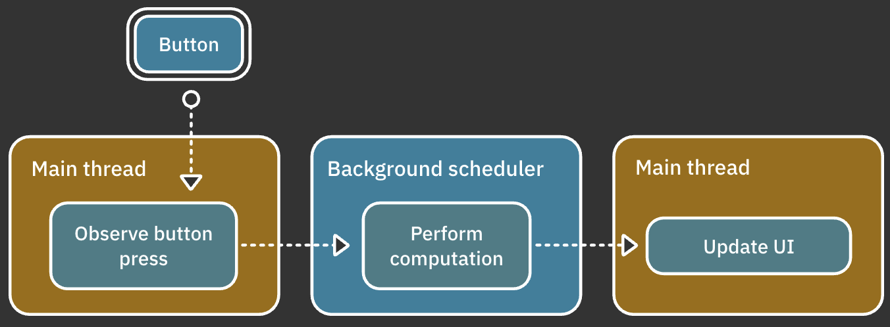

# 17.Schedulers

> **Reference**
>
> https://www.raywenderlich.com/books/combine-asynchronous-programming-with-swift/v3.0/chapters/17-schedulers

## Scheduler 소개

Apple 문서에 따르면 [Scheduler](https://developer.apple.com/documentation/combine/scheduler)는 클로저를 실행하는 시기와 방법을 정의하는 **프로토콜**이다. 

`Scheduler`는 가능한 빨리 또는 나중에 작업을 실행할 문법을 제공한다. 
the action은 프로토콜  자체에 정의된 클로저이다. 그러나 클로저라는 용어는 특정 Scheduler에서 수행되는 `Publisher` 에 의한 일부 값 전달을 숨길 수 도 있다. (Q) 이거 무슨 뜻?)

위 정의가 스레드에 의한 참조를 의도적으로 피하고 있다. 구체적인 구현은 `Scheduler` 프로토콜에서 제공하는 컨텍스트가 실행되는 위치를 정의하는 구현이기 때문이다. 

따라서 코드가 실행될 스레드의 정확한 세부정보는 선택한 스케줄러에 따라 다르다.

**스케줄러는 스레드와 같지 않다.** 이걸 기억하자

이벤트 흐름 관점에서 스케줄러의 개념을 살펴보면 다음과 같다.



* main(UI) 스레드에서 user interactive(버튼 누름)가 발생한다.
* 백그라운드 스케줄러에서 처리할 일부 작업을 트리거한다.
* 표시할 최종 데이터는 메인 스레드에서 구독자에게 전달되므로 구독자는 앱의 UI를 업데이트할 수 있다.

## 스케줄링을 위한 연산자

Combine은 스케줄러 작업을 위한 두가지 기본 연산자를 제공한다.

* `subscribe(on:options:)`  지정된 스케줄러에서 구독을 생성한다.(upstream)
* `receive(on:options:)` 지정된 스케줄러에서 값을 전달한다.(downstream)

또한 아래의 연산자는 스케줄러 및 스케줄러 options를 파라미터로 사용한다.(6장에서 배움)

* `debounce(for:scheduler:options:)`
* `delay(for:tolerance:scheduler:options:)`
* `measureInterval(using:options:)`
* `throttle(for:scheduler:lastest:)`
* `timeout(_:scheduler:options:customError:)`

### subscribe(on:)

publisher는 구독하기 전까지는 아무런 동작을 하지 않는다. 하지만 publisher를 구독하면 아래처럼 여러단계가 수행된다.


1. `Publisher` 가 구독자를 받고 `Subscription` 을 생성한다.
2. `Subscriber`는 구독을 수신하고 publisher (점선)에서 값을 요청한다.
3. `Publisher`가 동작한다.(`Subscription` 을 통해)
4. `Publisher`가 값을 방출한다.(`Subscription` 을 통해)
5. Operator는 값을 변환한다.
6. `Subscriber`가 최종 값을 받게 된다.

1,2,3단계는 일반적으로 코드가 publisher를 구독할 때 그때 스레드에서 동작한다. 그러나 `subscribe(on:)` 연산자를 사용하면 이러한 모든 작업이 `subscribe(on:)` 에 의해 지정한 스케줄러에서 실행된다.

```swift
// 연산이 오래걸리는 `computationPublisher` 에 publisher를 정의
let computationPublisher = Publishers.ExpensiveComputation(duration: 3)

// 특정 스케줄러에서 연산을 트리거하는 데 사용할 serial queue
let queue = DispatchQueue(label: "serial queue")

// 현재 실행되고 있는 스레드 number를 얻는다. 
let currentThread = Thread.current.number
print("Start computation publisher on thread \(currentThread)")
```

위 코드를 이용해 구독하고 방출하는 값을 보도록하자.

```swift
let subscription = computationPublisher
    .sink { value in
        let thread = Thread.current.number
        print("Received computation result on thread \(thread): '\(value)'")
    }
```

**결과**

```
Start computation publisher on thread 1
ExpensiveComputation subscriber received on thread 1
Beginning expensive computation on thread 1
Completed expensive computation on thread 1
Received computation result on thread 1 'Computation complete'
```

무슨일이 일어난건지 단계적으로 보도록하자

1. 코드가 메인 스레드에서 실행중이다.
2. `ExpensiveComputation`publisher는 subscriber를 받는다.
3. 구독이 생성되고 작업이 수행된다.
4. 작업이 완료되면 publisher는 구독을 통해 결과값을 전달하고 complete한다.

결과를 보면 모든 작업은 thread1(메인 스레드)에서 이루어진 것을 볼 수 있다.

publisher의 `subscribe(on:)`의 파라미터를 변경해보자

```swift
let subscription = computationPublisher
  .subscribe(on: queue)
  .sink { value in...
```

**결과**

```
Start computation publisher on thread 1
ExpensiveComputation subscriber received on thread 6
Beginning expensive computation on thread 6
Completed expensive computation on thread 6
Received computation result on thread 6: 'Computation complete'
```

메인 스레드에서 실행되었지만 구독이 수행되면 스레드6으로 task가 옮겨진 것을 볼 수 있다.

이후 구독이 마무리될 때까지 thread6에서 수행하고 있다.

그렇다면 upstream(구독을 생성하고 작업을 수행하는 일련의 과정)은 sub thread에서 진행을하고 downstream(구독이 끝나고 결과를 받은 이후의 과정)에서 UI를 업데이트를 해야할 경우에는 어떻게 할까? UI는 항상 main thread에서 동작해야한다.

### receive(on:)

구독자에게 값을 전달할 스케줄러를 지정할 수 있다. 즉, downstream의 스케줄러를 지정해준다.

```swift
let subscription = computationPublisher
    .subscribe(on: queue)
    .receive(on: DispatchQueue.main)
    .sink { value in
        let thread = Thread.current.number
        print("Received computation result on thread \(thread): '\(value)'")
    }
```

**결과**

```
Start computation publisher on thread 1
ExpensiveComputation subscriber received on thread 5
Beginning expensive computation on thread 5
Completed expensive computation on thread 5
Received computation result on thread 1: 'Computation complete'
```

computation을 background(thread 5)에서 수행하고 그 결과는 main trehad(thread 1)에서 받는 것을 볼 수 있다.

## 스케줄러 구현

위에 예제에서는 `DispatchQueue`를 사용했다.  `Scheduler` 프로토콜을 이용해 해당 implement를 사용했지만, 이게 전부는 아님. 다른 스케줄러가 무엇이 있는지 살퍼보도록한다.

Apple은 `Scheduler` 프로토콜의 몇가지 implementation을 제공한다.

* `ImmediateScheduler`
  * `subscribe(on:)` 을 사용하여 수정하지 않는 한 기본 실행 컨텍스트인 현재 스레드에서 즉시 코드를 실행하는 간단한 스케줄러
* `RunLoop` : Foundation의 Thread에 있는 객체
* `DispatchQueue`: serail 또는 concurrent
* `OperationQueue`: work item의 실행을 규제하는 queue

> 참고: 여기에는 `TestScheduler` 가 누락되어 있음. 반응형 프로그래밍 프레임워크의 테스트 부분에서 없어서는 안될 부분인데 없음. 이는 19장에서 보도록한다.

### ImmediateScheduler

우선 간단한 타이머를 만드는 것으로 시작하도록 한다.

```swift
let source = Timer
  .publish(every: 1.0, on: .main, in: .common)
  .autoconnect()
  .scan(0) { counter, _ in counter + 1 }
```

이 후 `Source/Record.swift`에 만들어놓은 custom 연산자를 사용하도록 한다. `recordThread(using:)` 이 연산자는 연사자가 통과하는 값을 볼 때 현재 스레드를 기록하고 publisher 에서 최종 sink 까지 여러번 기록할 수 있다.

```swift

```


