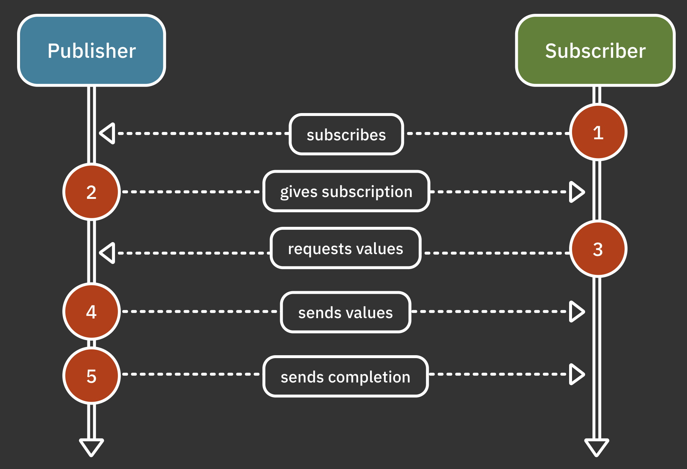

# 2. Publishers & Subscribers

> 출처: 출처: https://www.raywenderlich.com/books/combine-asynchronous-programming-with-swift

## Pbulisher

Combine의 핵심은 `Publihser` 프로토콜이다. 하나 이상의 subscrbier에게 값 시퀀스를 전송할 수 있는 요구사항을 정의한다. 

publisher를 subscription하는 것은 특정 notification을 subscription하는 것과 유사하다.

아래는 `NotificationCenter` 를 이용해 특정 이벤트에 대한 비동기 콜백을 정의한 것

```swift
example(of: "Publisher") {
    // notificaiton id를 생성
    let myNotification: Notification.Name = Notification.Name("MyNotification")
    
    // publisher를 호출하고 publisher에 저장
    let publisher: NotificationCenter.Publisher = NotificationCenter.default
        .publisher(for: myNotification, object: nil)
}
```

publisher는 두 가지 종류의 이벤트를 내보낸다.

1. elements라고 불리는 값
   * 0개 이상의 값을 내보낼 수 있다.
2. completion 이벤트 
   * 하나의 completion 이벤트만을 보낼 수 있다. ( 일반적인 completion 이벤트, failure 이벤트 중 하나)
   * publisher가 완료 이벤트를 내보내면 해당 파이프라인은 더이상 이벤트를 내보낼 수 없다.

위 코드에 마저 추가 하도록 하자

```swift
example(of: "Publisher") {
    // notificaiton id를 생성
    let myNotification: Notification.Name = Notification.Name("MyNotification")
    
    // publisher를 호출하고 publisher에 저장
    let publisher: NotificationCenter.Publisher = NotificationCenter.default
        .publisher(for: myNotification, object: nil)
    
    // NotificationCenter에 대한 핸들러를 가져온다. (default 핸들러)
    let center = NotificationCenter.default
    
    // 알림을 수신할 observer를 생성 한다.
    let observer = center.addObserver(forName: myNotification,
                                      object: nil,
                                      queue: nil) { notificaiton in
        print("Notification received!")
    }
    
    // myNotification에 알림을 보낸다.
    center.post(name: myNotification, object: nil)
    
    // NotificationCenter에서 observer를 제거
    center.removeObserver(observer)
}
```

<pre>
——— Example of: Publisher ———
Notification received!
</pre>


## Subscriber

`Subscriber`는 publisher 로 부터 이벤트를 받을 수 있는 요구사항을 정의하는 프로토콜이다. 

### sink(\_:\_:)

아래 코드는 예제 `sink` 메서드를 통해 publisher로 부터 event를 받는다. (subscription을 수행)

```swift
example(of: "Subscriber") {
    let myNotification = Notification.Name("MyNotification")
    let center = NotificationCenter.default
    
    let publisher = center.publisher(for: myNotification, object: nil)
    
    // sink를 호출해 subspcription을 만든다.
    let subscription = publisher
        .sink { _ in
            print("Notification received from a publisher!")
        }
    
    // myNotification에 알림을 보낸다.
    center.post(name: myNotification, object: nil)
    
    // subscription 취소
    subscription.cancel()
}
```

<pre>
  ——— Example of: Publisher ———
Notification received from a publisher!
</pre>

`sink`연산자는 publisher를 방출한 만큼 계속 값을 받을 수 있다.

`sink` 연산자는 두개의 클로저를 제공한다.

1. completion event(성공 또는 실패)
2. 수신한 값

```swift
example(of: "Just") {
    // Just를 이용해 단일 publisher를 생성
    let just = Just("Hello world!")
    
    // publisher에 대한 구독을 만들고 수신된 각 event에 대한 메세지를 출력
    _ = just
        .sink(receiveCompletion: {
            print("Received completion", $0)
        }, receiveValue: {
            print("Received value", $0)
        })
    
    // 또다른 구독을 생성할 수 도 있음.
    _ = just
      .sink(
        receiveCompletion: {
          print("Received completion (another)", $0)
        },
        receiveValue: {
          print("Received value (another)", $0)
      })
}
```

<pre>
——— Example of: Just ———
Received value Hello world!
Received completion finished
Received value (another) Hello world!
Received completion (another) finished
</pre>


### aissign(to: on:)

`assign(to: on:)` 연산자를 사용해 수신된 값을 KVO로 사용할 수도 있음.

```swift
example(of: "assign(to:on:)") {
    // didSet을 이용해 value가 초기화 될 때마다 출력
    class SomeObject{
        var value: String = ""{
            didSet{
                print(value)
            }
        }
    }
    
    // 클래스 인스턴스 생성
    let object = SomeObject()
    
    // 빼열 publisher 생성
    let publisher: Publishers.Sequence<[String], Never> = ["Hello", "world!"].publisher
    
    // subscription에서 받은 값을 object의 value에 할당
    _ = publisher
        .assign(to: \.value, on: object)
}
```

<pre>
——— Example of: assign(to:on:) ———
Hello
world!


</pre>


### assign(to:)

Protperty Wrapper `@Published` 를 사용하면 assign을 다시 publish할 수 있다.

```swift
example(of: "assign(to:)") {
    // 일반 프로퍼티로 사용할 수 있고, @Published 프로퍼티 래퍼로 도 사용할 수 있는 value 생성
    class SomeObject{
        @Published var value = 0
    }
    
    let object = SomeObject()
    
    // $를 이용해 @Published로 선언된 변수(value)에 대해 publisher를 얻고 subscription해서 수신된 값을 출력
  	// @Published가 Subscription protocol을 따른다고 함. 그래서 sink 메서드 호출이 가능한거임. 일단은 구현에 집중
    object.$value
        .sink {
            print($0)
        }
    
    // 0..<10 까지 publisher를 생성하고 value에 할당
    (0..<10).publisher
        .assign(to: &object.$value)
}
```

`assign(to:)` 와 `assign(to: on:)`의 차이는 return 값이 있냐 없냐의 차이

`assign(to: on:)` 는 `AnyCancellable` 을 리턴하고, 내부 생명주기를 관리해줘야 함.

`assign(to:)`는 내부적으로 수명주기를 관리하고 있음. `@Published`프로퍼티가 deinit될 때 구독을 취소함.

간단하게 말해서 `assign(to: on:)` 는 `store(in:)`을 통해 리소스 관리를 해줘야 하고,

`@Published` 를 이용할 경우 `assign(to:)`을 사용하고, 따로 메모리 관리를 해주지 않아도 된다.


## Cancellable

subscriber 가 작업을 마치고 더 이상 게시자로 부터 값을 받지 않으려는 경우 subscription을 취소하여 리소스를 확보하고 네트워크 호출과 같은 이벤트가 발생하지 않도록 하는 것이 좋다.

subscription은 `AnyCancellable`을 리턴하므로 완료되면 subscription을 취소할 수 있다. (AnyCancellable은 Cancellable 프로토콜을 따른다.)


## 무슨 일이 일어나는지 이해하기



1. subscriber는 publisher를 subscription 한다.
2. publisher는 subscription을 생성하여 subscriber에게 제공한다.
3. subscriber가 값을 요청
4. publisher가 값을 보내줌.
5. publisher가 completion을 보낸다.

아래는 Publisher 프로토콜의 일부

```swift
public protocol Publisher{
  	// Publisher가 생성할 수 있는 값의 타입
  	associatedtype Output
  	
  	// Publisher가 생성할 수 있는 오류타입 또는 Publisher가 오류를 생성하지 않을 경우 Never
  	associatedtype Failure: Error
  
  	// receive(subscriber:)의 구현은 subscriber를 publisher에 연결하기 위해 아래 subscribe(_:)을 호출한다.
  	// 즉, subscription을 생성한다.
  	public func receive<S>(subscriber: S)
	  		where S: Subscriber,
  			Self.Failure == S.Failure,
  			Self.Output == S.Input
}

extension Publisher{
  	// subscriber는 subscriber(_:)메서드를 호출 해 publisher에게 연결(bind)을 요청
  	public func subscriber<S>(_ subscriber: S)
	  		where S: Subscriber,
  			Self.Failure == S.Failure,
  			Self.Output == S.Input
}
```

Subscriber 프로토콜의 일부

```swift
public protocol Subscriber: CustomCombineIdentifierConvertible{
  	// Subscriber가 받을 수 있는 값 타입
  	associatedtype Input
  
  	// Subscriber가 생성할 수 있는 오류타입 또는 Publisher가 오류를 생성하지 않을 경우 Never
  	associatedtype Failure: Error
  
  	// publisher는 receive(subscription:)메서드를 호출 해 subscription을 제공한다.
  	func receive(subscription: Subscription)
  
  	// publisher는 receive(_:)를 통해 subscriber에게 방금 publish한 값을 보내도록 요청한다.
  	func receive(_ input: Self.Input) -> Subscribers.Demand
  
  	// publisher는 subscriber에게 receive(completion:)을 호출해 정상/오류 값을 알린다.
  	func receive(completion: Subscribers.Completion<Self.Failure>)
}
```


Publisher와 Subscriber간에는  subscription으로 연결되어 있다.

Subscription프로토콜은 아래와 같음.

```swift
public protocol Subscription: Cancellable, CustomCombineIdentifierConvertible {
  func request(_ demand: Subscribers.Demand)
}
```

subscriber는 값의 갯수를 정하기 위해 `request(_:)`를 호출한다.


Subsriber안의 `receive(_:)`는 Demand를 반환한다. 

