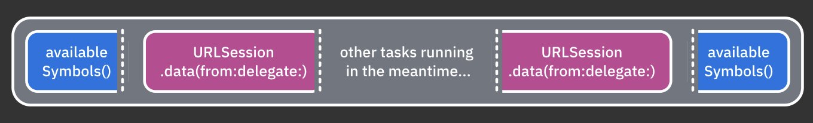
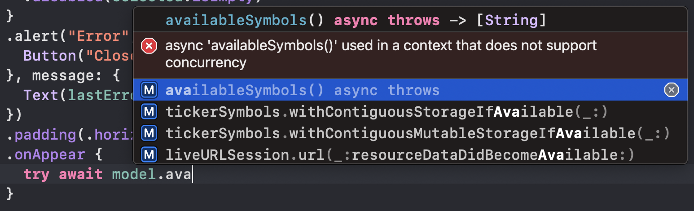
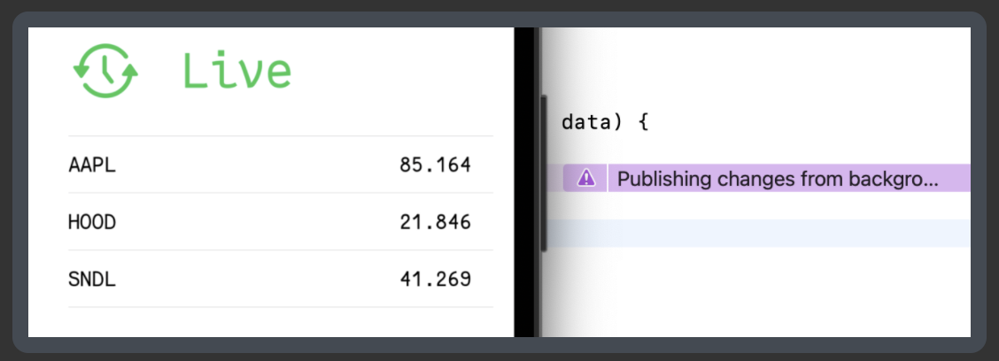
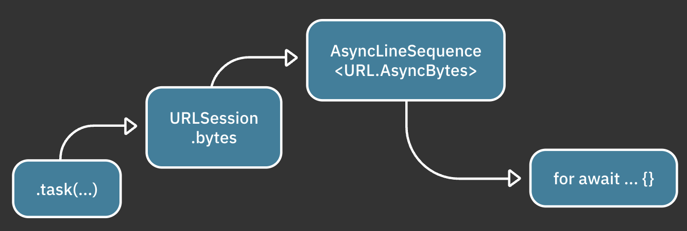
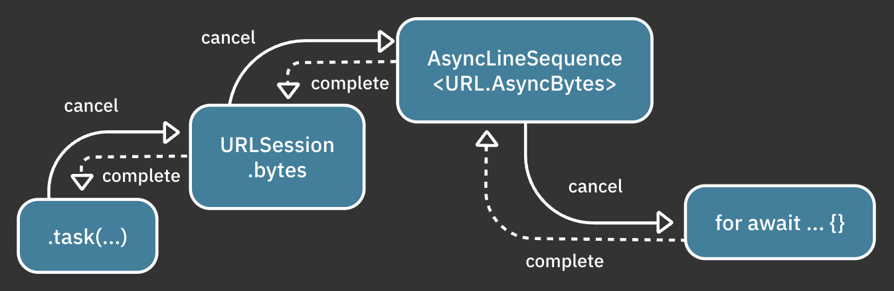
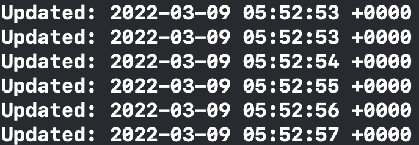
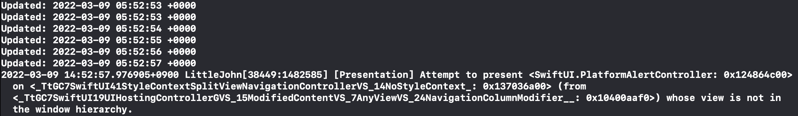

# 1. Why Modern Swift Concurrency?

> Reference: https://www.raywenderlich.com/books/modern-concurrency-in-swift

## 기존 동시성 검토

Swift5.5 이전 버전에서는 GCD를 사용하여 비동기 코드를 실행했다. 즉, thread를 통한 추상화를 했음. 

또한 Operation, Thread, pthread와 같은 API를 사용했음.

이러한 API는 모두 POSIX 스레드라는 동일한 기반을 사용한다.
POSIX 스레드 기반해서 만든 API이다. 즉, `Operation` 및 `Thread`는 스레드 래퍼라고 할 수 있다.
스레드 래퍼는 사용자가 수동을 실행을 관리하도록 요구한다. 즉, 스레드 생성 및 소멸, 동시 작업의 실행 순서 결정, 스레드 간에 공유 데이터 동기화 등을 담당한다. 이것은 오류가 발생하기 쉽고 지루하다.

GCD의 문제점

* 스레드 폭발: 너무 많은 동시 스레드를 생성하려면 활성 스레드 간에 지속적으로 전환해야 한다. 이는 궁극적으로 앱 속도를 저하시킨다.
* 우선 순위 반전: 임의의 낮은 우선 순위 작업이 동일한 대기열에서 대기중인 높은 우선 순위 작업의 실행을 차단하는 경우
* 실행 계층 부족: 비동기 코드 블록에는 실행 계층이 없었다. 즉, 각 작업이 독립적으로 관리었다. 이로 인해 실행 중인 작업을 취소하거나 엑세스하기가 어려웠다. 또한 작업이 호출자에게 결과를 반환하는 것을 복잡하게 만들었다.

## 최신 Swift 동시성 모델 소개

1. A cooperative thread pool(협력 스레드 풀)

   사용가능한 CPI코어 수를 초과하지 않도록 스레드 풀을 투명하게 관리한다. 이렇게 하면 런타임에서 스레드를 생성 및 삭제하거나 스레드 전환(컨텍스트 스위칭)을 지속적으로 수행할 필요가 없음. 대신 코드가 일시 중단되고 나중에 풀에서 사용가능한 스레드에서 매우 빠르게 재개될 수 있음.

2. async/await 구문(`async`/`await` syntax)

   코드 조각이 앞으로 한번 이상 실행을 일시정지하고 재개할 수 있도록 한다.(런타임은 이를 원할하게 처리하므로 스레드와 코어에 대해 걱정할 필요가 없음)

   보너스로 콜백으로 escaping closure를 사용할 필요가 없으므로 `self`나 기타 다른 변수를 약하게 또는 강하게 캡처 할 필요가 없는 경우가 많다.

3. 구조적 동시성(Structured concurrency)

   각 비동기 작업은 상위 작업과 실행 우선 순위가 지정된 계층 구조이다. 이 계층 구조를 사용하면 부모가 취소될 때 런타임에서 모든 자식 작업을 취소할 수 있다. 또한 런타임은 부모가 완료되기 전에 모든 자식이 완료될 때까지 기다릴 수 있다.

   이 계층구조는 높은 우선 순위 작업이 계층 구조의 낮은 우선 순위 작업보다 먼저 실행되는 큰 이점과 보다 분명한 결과를 제공한다.

4. 컨텍스트 인식 코드 컴파일(Context-aware code compilation)

   컴파일러단계에서 주어진 코드 조각이 비동기적으로 실행될 수 있는지 여부를 추적한다. 그렇다면 공유 상태 변경과 같이 잠재적으로 안전하지 않은 코드를 작성할 수 없다.

   이러한 높은 수준의 컴파일러 인식은 actor와 같은 정교한 새 기능을 가능하게 한다. 이 기능은 컴파일 시간에 상태에 대한 동기 및 비동기 엑세스를 구별하고 안전하지 않은 코드를 작성하기 어렵게 하여 실수로 데이터를 손상시키는 것을 방지한다.

## async/await 톺아보기

* server request 예제

  ```swift
  func availableSymbols() async throws -> [String]{
    guard let url = URL(string: "http://localhost:8080/littlejohn/symbols") else{
      throw "The URL could not be created."
    }
  
    let (data, response) = try await URLSession.shared.data(from: url)
  
    guard (response as? HTTPURLResponse)?.statusCode == 200 else{
      throw "The server responded with an error."
    }
  
    return try JSONDecoder().decode([String].self, from: data)
  }
  ```

  메서드에 정의되어 있는 `async`키워드를 사용하면 컴파일러에서 코드가 비동기 컨텍스트에서 실행된다. 즉, 코드가 마음대로 일시 정지되고 재개될 수 있다는 의미이다. 또한 메서드를 완료하는데 걸리는 시간에 관계없이 궁극적으로 동기 메서드와 매우 유사한 값을 반환한다.

  또한 

  ```swift
  let (data, response) = try await URLSession.shared.data(from: url)
  ```

  위 코드는 URLSession을 통해 서버에서 데이터를 가져올 동안 멈추고 가져왔으면 다시 재개된다.

  `await`을 사용하면 런타임에 일시 정지 지점이 제공된다. 

  

* SwiftUI에서 async/await 사용

  View.body에 다음 코드를 추가하면

  ```swift
  .onAppear{
    // availableSymbols() 메서드는 위에 server request 예제에서 선언한 async 메서드임
    try await model.availableSymbols()
  }
  ```

  

  이와 같은 컴파일 에러가 출력된다.

  `onAppear{}`는 동기적으로 실행하는데, 왜 비동기 함수인 `availableSymbols()`를 호출하냐는 거다.

  다행히도 `onAppear` 대신 `task(priority:_:)`를 사용해 비동기 함수를 즉시 호출할 수 있다.

  `onAppear`를 제거하고 다음 코드를 넣으면 됨

  ```swift
  // task는 onAppear와 유사하게 뷰가 화면에 나타날 때 호출된다.
  .task {
    // 그렇기 때문에 self.symbols가 있는지 확인하는 것으로 시작
    guard symbols.isEmpty else {return}
    
    // 그리고 비동기 함수 실행
    do{
      symbols = try await model.availableSymbols()
    }catch{
      lastErrorMessage = error.localizedDescription
    }
  }
  ```

## 비동기 시퀀스 톺아보기

주가 변동과 같이 지속적으로 업데이트되어야 하는 경우 "네트워크 요청을 실행하고 결과를 기다렸다가 하는 것을 반복하는 것"은 어울리지 않다. 데이터는 계속 제공되어야 하며, 이러한 가격 업데이트를 가져와야 한다.

우선 비동기를 호출하는 것으로 시작

```swift
task {
  do{try await model.startTicker(selectedSymbols)}
  ...
}
```

그리고 서버로 부터 요청한다.

```swift
// 지속적인 데이터 제공을 위한 URLSession
private lazy var liveURLSession: URLSession = {
  var configuration = URLSessionConfiguration.default
  configuration.timeoutIntervalForRequest = .infinity
  return URLSession(configuration: configuration)
}()

func startTicker(_ selectedSymbols: [String]) async throws {
  tickerSymbols = []
  guard let url = URL(string: "http://localhost:8080/littlejohn/ticker?\(selectedSymbols.joined(separator: ","))") else {
    throw "The URL could not be created."
  }

  // 시간이 지남에 따라 반복할 수 있는 비동기 시퀀스를 가져온다.
  let (stream, response) = try await liveURLSession.bytes(from: url)

  guard (response as? HTTPURLResponse)?.statusCode == 200 else {
    throw "The server responded with an error."
  }

  // 서버가 응답으로 보내는 byte 시퀀스를 line에 await해서 계속 받고 있음.
  for try await line in stream.lines{
    // 디코딩
    let sortedSymbols = try JSONDecoder()
    .decode([Stock].self, from: Data(line.utf8))
    .sorted(by: { $0.name < $1.name })

    // 디코딩 성공하면 tickerSybols 화면에 랜더링한다.
    tickerSymbols = sortedSymbols
  }
}
```

실행하면 실시간으로 업데이트되지만



위 스크린샷 처럼 "Publishing changes from background threads is not allowed..."라는 문구를 볼 수 있다.

Main 스레드에서 UI를 업데이트 해줘야 한다.

```swift
tickerSymbols = sortedSymbols
```

을 다음으로 바꾸면 된다.

```swift
await MainActor.run {
  tickerSymbols = sortedSymbols
  print("Updated: \(Date())")
}
```

## Canceling tasks in structured concurrency

앞서 언급했듯이 Swift를 사용한 동시 프로그래밍의 큰 도약 중 하나는 현대적인 동시 코드가 구조화된 방식으로 실행된다는 것이다.
작업은 엄격한 계층 구조로 실행되므로 런타임은 작업의 부모가 누구이고 새 작업이 상속해야 하는 기능을 알고 있다.

예를들어 위에서 작성한 `task(_:)`를 보면 코드가 `startTiker(_:)`를 비동기적으로 호출하고 차례로 `URLSession.bytes`를 호출하면서 비동기식으로 반복되는 비동기 시퀀스를 반환한다.



`task`는 다른 모든 작업의 부모이다. 

SwiftUI의 `task(_:)`는 뷰가 사라질 때 비동기 코드 취소를 처리한다. 구조적 동시성 덕분에 사용자가 화면 밖으로 이동할 때 모든 비동기 작업도 취소된다.



비동기 시퀀스가 반복되는 동작을 콘솔로그로 보면 다음과 같다.



그러다 back 버튼을 눌러 view를 사라지게 하면 view가 사라지고 task(_:) 의 작업이 취소된다. 이렇게 하면 task에 대한 호출을 포함하여 모든 하위 작업이 취소된다.



```
[Presentation] Attempt to present <SwiftUI.PlatformAlertController: 0x7f8051888000> on ... whose view is not in the window hierarchy.
```

가 출력되는데 이는 런타임에서 `model.startTicker(selectedSymbols)`에 대한 호출을 취소할 때 일부 내부 작업에서 취소 오류가 발생하기 때문에 다음과 같은 워닝을 띄운다.

보고 싶지 않다면 task 내부의 catch에 다음과 같은 코드를 추가하면 된다.

```swift
} catch {
  if let error = error as? URLError, 
    error.code == .cancelled {
    return
  }
  
  lastErrorMessage = error.localizedDescription
}
```

