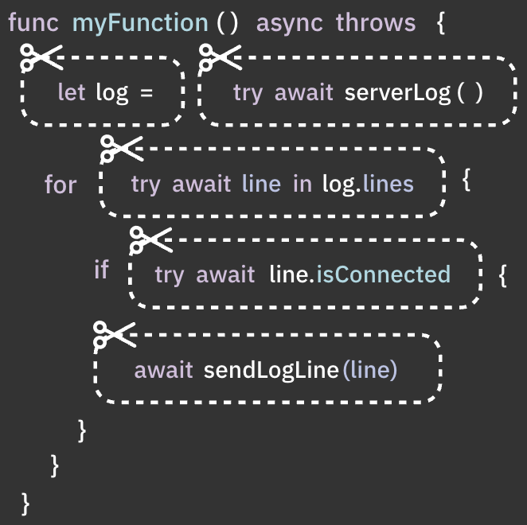
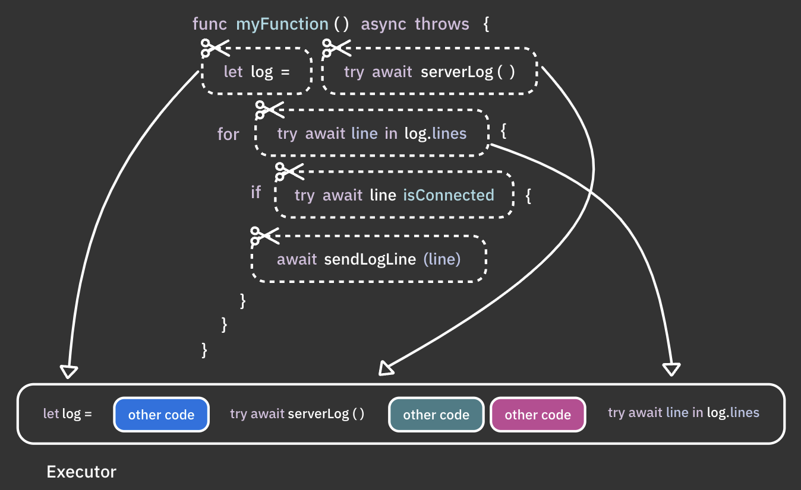
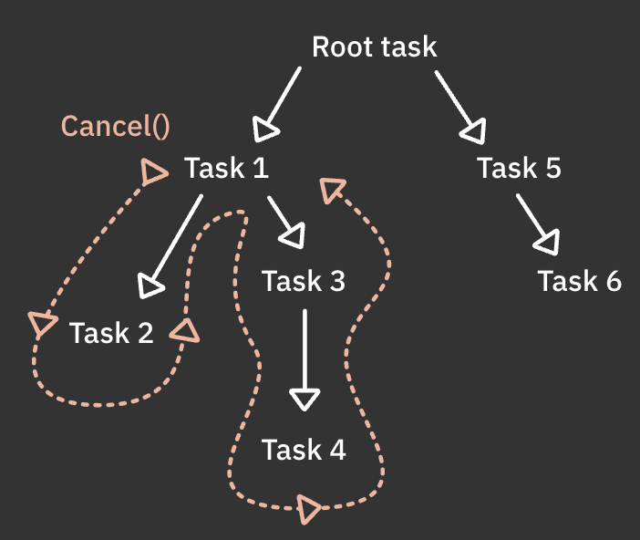
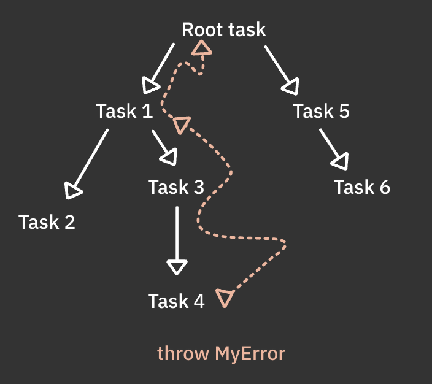
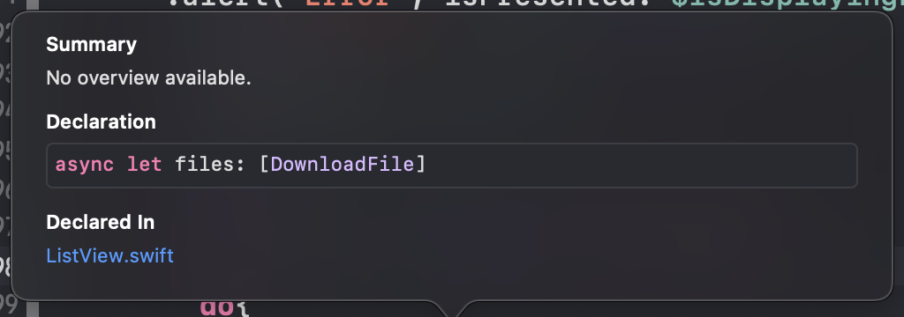
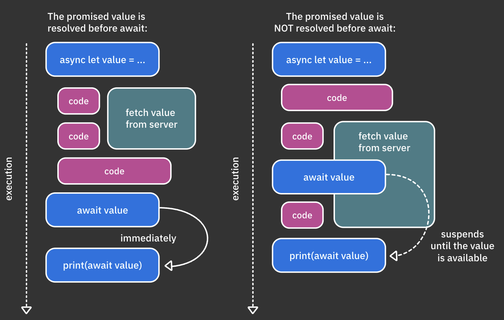
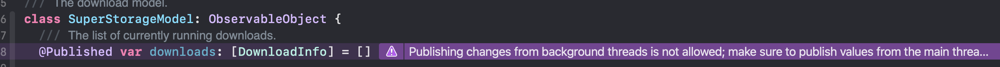

# 2. Getting Started With async/await

들어가기전에 이전 방식의 네트워크 api 호출과 최신 방식의 네트워크 api 호출을 비교 해보자 아래 2코드는 모두 동일한 작업을 수행한다.

**이전방식**

```swift
class API {
  ...
  func fetchServerStatus(completion: @escaping (ServerStatus) -> Void) {
    URLSession.shared
      .dataTask(
        with: URL(string: "http://amazingserver.com/status")!
      ) { data, response, error in
        // Decoding, error handling, etc
        let serverStatus = ...
        completion(serverStatus)
      }
      .resume()
  }
}

class ViewController {
  let api = API()
  let viewModel = ViewModel()

  func viewDidAppear() {
    api.fetchServerStatus { [weak viewModel] status in
      guard let viewModel = viewModel else { return }
      viewModel.serverStatus = status
    }
  }
}
```

**async/await**

```swift
class API {
  ...
  func fetchServerStatus() async throws -> ServerStatus {
    let (data, _) = try await URLSession.shared.data(
      from: URL(string: "http://amazingserver.com/status")!
    )
    return ServerStatus(data: data)
  }
}

class ViewController {
  let api = API()
  let viewModel = ViewModel()

  func viewDidAppear() {
    Task {
      viewModel.serverStatus = try await api.fetchServerStatus()
    }
  }
}
```

## 코드를 부분 작업으로 분리

await이 의미하는 바가 무엇인가? CPU 코어 및 메모리와 같은 공유 리소스를 최적화하기 위해 swift는 코드를 논리단위로 분할한다.



swift 런타임은 비동기 실행을 위해 이러한 각 부분을 개별적으로 예약한다. 각 부분 작업이 완료되면 시스템은 시스템 로드와 보류중인 작업의 우선순위에 따라 코드를 계속할지 아니면 다른 작업을 실행할지 결정한다.

그렇기 때문에 await이 달린 부분 작업 각각은 시스템의 재량에 따라 다른 스레드에서 실행될 수 있음을 기억하는 것이 중요하다.
스레드가 변경될 수 있을 뿐만 아니라 코드가 연속적으로 붙어서 있지만 둘 사이에 시간간격을 두고 실행될 수 있다는 것이다. 



## 작업 수명 제어

기존 다중 스레드 api의 큰 단점은 비동기 코드가 실행을 시작하면 코드가 제어를 포기하기전까지 시스템이 cpu를 정상적으로 회수할 수 없다는 것이다. 즉, 작업이 더 이상 필요하지 않아도 여전히 리소스를 소비하고 실제 이유없이 작업을 수행한다.

이에 대한 좋은 예는 원격 서버에 콘텐츠를 2번 호출하면 시스템에는 이제 불필요한 첫번째 호출에 대한 리소스를 회수하는 자동 메커니즘이 없으므로 리소스가 불필요하게 낭비된다.(뭔말이여 자동으로 회수하지 않나..?)

새로운 모델은 코드를 부분적으로 분할하여 런타임에 체크인하는 일시 중단 지점을 제공한다.(await) 이렇게 하면 시스템에서 코드를 일시 중지할 수 있을 뿐만 아니라 재량에 따라 코드를 모두 취소할 수 있다.

새로운 비동기 모델 덕분에 주어진 작업을 취소하면 런타임이 비동기 계층을 따라 내려가 모든 자식 작업도 취소할 수 있다.



물론 중단 지점없이 긴 작업을 수행하는 경우에도 swift는 현재 작업이 취소되었는지 감지하는 api를 제공한다. 이러면 수동으로 실행을 취소할 수 있음.

마지막으로 탈출 경로도 제공함



## async/await 조감도

```swift
func myFunction() async throws -> String { 
  ... 
}

let myVar = try await myFunction()
```

```swift
var myProperty: String {
  get async {
    ...
  }
}

print(await myProperty)
```

```swift
var myProperty: String {
  get async {
    ...
  }
}

print(await myProperty)
```

## async let

아래의 2개 코드는 같은 동작

```swift
guard files.isEmpty else {return}

do{
  files = try await model.availableFiles()
  status = try await model.status()
}catch{
  lastErrorMessage = error.localizedDescription
}
```

```swift
guard files.isEmpty else {return}
        
do{
  async let files = try model.availableFiles()
  async let status = try model.status()
}catch{
  lastErrorMessage = error.localizedDescription
}
```

두번째 코드를 보면 ` async let`이 있는데 async let을 이용해서 서버에 대한 두개의 요청을 동시에 실행한다.

async let 바인딩을 사용하면 다른 언어의 promise의 개념과 유사한 로컬 상수를 만들 수 있다.

`files`변수를 option 키를 이용해 눌러보면



선언은 명시 적으로 비동기를 제공한다. 즉, `await`없이 값에 액세스 할 수 없음을 의미한다.

files 및 status 바인딩은 특정 유형 또는 오류의 값을 나중에 사용할 수 있음을 약속한다.

바인딩 결과를 읽으려면 await을 사용해야 한다. 값이 이미 사용 가능한 경우 즉시 가져온다. 그렇지 않으면 결과를 사용할 수 있을 때까지 대기 시 코드가 일시 중단된다.

> 이해가 잘안갈 수 있는데 https://jinsangjin.tistory.com/147 보면 확실히 이해감
>
> 예를들어 두개의 api를 각각 call한 후 각각의 api가 모두 완료된 후에 특정 액션을 취하는 것이 있다.
>
> fetchA, fetchB를 기다려야 하는 경우 기존에는 dispatchGroup을 사용했음.
>
> async let을 사용하면 아래처럼 처리가 가능하다.
>
> ```swift
> func fetchA() async -> AModel {
>     let A = try await KMNetworkManager.shared.getA()
>     return A
> }
> 
> func fetchB() async -> BModel {
>     let B = try await KMNetworkManager.shared.getB()
>     return B
> }
> 
> // async, await 사용
> func process() async {
>     async let a = fetchA()
>     async let b = fetchB()
> 
>     let viewModel = await ViewModel(a, b)
>     self.navigateToAlarmSetting(viewModel)
> }



왼쪽 그림 보면 됨

딱 이그림대로임 처음에는 await을 호출하는 순간 async붙은 애들이 호출되는 줄 알았는데

async 먼저 호출하고 await만나면 가져옴. 근데 생각하는 거랑 다를 수 있음 아래 코드한번 보자

```swift
func fetchServerStatus() async throws -> ServerStatus {
  print("before-server")
  let (data, _) = try await URLSession.shared.data(
    from: URL(string: "http://amazingserver.com/status")!
  )
  print("after-server")
  return ServerStatus(data: data)
}

func fetchA() async -> String{
  print("before")
  
  let str = await fetchServerStatus() as! String
  
  print("after")
  
  return str
}

func fetchB() ....{ ... }

Task{
  async let a = fetchA()
  async let b = fetchB()

  // let viewModel = await ViewModel(a, b)

  ...
}
```

이러면 출력이

```swift
before
before-server
```

만 출력됨

async let을 만나면 해당 비동기가 호출되기전 await 전까지만 호출되고

최종 task에서 await을 만나야지만 전부다 호출된다는 것을 기억하자

## Task

```swift
struct FileDetails: View {
  ...
  let downloadSingleAction: () -> Void
  ...
}
```

```swift
...
FileDetails(
  ...
  downloadSingleAction:{
    fileData = try await model.download(file: file)
  }
)
...
```

위 코드는 에러가 출력된다.

`() -> Void` 타입의 파라미터를 예상하고 있는데 `() -> async throws ()`가 들어오고 있다는 것.

이럴 때 Task를 사용한다.

```swift
...
FileDetails(
  ...
  downloadSingleAction:{
    Task{
	    fileData = try await model.download(file: file)      
    }
  }
)
...
```

Task는 최상위 비동기 작업을 나타내는 타입이다. 최상위 수준이라는 것은 
동기 컨텍스트에서 시작할 수 있는 "비동기 컨텍스트를 생성하는 녀석"이라는 것

간단히 말해서 동기 컨텍스트에서 새로운 비동기 코드를 실행하려면 Task를 사용해야 한다.

여러가지 api가 있는데 추후 다뤄볼 것이다. (https://developer.apple.com/documentation/swift/task)

* Task(priority:operation:)
* Task.detached(priority:operation:)
* Task.value
* Task.isCancelled
* Task.checkCancellation()
* Task.sleep(nanoseconds:)

## Actor

Actor라는게 있는데 이는 globalQueue, main Queue 같이 동작하는 스레드 이름인 것 같다. 나중에 알아본다고 하니 지금은 그냥 actor에 따라서 호출한 actor에서 실행된다는 것 정도만 알면 될듯

`Task`를 그냥 호출하면 호출 된 actor에서 작업이 실행된다.
actor의 일부가없는 동일한 작업을 만들려면 `Task.Detached (priority:operation:)`을 사용하면 된다. (뭔소린지 모르겠으니 일단 넘어가자)

그냥 `Task`를 실행하면 main 스레드에서 새 비동기를 생성한다. 그리나 `await`의 사용은 일시중단 지점이며 코드는 다른 스레드에서 재개될 수 있다. 따라서 Task 내부에 있는 await을 사용은 메인스레드가 아닐확률이 높다는 것이다.

아래 그림 처럼 보라색을 보게 될 것이다.



UI는 명시적으로 main 스레드에서 동작하도록 해야 한다.

`DispatchQueue.main`은 옛날 방식이고 여기서는 다음과 같이 쓴다.

`downloads` 프로퍼티에서 경고가 나오고 있으니 downloads에 할당하는 부분을 다음과 같이 해주면 된다.

```swift
Task{
await MainActor.run{
    someUIupdateData = someData()
  }
}
```

근데 이렇게 하면 closure가 많이 생성되서 가독성을 해친다. 좀 더 우아한 방법은 `@MainActor` 프로퍼티 래퍼를 사용한다.
지정된 함수 또는 프로퍼티에 대한 호출을 main 스레드로 자동으로 라우팅할 수 있다.

UI를 업데이트하는 메서드에 @MainActor를 달아준다.

```swift
@MainActor func addDownload(name: String){ ... }
@MainActor func updateDownload(name: String, progress: Double){...}
```

호출부도 다음과 같이 호출해야한다.

```swift
await addDownload(name: file.name)
await updateDownload(name: file.name, progress: 1.0)
```

