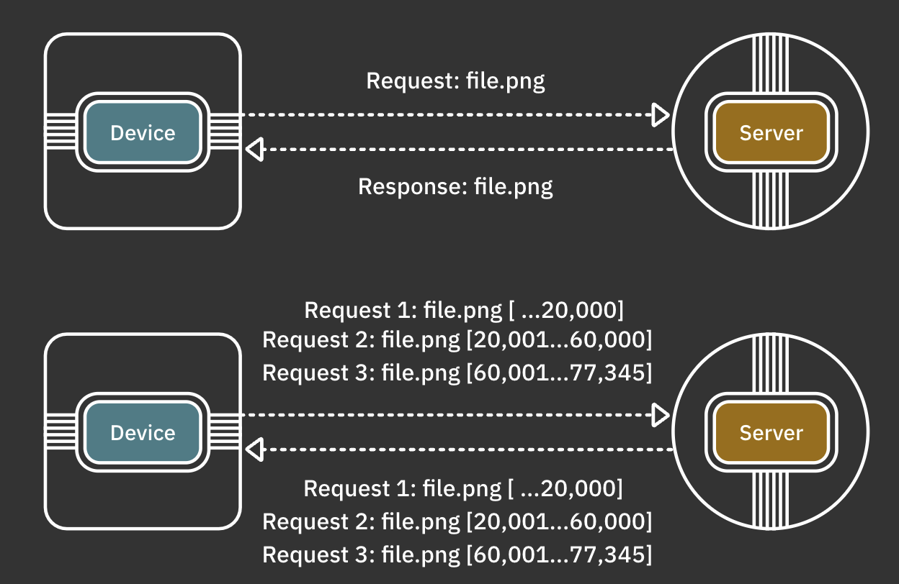
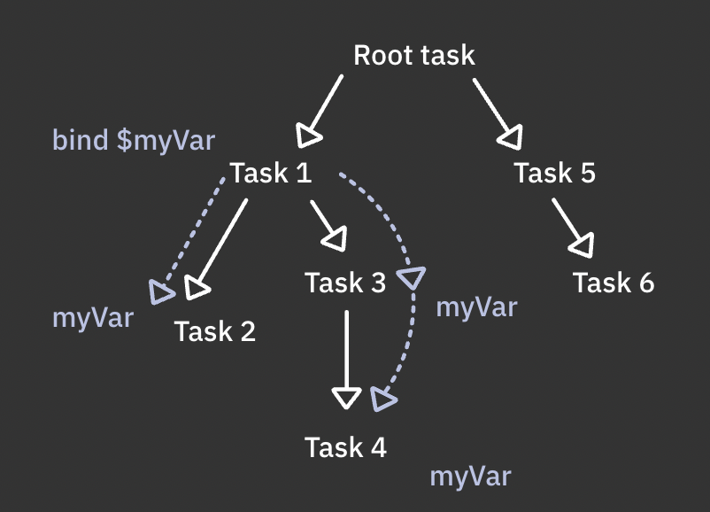
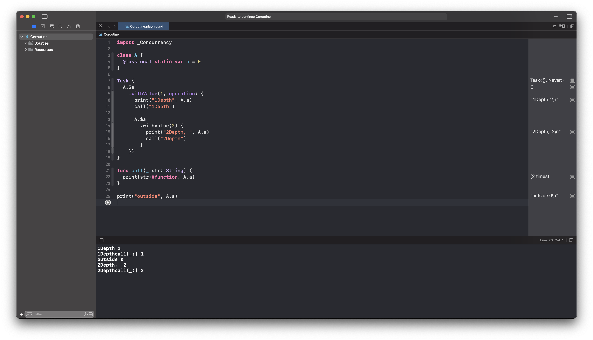
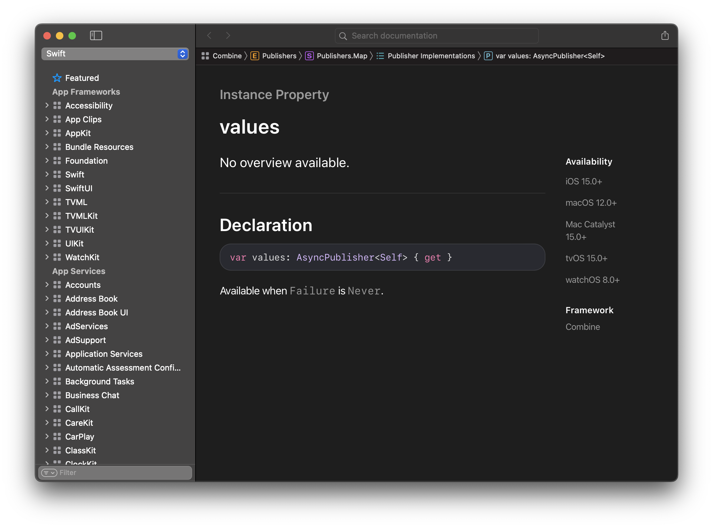

# 3. AsyncSequence&Intermediate Task

* Reference: https://www.raywenderlich.com/books/modern-concurrency-in-swift

## AsyncSequence 맛보기

AsyncSequence는 비동기적으로 element를 처리할 수 있는 프로토콜이다. 기존 `Sequence`와 다른 점은 `await`을 사용할 수 있다.

* for 루프에서 사용. 각 루프에서 일시 중단 된다.

  ```swift
  for try await item in asyncSequence {
    // Next item from `asyncSequence`
  }
  ```

* while 루프에서 사용

  ```swift
  var iterator = asyncSequence.makeAsyncIterator()
  while let item = try await iterator.next() {
    ...
  }
  ```

* 응용 할 수 도 있음

  dropFirst, prefix 처럼 표준 시퀀스와 같이 사용 가능

  ```swift
  for await item in asyncSequence
    .dropFirst(5)
    .prefix(10)
    .filter { $0 > 10 }
    .map { "Item: \($0)" } {
      ...
    }
  ```

  원시 바이트에 대한 접근

  ```swift
  for await item in asyncSequence
    .dropFirst(5)
    .prefix(10)
    .filter { $0 > 10 }
    .map { "Item: \($0)" } {
      ...
    }
  ```

## AsyncSequence

HTTP프로토콜을 이용하면 [partitial request](https://developer.mozilla.org/ko/docs/Web/HTTP/Range_requests)를 사용할 수 있음 간단하게 파일 하나를 요청할 때 한번에 응답을 주는 대신 바이트 단위로 일정 범위만큼 나눠서 요청 할 수 있음.



아래 처럼 byte 요청을 할 수 있다.

```swift
// 아래 구현된 URLRequest는 extension해서 만든거임
let urlRequest = URLRequest(url: url, offset: offset, length: size)
result = try await URLSession.shared.bytes(for: urlRequest, delegate: nil)

...

var asyncDownloadIterator = result.downloadStream.makeAsyncIterator()
let accumulator = SomeAccumulator(name: name, size: size)

// stopDownloads는 flag임, checkCompleted()를 이용해 다운로드 완료인지 확인
while !stopDownloads, !accumulator.checkCompleted() {
  // isBatchCompleted 되거나
  while !accumulator.isBatchCompleted,
  // byte 시퀀스가 완료될 때까지 2번째 loop는 돈다. next가 더이상 없으면 false 떨어지면서 loop 나옴.
  // await이 있다는 것에 주목하자.
  let byte = try await asyncDownloadIterator.next() {
    // loop 돌 때마다 저장
    accumulator.append(byte)
    
    // download현황을 Task.detached(...)를 이용한다.
		// 문서에는 사용하지 않는 것을 권장하지만 여기서는 확인용으로 쓸 거기 때문에 그냥 쓴다.
    Task.detached(priority: .medium) { [weak self] in
			await self?.updateDownload(name: name, progress: accumulator.progress)
    }
    // acuumulator 상태를 출력
    print(accumulator.description)
  }
}

return accumulator.data
```

해당 메서드를 출력해보면 다음과 같이 하나의 파일에 대해 바이트 단위로 받고 있는 것을 볼 수 있다. (너무나도 직관적인 코드)

```swift
[graphics-project-ver-1.jpeg] 0.9 MB
[graphics-project-ver-1.jpeg] 1 MB
[graphics-project-ver-1.jpeg] 1.2 MB
[graphics-project-ver-1.jpeg] 1.3 MB
[graphics-project-ver-1.jpeg] 1.4 MB
[graphics-project-ver-1.jpeg] 1.6 MB
...
```

## 작업 취소

`TaskGroup`(나중에 알랴줌)또는 `async let`를 사용하면 시스템은 알아서 작업을 취소한다.

그러나 `Task` api들을 사용하면 좀 더 세분화된 작업 취소 전략을 구현할 수 있다.

* `Task.isCancelled`: 작업이 아직 살아있지만 마지막 일시 중단 지점 이후 취소된 경우 `true`반환
* `Task.currentPriority`: 현재 작업의 우선순위를 반환
* `Task.cancel()`: 작업과 그 자식 작업을 취소 시도
* `Task.checkCancellation()`: 작업이 취소되면 `CancellationError`를 throw하여 throw하는 컨텍스트를 좀 더 쉽게 종료할 수 있음
* `Task.yield()`: 현재 작업의 실행을 일시 중단하여 시스템이 자동으로 취소하여 더 높은 우선 순위의 다른 작업을 실행할 수 있도록 한다.

위의 예제에서 뒤로가기 버튼을 누르거나 다른 작업을 수행할 때 도 계속해서 다운로드를 하게 된다.

수동으로 취소시켜줘야 함

Task가 성공했는지 오류가 발생했는지를 저장하기 위해 다음과 같은 @State 프로퍼티를 추가한다.

아래 downloadTask는 성공과 실패가 발생할 수 있는 비동기 작업을 저장한다. 성공은 Void, 실패는 Error

```swift
@State var downloadTask: Task<Void, Error>?
```

다음으로 비동기 작업에 대한 내용을 downloadTask에 저장한다. 

```swift
downloadTask = Task {
  ...
}
```

이러면 나중에 downloadTask를 통해 해당 비동기 작업에 대해 엑세스 할 수 있다.

예를 들어 화면을 나갈 때 해당 작업(download)을 취소하고 싶다면 아래처럼 쓰면 된다.

```swift
.onDisappear{
  downloadTask?.cancel()
}
```

이러면 downloadTask의 모든 하위 작업도 취소 된다.

## task에 상태 저장

각 비동기 task는 다른 task를 호출할 수 있다. 각각 다양한 기능과 상호 작용을 할 수 있기 때문에 런타임에 공유 데이터를 격리하는 것이 어려울 수 있음

이 문제를 해결하기 위해 swift는 주어진 프로퍼티를 task-local로 표시하는 새로운 프로퍼티 래퍼를 제공한다.

SwiftUI 중에 @Bind 같은 걸 이용해서 자식뷰에서 사용하도록 주입하는 것을 상상해보자
task-local값을 바인딩하면 즉각적인 task뿐만 아니라 모든 하위 task에서도 사용할 수 있다.



task-local 를 이용해서 호출 컨텍스트에 따라 함수의 동작이 달라지도록 해보자

```swift
@TaskLocal static var supportsPartialDownloads = false
```

사용자가 다운로드를 시작하면 supportsPartialDownloads는 true가 되도록 하고 flag 값으로 적절한 동작을 구현해보자

> 참고: task-local 프로퍼티는 static이거나 전역 변수여야 한다.

@TaskLocal 프로퍼티 래퍼는 비동기 작업에 값을 바인딩 하거나 task 계층에 값을 삽입할 수 있도록 하는 `withValue()` 메서드를 제공한다.

```swift
try await SuperStorageModel
  .$supportsPartialDownloads
  .withValue(file.name.hasSuffix(".jpeg")) {
    fileData = try await model.downloadWithProgress(file: file)
  }
```

SuperStorageModel에 있는 supportsPartialDownloads를 바인딩해서 withValue 메서드를 호출한다.

supportsPartialDownloads가 true면 withValue를 통해 supportsPartialDownloads는 `file.name.hasSuffix(".jpeg")`에 따라 값이 정해지고(Bind되고) 해당 task 내부에서만 그 값이 그대로 쓰인다. 즉, 지역성을 갖는다는 것

이 방법으로 여러 값을 바인딩값을 덮어 쓸 수도 있다.

```swift
try await $property1.withValue(myData) {
  ...
  try await $property2.withValue(myConfig1) {
    ...
    try await serverRequest()
    try await $property2.withValue(myConfig2) {
      ...
    }
  }
}
```


좀 더 직관적인 예제를 들고오면 다음과 같다.

```swift
import _Concurrency

class A {
  @TaskLocal static var a = 0
}

Task {
  A.$a
    .withValue(1, operation: {
      print("1Depth", A.a)
      call("1Depth")
      
      A.$a
        .withValue(2) {
          print("2Depth, ", A.a)
          call("2Depth")
        }
    })
}

func call(_ str: String) {
  print(str+#function, A.a)
}

print("outside", A.a)
```



어쨌든 너무 많은 작업 로컬 저장소 속성을 사용하면 각 바인딩에 대한 클로저에 코드를 래핑해야 하므로 읽기 및 추론이 어려워질 수 있으므로 너무 남발하는 것은 자제하도록 한다.

> 참고: 그런 의미에서 task storage는 위의 예에서와 같이 개별 값이나 플래그를 분리하는 것 보다 더 적은 수의 값(전체 구성 개체 또는 전체 데이터 모델)을 바인딩하는 데 유용하다.

다시 돌아와서 이걸 언제 쓰냐 하면...

위에서 아래 처럼 사용했다.

```swift
try await SuperStorageModel
  .$supportsPartialDownloads
  .withValue(file.name.hasSuffix(".jpeg")) {
    fileData = try await model.downloadWithProgress(file: file)
  }
```

`file.name.hasSuffix(".jpeg")` 이름이 `.jpeg` 형태로 되어 있으면 supportsPartialDownloads는 withValue Task 내에서 true로 바인딩 된다. 

취소 버튼에 다음과 같으 flag를 두고

```swift
model.stopDownloads = true
```

다시 withValue로 돌아와서 클로저 내부에서 `downloadWithProgress(file:)`를 호출하는데 여기 메서드 맨 아래에 다음과 같은 코드를 추가하면 

```swift
if stopDownloads, !Self.supportsPartialDownloads {
  throw CancellationError()
}
```

취소 버튼을 누르는 순간 if 조건이 ture / true가 되어서 task가 throw하면서 종료한다. 

## Combine과 AsyncSequence 브리징

Combine으로 작성된 비동기 sequence를 async/await으로 핸들링할 수 있다.

`.values`를 이용하면 되는데 실패하지 않는 (Failure가 Never인)Pubilsher에서 사용할 수 있다.



문서만 봐서는 뭔지 잘 모르겠으니 한번 보도록 하자 

실시간으로 시간을 저장하는 Task 프로퍼티를 하나 만든다.

```swift
@State var timerTask: Task<Void, Error>?
```

그리고 download가 시작되면 저장되는 downloadTask 에서 timerTask를 초기화 해준다.

```swift
@State var downloadTask: Task<Void, Error>? {
  didSet {
    timerTask?.cancel()
    // 여기 밑에는 몰라도 됨
    guard isDownloadActive else { return }
		let startTime = Date().timeIntervalSince1970
  }
}
```

이제 combine 타이머를 만들고  values를 이용해서 await 키워드를 사용할 수 있도록 한다.

```swift
@State var downloadTask: Task<Void, Error>? {
  didSet {
    timerTask?.cancel()
    // 여기 밑에는 몰라도 됨
    guard isDownloadActive else { return }
		let startTime = Date().timeIntervalSince1970
    
    let timerSequence = Timer
      .publish(every: 1, tolerance: 1, on: .main, in: .common)
      .autoconnect()
      .map { date -> String in
        let duration = Int(date.timeIntervalSince1970 - startTime)
        return "\(duration)s"
      }
      .values
  }
}
```

이러면 `timerSequence` 는 async sequence가 되며 await 을 사용할 수 있다.

이런식으로 async/await 구문이 사용가능하다.

```swift
timerTask = Task {
  for await duration in timerSequence {
    self.duration = duration
  }
}
```


