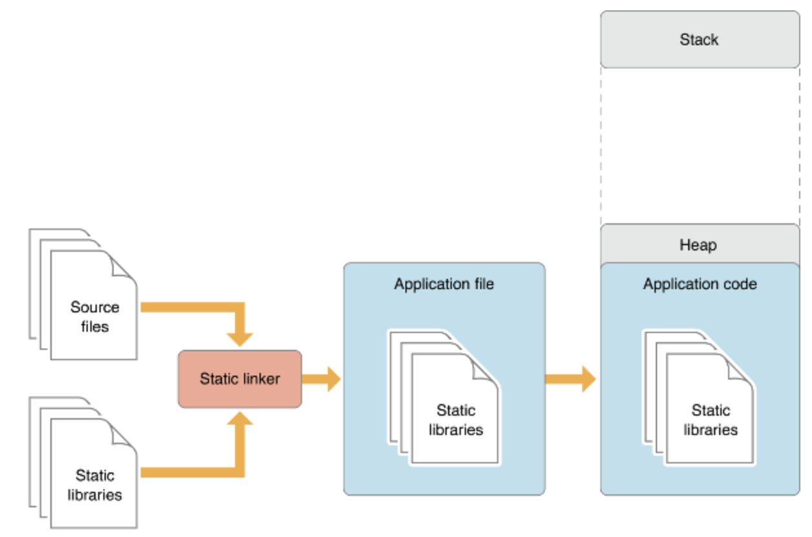
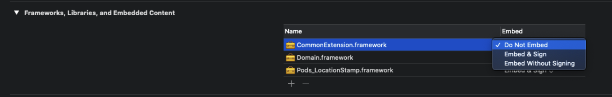
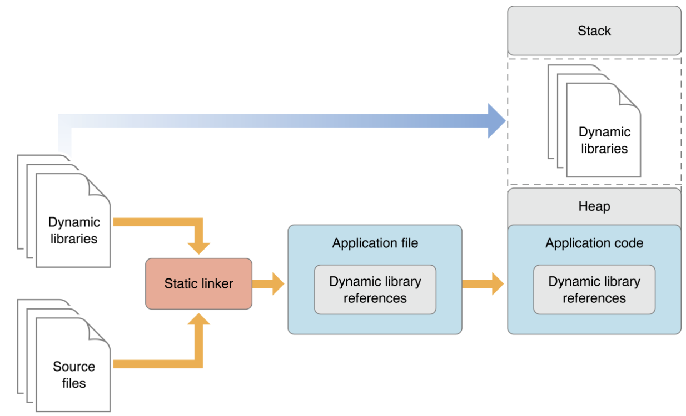
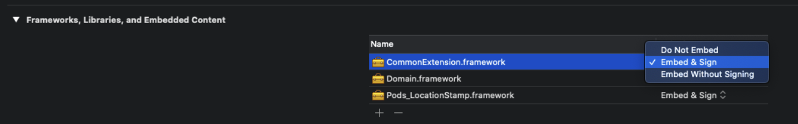

# Dynamic Framework vs Static Framework vs Static Library

> Reference
>
> * https://minsone.github.io/ios/mac/ios-framework-part-1-static-framework-dynamic-framework
> * https://stackoverflow.com/questions/15331056/library-static-dynamic-or-framework-project-inside-another-project
> * https://ios-development.tistory.com/281
> * https://jjhyuk15.medium.com/ios-static-dyanamic-framework-1e00871f35d6
>
> 읽어볼만한 글
>
> * [static linking vs dynamic linking](https://stackoverflow.com/questions/1993390/static-linking-vs-dynamic-linking/61140381#61140381)
> * https://medium.com/@zippicoder/libraries-frameworks-swift-packages-whats-the-difference-764f371444cd

## 결론

* Library
  * library는 기본적으로 호출할 수 있는 함수들의 집합, 일반적으로 클래스로 구성된다. 각 호출은 일부 작업을 수행하고 제어를 클라이언트에게 반환한다.
  * 사용하는 주체 가 기능을 요청하며 사용 (언제 요청 할지, 언제 응답 받을지, 언제 결과 처리할 지 모두 주체가 정함)
  * 하나 이상의 아키텍처에 대해 컴파일된 Mach-O 파일 모음 이다.
* Framework
  *  더 많은 동작이 내장된 추상적인 디자인을 구현한다. 이를 사용하려면 서브클래싱 또는 자체 클래스를 연결하여 프레임워크의 다양한 위치에 동작을 삽입해야 한다. 그러면 프레임워크의 코드가 해당 지점에서 코드를 호출한다. 프로그램의 주요 제어가 반전되어 사용자에게서 프레임워크로 이동한다. (IoC)
  * 사용하는 주체 와 기능의 제어권이 역전 IoC(Inversion of Control). Combine, RxSwift와 같이 bind 시켜놓으면 이벤트 일어날 시 처리되는 로직

한마디로 코드 뭉치를 따로 빼놓은 것을 Library라고 하며 Framework는 코드 뿐만 아니라 image, asset Bundle 등을 포함하고 있다.
이해하기로는 Framework가 Library보다 큰 개념

* Static Library ( `.a` )
  * static library는 정적으로 존재하는 라이브러리라고 할 수 있는데 compile time동안에 메모리에 올라간다.
    * compile time동안 static linker를 이용해 라이브러리 object file과 application object 파일과 함께 병합해서 하나의 실행 파일로 만들어준다.
  * 앱이 실행되는 동안 메모리에 항상 상주하고 있기 때문에 메모리를 항상 차지하고 있다. 
  * 메모리에 항상 상주하고 있기 때문에 빠르다.
* Dynamic Library ( `.dylib`)
  * runtime에서 메모리에 올라간다.
    * 라이브러리의 reference 만 갖고 있고 실제 메모리에 적재하지 않음.
    * 런타임에서 링킹하고 있기 때문에 링커에러가 발생할 수 있음.
    * 따라서 모든 동적 라이브러리를 복사(적재)하고 링킹해야 하므로 시작시간이 느리다.
    * 대신 필요할 때만 메모리에 적재하고 쓰기 때문에 메모리를 효율적으로 사용할 수 있음.

사실 Library는 잘 사용하지 않는다. Framework부분만 집중적으로 봐도 된다.

Framework의 경우 Mach-O Type에 따라 프레임워크가 다르게 생성된다.

Static, Dynamic 인데, 두 프레임워크 타입은 컴파일된 코드를 참조하는 방식에 차이가 있다.

* Static Framework

  * 앱이 사용하는 프레임워크의 코드는 컴파일 시간 동안 static linker에 의해 앱의 실행파일 안에 복사된다.

  * 아래 그림을 해석하면

    Source file과 Static framework를 static linker에 의해 병합된다.(그림은 libraries라고 나와있는데 framework라고 생각하면 됨)
    병합된 내용은 Application file(실행파일)이다.
    App을 실행시키면 Application code 영역에 static framework가 같이 적재된다.(그림에 나와있듯이 Heap영역에 상주 중임)
    

  * 앱 실행파일에 직접 link되어 있으므로 런타임상 속도가 빠르다.

  * 참조가 아닌 코드가 복사되기에 안정적이다.

  * 항상 메모리에 상주하고 있기 때문에 불필요한 낭비를 초래

  * Framwork안에 이미지 파일과 같은 리소스 파일이 있어도 사용불가

  * static framework의 경우 Do Not Embed 선택
    

* Dynamic Framework

  * 런타임 상에서 Mach-O 파일과 참조관계(link)이다.
  * 아래 그림을 해석하면
    Source file과 dynamic framework를 static linker에 의해 병합된다.
    이때 dynamic framework의 경우 framework 자체가 아닌 reference가 들어간다.
    병합된 내용은 Application file(실행 파일)이다.
    App을 실행시키고 stack frame이 실행됨에 따라 해당 모듈 호출 시 Application code에서 framework reference를 찾아가서 메모리에 적재한다.
    
  * framework 내에 이미지나 View같은 Resource 파일 혹은 Bundle을 Embeded할 수 있다. (사용할 수 있다.)
  * 링크를 참조하기에 static에 비해 메모리가 자유롭다.(필요할 때 로드시키기에 lazy하다.)
  * App실행 시 framework 전체가 올라가는게 아니기 때문에 빌드속도가 어느정도 단축된다.
  * 디버그 시 필요한 [dSYM파일](https://jjhyuk15.medium.com/ios-dsym-%EC%9D%B4%EB%9E%80-%EB%AC%B4%EC%97%87%EC%9D%B8%EA%B0%80-69516fa7ce99?p=69516fa7ce99)을 프레임워크 개발자가 제공해야 한다.
  * static에 비해 런타임 속도가 느리다.
  * dynamic framework의 경우 Embed & Sign 선택 (*sign은 애플개발자 계정에서도 사용되는 프레임워크의 signing파일이라고 이해)
    

## 어떤 Mach-O 타입(Static framework vs Dynamic framework)을 써야 하나 (library는 논외로 한다. 잘안쓰임)

일반적으로 리소스를 스스로 가지고 있고나 전체 소스를 제공하는 경우(한마디로 image, asset이 있는 경우) dynamic framework를, 그렇지 않고 SDK형태로 배포하는 경우는 Static Framework를 사용한다.

