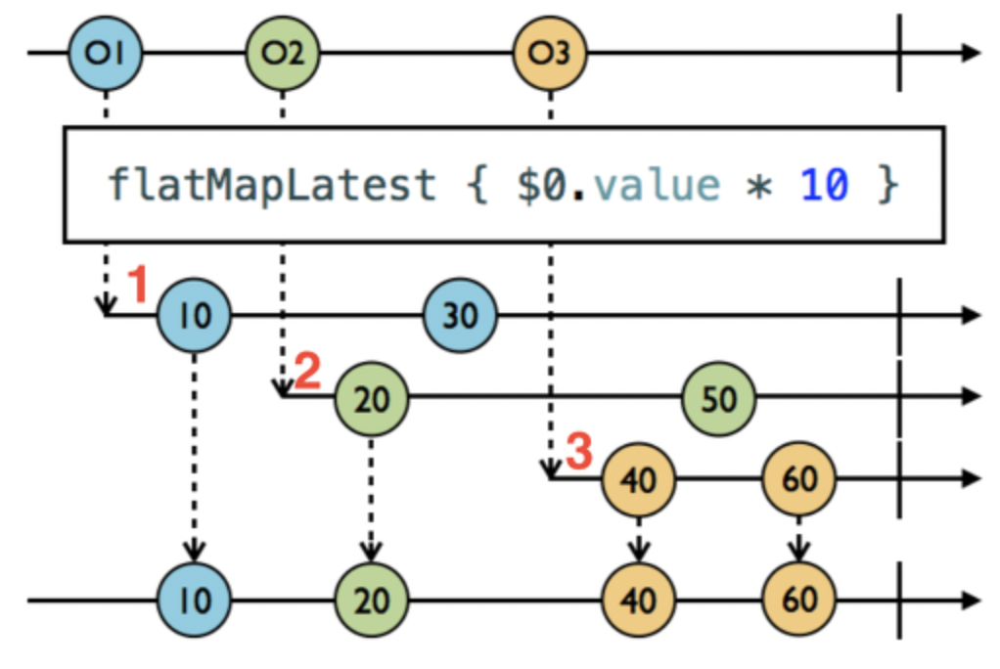
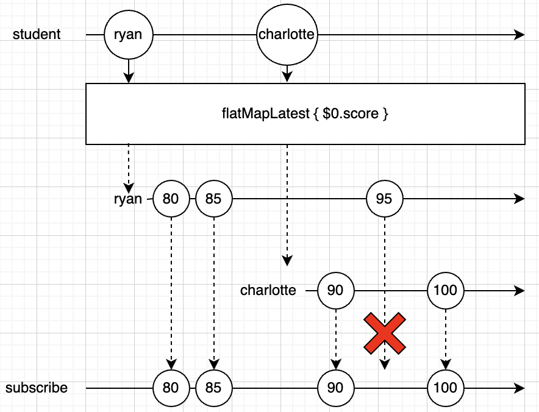
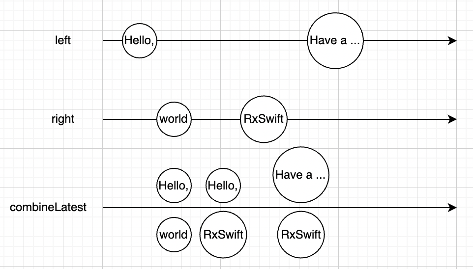
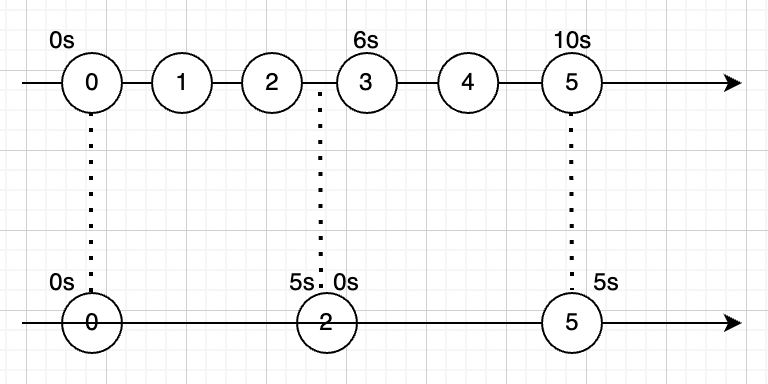
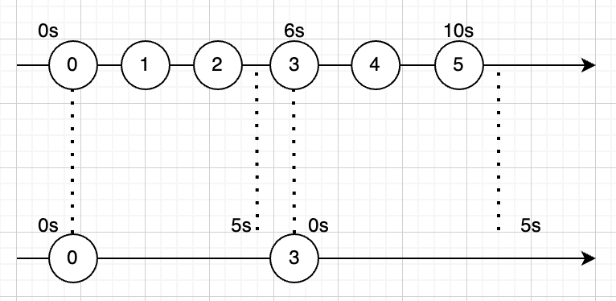
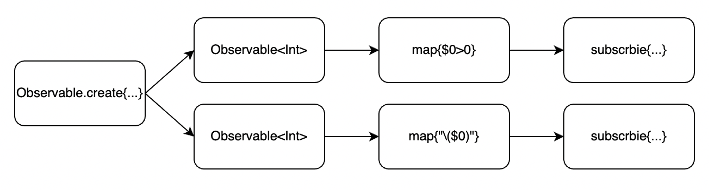
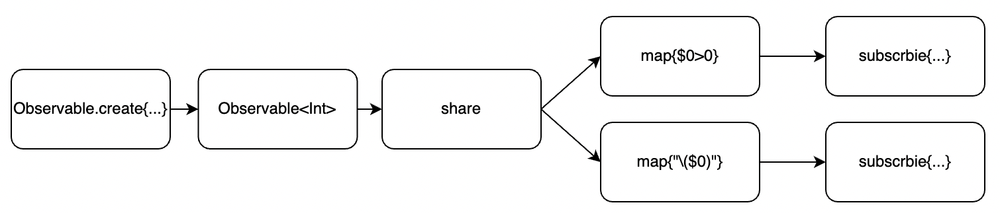

# OperatorPractice

## map

방출되는 값에 어떤 변형을 주어 방출하는 오퍼레이터

**#1**

```swift
Observable.of(1, 2, 3)
    .map({ (result: Int) -> Int in
      result * 10
    })
    .subscribe(onNext:{
      print($0)
    })
    .disposed(by: disposeBag)
```

**결과**

```
10
20
30
```

**#2**

```swift
Observable.of(1, 2, 3)
    .map({ (result: Int) -> String in
      "\(result)"
    })
    .subscribe(onNext:{
      print("String: " + $0)
    })
  // onNext가 없으면 Event<Element> 를 받는데 이는 next, error 이런 이벤트를 핸들링 하기 위함임.
//    .subscribe({
//      print("String: " + $0)
//      switch $0{
//      case let .next(value):
//        print(value)
//      case let .error(error):
//        print(error)
//      default:
//        print("finished")
//      }
//    })
    .disposed(by: disposeBag)
```

**결과**

```
String: 1
String: 2
String: 3
```


## enumerated

index와 value를 파라미터로 받아서 값으로 리턴

```swift
Observable.of(1, 2, 3, 4, 5)
    .enumerated()
    .map({ (index: Int, value: Int) -> String in
      index > 3 ? "\(value)" : "x"
    })
    .subscribe(onNext:{
      print($0)
    })
    .disposed(by: disposeBag)
```

**결과**

```
x
x
x
x
5
```


## flatMap

이벤트를 다른 Observable로 변경

Observable 시퀀스의 element당 한개의 새로운 Observable 시퀀스를 생성한다. 이렇게 생성된 여러개의 새로운 시퀀스를 하나의 시퀀스로 만들어 준다.

Observer in Observer를 다룬다.  (Observer 안에 Observer이며, 내부 Observable을 inner Observable이라 한다. Observable안에 있는 Observable,)

**#1**

```swift
Observable.of(1, 2, 3)
    .flatMap({ (result: Int) -> Observable<String> in
      Observable.just("\(result)")
    })
    .subscribe(onNext:{ (result: String) in
      print("String: " + result)
    })
    .disposed(by: disposeBag)
```

**결과**

```
String: 1
String: 2
String: 3
```


**#2**

비동기 처리할 때 많이 쓰임

> https://jcsoohwancho.github.io/2019-09-09-Rxswift%EC%97%B0%EC%82%B0%EC%9E%90-flatmap/

```swift
// 1초마다 second를 방출
let timer1 = Observable<Int>
	.interval(RxTimeInterval.seconds(1), scheduler: MainScheduler.instance)
	.map({"o1: \($0)"})
// 2초마다 second를 방출
let timer2 = Observable<Int>
	.interval(RxTimeInterval.seconds(2), scheduler: MainScheduler.instance)
	.map({"o2: \($0)"})

Observable.of(timer1, timer2)
    .flatMap({ (emit: Observable<String>) -> Observable<String> in
      emit
    })
    .subscribe({ (result: Event<String>) -> Void in
      print(result)
      switch result{
      case let .next(value):
        print(value)
      default:
        print("finished")
      }
    })
    .disposed(by: disposeBag)
```

**결과**

```
next(o1: 0)
o1: 0
next(o1: 1)
o1: 1
next(o2: 0)
o2: 0
next(o1: 2)
o1: 2
next(o1: 3)
o1: 3
next(o2: 1)
o2: 1
next(o1: 4)
o1: 4
next(o1: 5)
o1: 5
next(o2: 2)
o2: 2
```

> # Question
>
> ## #1
>
> **map**
>
> ```swift
> Observable.of(timer1, timer2)
>  .map({ (emit: Observable<String>) -> Observable<String> in
>    emit
>  })
>  .subscribe(onNext: { (result: Observable<String>) in
>    print(result)
>  })
>  .disposed(by: disposeBag)
> ```
>
> **결과**
>
> ```
> RxSwift.(unknown context at $12071da78).Map<Swift.Int, Swift.String>
> RxSwift.(unknown context at $12071da78).Map<Swift.Int, Swift.String>
> next(o1: 0)
> o1: 0
> next(o1: 1)
> o1: 1
> next(o2: 0)
> o2: 0
> next(o1: 2)
> o1: 2
> next(o1: 3)
> o1: 3
> next(o2: 1)
> o2: 1
> next(o1: 4)
> o1: 4
> next(o1: 5)
> o1: 5
> next(o2: 2)
> o2: 2
> ```
>
> **flatMap**
>
> ```swift
> Observable.of(timer1, timer2)
>  .flatMap({ (emit: Observable<String>) -> Observable<String> in
>    emit
>  })
>  .subscribe(onNext: { (result: String) -> Void in
>    print(result)
>  })
>  .disposed(by: disposeBag)
> ```
>
> **결과**
>
> ```
> o1: 0
> o1: 1
> o2: 0
> o1: 2
> o1: 3
> o2: 1
> o1: 4
> o1: 5
> o2: 2
> ```
>
> map은 Observable값 그대로 받는 반면에: Observable<Element> --> subscribe({ Observable<Element> ... })
>
> flatMap은 언래핑해서 받고 있음: Observable<Element> --> subscribe({ Element ... })
>
> **왜 이런일이 발생할까?**
>
> 
>
> ## # 더 간단한 코드를 보면 ...
>
> **map**
>
> ```swift
> Observable.of(1, 2, 3)
>  .map({ (emit: Int) -> Observable<Int> in
>    Observable.just(emit)
>  })
>  .subscribe(onNext:{ (result: Observable<Int>) in
>    print(result)
>  })
>  .disposed(by: disposeBag)
> ```
>
> **flatMap**
>
> ```swift
> Observable.of(1, 2, 3)
> // return은 Observable<Int> 인데
>  .flatMap({ (emit: Int) -> Observable<Int>/*🌟*/ in
>    Observable.just(emit)
>  })
> // subscribe에서 받는 값은 upwrapping
>  .subscribe(onNext:{ (result: Int)/*🌟*/ in
>    print(result)
>  })
>  .disposed(by: disposeBag)
> ```
>
> map, flatMap에서의 return 타입만 다르고 subscribe에서 받는 값은 타입이 같음.
>
> **flatMap의 경우 Observable을 리턴하는데 받는 값은 unwrapping 한 값임. 왜?**
>
> element당 새로운 Observable 시퀀스를 만들어야 하기 때문에 return값이 Observable이다.
> 하나의 시퀀스(subscribe)를 만들었고, 거기에 대한 value를 핸들링하니까 당연히 unwrapping된 값이어야 한다.
>
> (아래 Answer를 보자)
>
> # Answer
>
> https://rhammer.tistory.com/300 에서 답을 찾을 수 있었다.
>
> 우선 flatMap이 어떤 것인지 부터 자세히 볼 필요가 있다.
>
> 문서에는 flatMap을 다음과 같이 정의하고 있다.
>
> Projects each element of an observable sequence to an observable sequence and merges the resulting observable sequences into one observable sequence
>
> **Observable시퀀스의 element당 한 개의 새로운 Observable 시퀀스를 생성한다.** **이렇게 생성된 여러개의 새로운 시퀀스를 하나의 시퀀스로 합쳐준다.**
>
> 글만 봤을 때는 이해가 잘안갔는데 그림을 보면 알 수 있다.
>
> 
>
> 1. 01 엘리먼트가 flatMap을 만나 새로운 시퀀스가 생겼다. 이 시퀀스는 01엘리먼트의 vlaue에 대한 시퀀스다.
>
>    새로 생성된 시퀀스에 10 이벤트가 발생했고, 최종 시퀀스(제일 하단 시퀀스)로 전달되었다.
>
>    **즉, 01엘리먼트의 value에 변동이 있으면, 이 시퀀스에 이벤트가 발생하는 것이다.(중요)**
>
> 2. 02 엘리먼트가 flatMap을 만나 새로운 시퀀스가 생겼다. 이 시퀀스는 02엘리먼트의 value에 대한 시퀀스다.
>
>    새로 생성된 시퀀스에 20 이벤트가 발생했고, 최종 시퀀스로 전달되었다.
>
>    즉, 02엘리먼트의 value에 변동이 있으면, 이 시퀀스에 이벤트가 발생하는 것이다.
>
> 3. 01 엘리먼트의 value에 변동이 생겼다. 1에서 4로 바뀐 것.(그림에는 표시 안함)
>
>    flatMap이 생성한 시퀀스 중 01엘리먼트에 해당하는 시퀀스에 40이라는 이벤트가 발생하여 최종 시퀀스로 전달되었다.
>
> 4. 02 엘리먼트의 value에 변동이 생겼다. 2에서 5로 바뀐 것.
>
>    flatMap이 생성한 시퀀스 중 02엘리먼트에 해당하는 시퀀스에 50이라는 이벤트가 발생하여 최종 시퀀스로 전달되었다.
>
> flatMap은 한 시퀀스의 엘리먼트를 전달받아 이를 변형한 새로운 시퀀스를 만들고(엘리먼트 하나 당 시퀀스하나 생성)
> 이 시퀀스에서 발생하는 모든 이벤트를 최종 시퀀스로 전달한다.
>
> 코드를 보자
>
> ```swift
> struct Student{
>   var score: BehaviorSubject<Int>
> }
> 
> // Student 타입의 변수 2개를 생성 ryan은 80, charlotte는 90으로 초기화 되어있다.
> let ryan = Student(score: BehaviorSubject(value: 80))
> var charlotte = Student(score: BehaviorSubject(value: 90))
> 
> let student = PublishSubject<Student>()
> 
> // student의 시퀀스를 변환한다.
> student
> // Student 에서 Observable<Int>으로 변환
> 	.flatMap({ (element: Student) -> Observable<Int> in
>   	element.score
> 	})
>   .subscribe(onNext:{ (result: Int) in
>   	print(result)
> 	})
>   .disposed(by: disposeBag)
> ```
>
> 그림으로 보면 이렇다.
>
> 
>
> next 이벤트를 발생 시켜 어떤 결과를 내는지 보자
>
> ```swift
> student.onNext(ryan)
> ryan.score.onNext(85)
> student.onNext(charlotte)
> charlotte.score.onNext(95)
> charlotte.score.onNext(100)
> ```
>
> **결과**
>
> ```
> 80
> 85
> 90
> 95
> 100
> ```
>
> 결과가 그렇게 중요한 건 아니고, 어떤 일이 일어났는지가 중요하다.
>
> flatMap은 observable의 element변화를 계속 관찰하고 있다. (ryan의 score (Observable이다.)에 next 이벤트를 방출하면 flatMap이 알아차린다.)
>
> 그림으로 보면 이렇다.
>
> 
>
> 왜 쓰는지에 대해 알아보기 위해 map과 비교해보겠다.
>
> ```swift
> student
>     .map({ (element: Student) -> Observable<Int> in
>       element.score
>     })
>     .subscribe(onNext:{ (result: Observable<Int>) in
>       result.subscribe(onNext:{
>         print($0)
>       })
>         .disposed(by: disposeBag)
>     })
>     .disposed(by: disposeBag)
> 
> student.onNext(ryan)
> ryan.score.onNext(85)
> student.onNext(charlotte)
> charlotte.score.onNext(95)
> charlotte.score.onNext(100)
> ```
>
> **결과**
>
> ```
> 80
> 85
> 90
> 95
> 100
> ```
>
> 같은 결과를 내기 위해서는 subscribe안에 subscribe를 하나 더 만들어야 한다.
>
> 결국에는 이짓거리(subscribe안에 subscribe하나 더 넣는 거)를 안하려고 flatMap을 쓴다.
>
> 정리하자면
>
> flatMap은 Observable시퀀스의 element당 하나의 새로운 Observable 시퀀스를 생성한다.
> 이렇게 생성된 여러개의 새로운 시퀀스를 하나의 시퀀스로 합쳐준다.
>
> ```swift
> Observable.of(1, 2, 3)
> // element( result: Int )당 하나의 새로운 Observable시퀀스( Observable<String> )을 생성
>     .flatMap({ (result: Int) -> Observable<String> in
> 			...
> 		})
> // 이렇게 생성된 여러개의 시퀀스를 하나의 시퀀스( subscribe로 하나의 시퀀스 )로 합쳐준다.
> 		.subscribe(onNext:{ (result: String) in
> 			...
>     })
> 		.disposed(by: disposeBag)
> ```
>
> 위의 **Question #1** 에 대한 답이 된다.
>
> element당 새로운 Observable 시퀀스를 만들어야 하기 때문에 return값이 Observable이다.
> 하나의 시퀀스(subscribe)를 만들었고, 거기에 대한 value를 핸들링하니까 당연히 unwrapping된 값이어야 한다.


## flatMapLatest

https://rhammer.tistory.com/303 를 참고 했음.

기존 옵저버블이 동작하고 있는 도중에 새로운 옵저버블이 전달되면 기존것은 끊기게 되는 것을 제외하고는 flatMap과 동작이 똑같음.

flatMapLatest는 flatMap과 switchLatest두개가 합쳐진 형태이다.

switchLatest는 Observer in Observer 를 다룬다. 가장 최근에 추가된 시퀀스의 inner Observable만 넘겨준다.

즉, switchLatest와 flatMap을 합친 flatMapLatest는 가장 마지막으로 추가된 시퀀스의 inner Observable 이벤트만 subscribe하게 된다.

그림을 보면 아래와 같다.



1. flatMap과 마찬가지로 01 엘리먼트의 value에 해당하는 시퀀스가 생긴다. 01엘리먼트의 최초 value인 1에 10을 곱하여 최종 시퀀스로 전달된다.

2. 마찬가지로 02엘리먼트의 value에 해당하는 시퀀스가 생긴다. 02엘리먼트의 최초 value인 2에 10을 곱하여 최종 시퀀스로 20이 전달된다.

   그리고 01엘리먼트의 value가 3으로 변경되었다. 01시퀀스에는 30이 전달되었다.

   하지만 최종 시퀀스에는 전달되지 않는다. 가장 마지막에 생성된 시퀀스인 02시퀀스가 있기 때문 01시퀀스는 앞으로 계속 무시된다.

3. 03엘리먼트에 해당하는 시퀀스가 생긴다. 03엘리먼트의 최초 value인 4에 10을 곱하여 최종 시퀀스로 40이 전달된다.

   그리고 02엘리먼트의 value가 5로 변경되었다. 02시퀀스에는 50이 전달되었다.

   하지만 최종 시퀀스에는 전달되지 않는다. 가장 마지막에 생성된 시퀀스인 03시퀀스가 있기 때문 02시퀀스는 앞으로 계속 무시된다.

   그리고 03엘리먼트의 value가 6으로 변경되었다. 03시퀀스에는 60이 전달되었다.

   최종 시퀀스에는 60이라는 값이 전달되었다. 03시퀀스는 **가장 마지막에 생성된 시퀀스**이기 때문이다.

네트워크 통신에서 많이 사용됨.
예를 들어 검색어 자동완성 같이 G만 쳤을 때 나오는 것과 GO를 쳤을 때 나오는 것이 다르듯
사용자가 마지막에 친 문자열에 대해서 자동완성을 시켜주는 것과 같은 기능을 구현할 수 있다.
G에서 이어지는 동작이 끊기고 마지막에 방출된 GO로 이어지는 동작만 살아있는 것

**#1**

```swift
struct Student{
  var score: BehaviorSubject<Int>
}

// Student 타입의 변수 2개를 생성 ryan은 80, charlotte는 90으로 초기화 되어있다.
let ryan = Student(score: BehaviorSubject(value: 80))
let charlotte = Student(score: BehaviorSubject(value: 90))

let student = PublishSubject<Student>()

student
	.flatMapLatest({ (element: Student) -> Observable<Int> in
		element.score
	})
	.subscribe(onNext:{ (result: Int) in
		print(result)
  })
	.disposed(by: disposeBag)

student.onNext(ryan)
ryan.score.onNext(85)
// 여기서부터는 ryan 시퀀스는 무시된다.
student.onNext(charlotte)

// 얘는 누락됨
ryan.score.onNext(95)

charlotte.score.onNext(100)
```

**결과**

```
80
85
90
100
```

위 코드를 그림으로 보면 다음과 같다.

가장 마지막에 생성된 시퀀스가 charlotte 시퀀스이기 때문에 ryan의 95 엘리먼트는 무시되는 모습



> ## 같이 보면 좋은 내용
>
> * flatMapLatest를 이용해 요청한 결과를 받아서 다시 요청하기(콜백헬 없애기)/동시에 여러개 요청하기
>   * http://minsone.github.io/programming/reactive-swift-observable-chaining-async-task
> * 네트워크 요청은 single과 같이 쓰자
>   * https://ntomios.tistory.com/11


## filter

조건에 해당하는 값만 방출

**#1**

```swift
Observable.of(1, 2, 3, 4, 5)
    .filter({ (element: Int) -> Bool in
      element < 3
    })
    .subscribe(onNext:{ (result: Int) in
      print(result)
    })
    .disposed(by: disposeBag)
```

**결과**

```
1
2
```


## take

몇개의 엘리먼트를 가져올지 정해준다.

**#1**

```swift
Observable.of(1, 2, 3, 4)
    .take(2)
    .subscribe(onNext:{
      print($0)
    })
    .disposed(by: disposeBag)
```

**결과**

```
1
2
```


## take(while:)

조건식이 false가 되기 전까지는 방출하고 false가 되면 뒤로는 무시

**#1**

```swift
Observable.of(1, 2, 3, 4, 5)
    .take(while: {
      $0 != 5
    })
    .subscribe(onNext:{
      print($0)
    })
    .disposed(by: disposeBag)
```

**결과**

```
1
2
3
4
```


## take(until:)

어떤 다른 옵저버블의 실행이 있기전까지 가져오고 그 뒤론 종료

**#1**

```swift
let subject = PublishSubject<Int>()
let subject2 = PublishSubject<Int>()

subject
	.take(until: subject2)
	.subscribe(onNext:{
  	print($0)
	})
	.disposed(by: disposeBag)

subject.onNext(1)
subject.onNext(2)
subject2.onNext(10)
subject.onNext(3)
subject2.onNext(20)
subject.onNext(4)
```

**결과**

```
1
2
```


## startWith

Observable 시퀀스 앞에 값을 추가해준다.

**#1**

```swift
Observable.of(1, 2, 3, 4)
    .startWith(0)
    .subscribe(onNext:{
      print($0)
    })
    .disposed(by: disposeBag)
```

**결과**

```
0
1
2
3
4
```


## merge

참고: https://rhammer.tistory.com/309?category=649741

Observable 시퀀스를 순서없이 합쳐준다.
1번 2번 Observable이 있다고 했을 때 1번 시퀀스 방출 하고 2번 시퀀스 방출( 이건 concat()임 )이 아니라 
시퀀스에 대해 순서가 없이 그냥 흐름대로 합쳐준다.

**#1**

```swift
let left = Observable.of("0", "1")
let right = Observable.of("zero", "one")

//  let source = Observable.of(left, right)

// 이렇게 해도 됨
//  source.merge()
Observable.merge(left, right)
	.subscribe(onNext:{
  	print($0)
	})
	.disposed(by: disposeBag)
```

**결과**(순서는 먼저 오는 이벤트부터라 그때마다 다른 결과가 나온다.)

```
0
zero
1
one
```

**merge에 대한 몇가지 규칙**

* 내부 시퀀스가 종료되면 merge 시퀀스도 종료됨
* 내부 시퀀스가 complete되는 시점은 모두 독립적
* 만약 내부 시퀀스에서 에러가 발생하면 그 즉시 merge시퀀스도 에러를 발생시키며 종료됨

**merge(maxConcurrent:)**

예제에서는 2개의 시퀀스만 합쳤지만 2개 이상의 시퀀스를 합칠수도 있다.

`merge(maxConcurrent:)`오퍼레이터를 사용하면 된다. maxConcurrent개수만큼 합친다.
만약 maxConcurrent가 작아서 합쳐지지 못한 시퀀스는 큐에 대기하다가, 내부 시퀀스 중 하나가 complete되면 합쳐진다.


## withLatestFrom

참고: https://rhammer.tistory.com/349?category=649741

각기 두개의 Observable을 합성한다. 다만 첫번째 Observable의 이벤트가 발생해야 지만 2개를 묶어서 최종 시퀀스로 전달한다.
첫번째 이벤트가 없다면 최종시퀀스로 전달x

**#1**

```swift
let inputNumber = PublishSubject<Int>()
let inputString = PublishSubject<String>()

inputNumber
	.withLatestFrom(inputString){ (lhs: Int, rhs: String) -> String in
  	"\(lhs):\(rhs)"
  }
	.subscribe(onNext:{
  	print($0)
	})
	.disposed(by: disposeBag)

// 방출x
inputNumber.onNext(1)
inputString.onNext("one")

// 2:one
inputNumber.onNext(2)
inputString.onNext("two")
inputString.onNext("three")
inputString.onNext("four")

// 3:four
inputNumber.onNext(3)

// 4:four
inputNumber.onNext(4)

// 5:four
inputNumber.onNext(5)
```

**결과**

```
2:one
3:four
4:four
5:four
```


**#2**

특정 트리거가 발생했을 때, 특정 상태의 최신값을 얻고싶을 때 사용하면 좋다.

```swift
let button = PublishSubject<Void>()
let textField = PublishSubject<String>()

button
	.withLatestFrom(textField)
	.subscribe(onNext:{
  	print($0)
	})
	.disposed(by: disposeBag)

// textField에 입력중
textField.onNext("Par")
textField.onNext("Pari")
textField.onNext("Paris")

// 다 입력하고 버튼을 두번 탭
button.onNext(())
button.onNext(())
```

**결과**

```
Paris
Paris
```


## combineLatestF

참고: https://rhammer.tistory.com/311?category=649741

2개의 OBservable에 각각의 이벤트가 발생했을 때 최신 이벤트끼리 묶어서 최종 시퀀스에 전달한다.

두 시퀀스가 각각 최초 이벤트를 발생시켜야만 합쳐진 시퀀스에서 이벤트가 발생한다.

**#1**

```swift
let left = PublishSubject<String>()
let right = PublishSubject<String>()

Observable
	.combineLatest(left, right) { lastLeft, lastRight in
		"\(lastLeft) \(lastRight)"
	}
	.subscribe(onNext:{
  	print($0)
	})
	.disposed(by: disposeBag)

print("> Sending a value to left")
left.onNext("Hello, ")

print("> Sending a value to right")
right.onNext("world")

print("> Sending another value to right")
right.onNext("RxSwift")

print("> Sending another value to left")
left.onNext("Have a good day,")
```

**결과**

```
> Sending a value to left
> Sending a value to right
Hello,  world
> Sending another value to right
Hello,  RxSwift
> Sending another value to left
Have a good day, RxSwift
```

그림으로 표현아면 아래와 같다.



**#2**

```swift
let choice: Observable<DateFormatter.Style> = Observable.of(.short, .long)
let dates = Observable.of(Date())

Observable.combineLatest(choice, dates){ (format: DateFormatter.Style, when: Date) -> String in
		let formatter = DateFormatter()
	  formatter.dateStyle = format

		return formatter.string(from: when)
	}
	.subscribe(onNext:{
  	print($0)
	})
	.disposed(by: disposeBag)
```

**결과**

```
2022/03/07
March 7, 2022
```


## debounce & throttle

> Reference
>
> * https://green1229.tistory.com/m/178
> * https://opendoorlife.tistory.com/19

Rx에서는 사용자의 액션이나 정의해준 것에 따라 observable이 방출된다.
이 말은 만약 동시다발적으로 여러 액션을 취하면 observable이 따닥따닥 붙어서 방출된다는 얘기.

* 버튼을 여러번 클릭했을 때
* API 중복 호출을 막아주는 별도 조치를 취해줘야 하는데

debounce랑 throttle을 사용한다.

### throttle

지정된 시간동안 Observable이 내보낸 첫번째 엘리먼트와마지막 엘리먼트(latest 에 따라 다름)를 내보내는 Observable을 반환한다.
이 연산자는 DueTime보다 짧은 시간에 두개의 요소가 내보내지지 않도록 한다.
(참고: 방출하면  throttle 타이머 흘러감)

지정된 시간안에 수많은 이벤트가 발생해도 2개 이상 요소가 방출되지 않는다는 얘기임

throttle은 여러 요청중에서 값을 딱 한번만 보낼 때 사용한다. tableView infinity scroll에 많이 사용된다.
미친듯이 스크롤링 하면 요청이 여러번 이루어 질 수 있으니 요청이 한번 이루어지면 throttle로 딜레이를 줘서 의도하지 않은 요청을 막을 수 있다.
또는 button에도 사용되는데 미친듯이 button을 누르면 api call을 여러번 할 수도 있으니 throttle로 막는다. (chattering발생에 delay 주는거랑 똑같다.)

**#1**

latest가 true인 경우

```swift
Observable<Int>
    .interval(.seconds(2), scheduler: MainScheduler.instance)
    .take(6)
    .throttle(.seconds(5), scheduler: MainScheduler.instance)
    .subscribe(onNext:{
      print($0)
    })
    .disposed(by: disposeBag)
```

**결과**

```swift
0
2
5
```

latest가 true인 경우 지정된 시간이 지난 이후 마지막에 방출된 요소도 방출해준다. 따라서 throttle 시간이 5초 흘러갔을 때 4초에 방출된 2가 마지막 엘리먼트이므로 2가 방출된다. 그리고 다시 throttle은 0초부터 초를 센다. 5초가 지나고 10초에 방출된 5 엘리먼트를 방출한다.

그림으로 보면 다음과 같다.



**#2**

latest가 false인 경우

```swift
Observable<Int>
    .interval(.seconds(2), scheduler: MainScheduler.instance)
    .take(6)
		.throttle(.seconds(5), latest: false, scheduler: MainScheduler.instance)
    .subscribe(onNext:{
      print($0)
    })
    .disposed(by: disposeBag)
```

**결과**

```
0
3
```

latest가 false인 경우 지정된 시간동안은 어떠한 값도 방출하지 않는다. true일때와는 다르게 마지막에 방출된 값도 방출하지 않는다.

그림으로 보면 다음과 같다.



### debounce

지정된 시간간격 내에 마지막 하나의 source 이벤트를 최종 시퀀스에 방출한다. source 이벤트가 방출될 때마다 타이머는 초기화된다.

**#1**

```swift
Observable<Int>
    .interval(.seconds(2), scheduler: MainScheduler.instance)
    .take(3)
    .debounce(.seconds(1), scheduler: MainScheduler.instance)
    .subscribe(onNext: {
      print($0)
    })
    .disposed(by: disposeBag)
```

**결과**

```
0
1
2
```

시간 값을 보면 2초마다 timer가 발생하고 debounce 에서 1초로 설정했기에 1초 내에 다른 이벤트가 발생하지 않으므로 1초뒤 debounce된 Observable에 이벤트가 발생한다.

그림으로 보면 다음과 같다.


만약 deobunce에 2보다 큰값(interval에서 설정한 시간값보다 큰값)을 설정하면 아무것도 방출하지 않는다.

```swift
Observable<Int>
    .interval(.seconds(2), scheduler: MainScheduler.instance)
    .take(3)
// 만약 deobunce에 2보다 큰값을 설정하면 아무것도 방출하지 않는다.
    .debounce(.seconds(3), scheduler: MainScheduler.instance)
    .subscribe(onNext: {
      print($0)
    })
    .disposed(by: disposeBag)
```

**결과**

```
```


## share

참고: https://jusung.github.io/shareReplay/

share는 동일한 여러 Observable에 대해 하나의 시퀀스만 생성해준다. 즉, 리소스 비용을 줄여준다.

우선 share를 설명하기 전에 Observable의 특징하나를 기억하자. **Observable은 subscribe가 호출되기 전까지는 시퀀스를 생성하지 않는다.**

다음 코드는 share를 적용하지 않은 코드이다.

```swift
class ViewController: UIViewController{
  let disposeBag = DisposeBag()
  @IBOutlet weak var label: UILabel!
  @IBOutlet weak var button: UIButton!
  
  override func viewDidLoad() {
    super.viewDidLoad()
    
    let rx = Observable.of(100).debug("##")
      
    let result = button.rx.tap
      .flatMap{rx}
//      .share()
    result
      .map{$0>0}
      .bind(to: button.rx.isHidden)
      .disposed(by: disposeBag)
      
    
    result
      .map { "\($0)" }
      .bind(to: label.rx.text)
      .disposed(by: disposeBag)
  }
}
```

**결과**

```
2022-03-09 11:22:22.674: ## -> subscribed
2022-03-09 11:22:22.676: ## -> Event next(100)
2022-03-09 11:22:22.677: ## -> Event completed
2022-03-09 11:22:22.677: ## -> isDisposed
2022-03-09 11:22:22.677: ## -> subscribed
2022-03-09 11:22:22.677: ## -> Event next(100)
2022-03-09 11:22:22.677: ## -> Event completed
2022-03-09 11:22:22.678: ## -> isDisposed
```

문제가 뭐냐면 동일한 시퀀스가 subscribe 갯수만큼 생성되었다. 2개는 최종 결과는 다를지 몰라도 `observable`을 통해 동일하게 next(100)을 방출한 값을 사용한다. next(100)이 두번 발생했다. 즉, 시퀀스가 2개라는 뜻

그림으로 보면 다음과 같다.



> 참고로 bind(to:)를 적지 않고 subscrbie{...} 를 적었는데 bind(to:)는 subscribe의 별칭(alias)으로 subscrbie를 호출한 것과 동일하다.

share는 subscribe할 때마다 새로운 시퀀스가 생성되지 않고, 하나의 시퀀스에서 방출되는 엘리먼트를 공유해 사용할 수 있다.

```swift
class ViewController: UIViewController{
  let disposeBag = DisposeBag()
  @IBOutlet weak var label: UILabel!
  @IBOutlet weak var button: UIButton!
  
  override func viewDidLoad() {
    super.viewDidLoad()
    
    let rx = Observable.of(100).debug("##")
      
    let result = button.rx.tap
      .flatMap{rx}
      .share()
    result
      .map{$0>0}
      .bind(to: button.rx.isHidden)
      .disposed(by: disposeBag)
      
    
    result
      .map { "\($0)" }
      .bind(to: label.rx.text)
      .disposed(by: disposeBag)
  }
}
```

**결과**

그림으로 보면 다음과 같다.



`share()`는 `subscribe()`가 처음 호출될 때 (Subscriptoin횟수가 0 -> 1 일때)만 Subscription을 생성하고, 이후 두번째 세번째로 `subscribe()`가 호출되면 새로운 Subscription을 생성하는 것 대신 이미 만들어진 Subscription을 이후 `subscribe()`를 호출한 곳에 공유해 사용한다.

만약 `share()`에 `subscribe()`한 Subscription이 모두 `disposed` 되면 `share()`는 공유했던 Subscription을 `dispose` 시킨다.

이후 다른 `subscribe()`가 호출되면 `share()`는 새로운 Subscription을 생성한다. 그렇기 때문에 `share()`는 completed 되지 않는 `Observable`에 사용하는 것이 안전하다. 혹은 공유하는 시퀀스가 completed 된 후 새로운 `Observable`이 생성되지 않는다고 확신할 때 사용해야한다.

> 예제를 playground가 아닌 xcodeproj 에서 한 이유도 이와 같은 맥락이다 playground에서 아래와 같은 코드를 실행하면 2번째 시퀀스가 수행되기 전에 completed 되기 때문에 share 예제를 보여주기에 어려움이 있다.
>
> ```swift
> let observable = Observable.of(1)
> 	.debug("### ")
> 	.share()
> 
> 
> observable
> 	.map{ $0 * 2 }
> 	.subscribe(onNext:{
> 		print($0)
> 	})
> 	.disposed(by: disposeBag)
> 
> observable
> 	.map{ $0 * 3 }
> 	.subscribe(onNext:{
> 		print($0)
> 	})
> 	.disposed(by: disposeBag)
> ```
>
> **결과**
>
> ```
> 2022-03-09 11:16:26.771: ###  -> subscribed
> 2022-03-09 11:16:26.771: ###  -> Event next(1)
> 2
> 2022-03-09 11:16:26.772: ###  -> Event completed
> 2022-03-09 11:16:26.772: ###  -> isDisposed
> 2022-03-09 11:16:26.814: ###  -> subscribed
> 2022-03-09 11:16:26.815: ###  -> Event next(1)
> 3
> 2022-03-09 11:16:26.815: ###  -> Event completed
> 2022-03-09 11:16:26.815: ###  -> isDisposed
> ```
>
> 물론 이렇게 해도 되지만 위에 처음 예제가 더 직관적이다.
>
> ```swift
> let observable = PublishSubject<Int>()
>   
> let reulst = observable.debug().share()
> 
> reulst
> 	.map{ $0 * 2 }
> 	.subscribe(onNext:{
>   	print($0)
> 	})
> 	.disposed(by: disposeBag)
> 
> reulst
> 	.map{ $0 * 3 }
> 	.subscribe(onNext:{
>   	print($0)
> 	})
> 	.disposed(by: disposeBag)
> 
> observable.onNext(1)
> ```
>
> **결과**
>
> ```
> 2022-03-09 11:30:59.207: OperatorPractice.playground:643 (__lldb_expr_183) -> subscribed
> 2022-03-09 11:30:59.207: OperatorPractice.playground:643 (__lldb_expr_183) -> Event next(1)
> 2
> 3
> ```
>
> 

