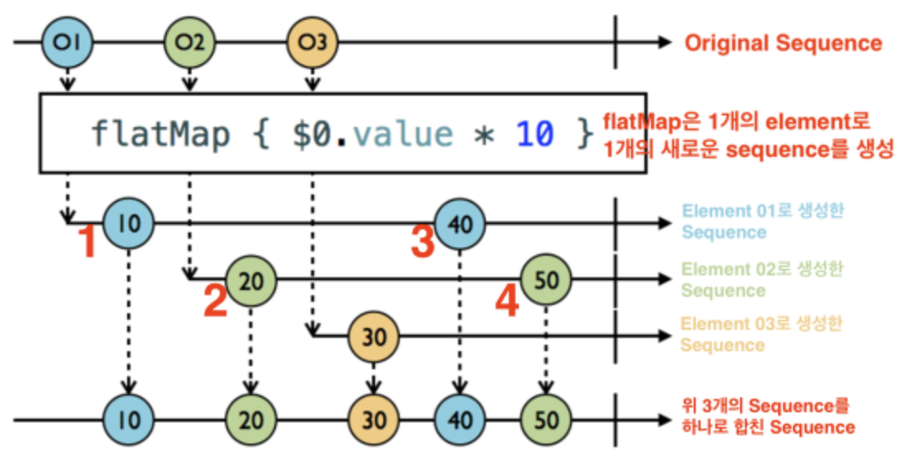
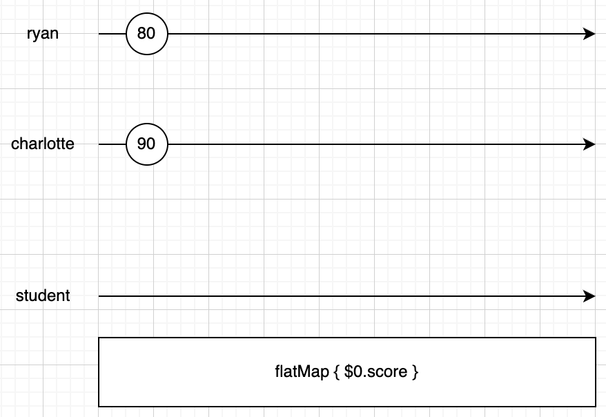

# OperatorPractice

## map

방출되는 값에 어떤 변형을 주어 방출하는 오퍼레이터

**#1**

```swift
Observable.of(1, 2, 3)
    .map({ (result: Int) -> Int in
      result * 10
    })
    .subscribe(onNext:{
      print($0)
    })
    .disposed(by: disposeBag)
```

**결과**

```
10
20
30
```

**#2**

```swift
Observable.of(1, 2, 3)
    .map({ (result: Int) -> String in
      "\(result)"
    })
    .subscribe(onNext:{
      print("String: " + $0)
    })
  // onNext가 없으면 Event<Element> 를 받는데 이는 next, error 이런 이벤트를 핸들링 하기 위함임.
//    .subscribe({
//      print("String: " + $0)
//      switch $0{
//      case let .next(value):
//        print(value)
//      case let .error(error):
//        print(error)
//      default:
//        print("finished")
//      }
//    })
    .disposed(by: disposeBag)
```

**결과**

```
String: 1
String: 2
String: 3
```


## enumerated

index와 value를 파라미터로 받아서 값으로 리턴

```swift
Observable.of(1, 2, 3, 4, 5)
    .enumerated()
    .map({ (index: Int, value: Int) -> String in
      index > 3 ? "\(value)" : "x"
    })
    .subscribe(onNext:{
      print($0)
    })
    .disposed(by: disposeBag)
```

**결과**

```
x
x
x
x
5
```


## flatMap

이벤트를 다른 Observable로 변경

Observable 시퀀스의 element당 한개의 새로운 Observable 시퀀스를 생성한다. 이렇게 생성된 여러개의 새로운 시퀀스를 하나의 시퀀스로 만들어 준다.

**#1**

```swift
Observable.of(1, 2, 3)
    .flatMap({ (result: Int) -> Observable<String> in
      Observable.just("\(result)")
    })
    .subscribe(onNext:{ (result: String) in
      print("String: " + result)
    })
    .disposed(by: disposeBag)
```

**결과**

```
String: 1
String: 2
String: 3
```


**#2**

비동기 처리할 때 많이 쓰임

> https://jcsoohwancho.github.io/2019-09-09-Rxswift%EC%97%B0%EC%82%B0%EC%9E%90-flatmap/

```swift
// 1초마다 second를 방출
let timer1 = Observable<Int>
	.interval(RxTimeInterval.seconds(1), scheduler: MainScheduler.instance)
	.map({"o1: \($0)"})
// 2초마다 second를 방출
let timer2 = Observable<Int>
	.interval(RxTimeInterval.seconds(2), scheduler: MainScheduler.instance)
	.map({"o2: \($0)"})

Observable.of(timer1, timer2)
    .flatMap({ (emit: Observable<String>) -> Observable<String> in
      emit
    })
    .subscribe({ (result: Event<String>) -> Void in
      print(result)
      switch result{
      case let .next(value):
        print(value)
      default:
        print("finished")
      }
    })
    .disposed(by: disposeBag)
```

**결과**

```
next(o1: 0)
o1: 0
next(o1: 1)
o1: 1
next(o2: 0)
o2: 0
next(o1: 2)
o1: 2
next(o1: 3)
o1: 3
next(o2: 1)
o2: 1
next(o1: 4)
o1: 4
next(o1: 5)
o1: 5
next(o2: 2)
o2: 2
```

> # Question
>
> ## #1
>
> **map**
>
> ```swift
> Observable.of(timer1, timer2)
>  .map({ (emit: Observable<String>) -> Observable<String> in
>    emit
>  })
>  .subscribe(onNext: { (result: Observable<String>) in
>    print(result)
>  })
>  .disposed(by: disposeBag)
> ```
>
> **결과**
>
> ```
> RxSwift.(unknown context at $12071da78).Map<Swift.Int, Swift.String>
> RxSwift.(unknown context at $12071da78).Map<Swift.Int, Swift.String>
> next(o1: 0)
> o1: 0
> next(o1: 1)
> o1: 1
> next(o2: 0)
> o2: 0
> next(o1: 2)
> o1: 2
> next(o1: 3)
> o1: 3
> next(o2: 1)
> o2: 1
> next(o1: 4)
> o1: 4
> next(o1: 5)
> o1: 5
> next(o2: 2)
> o2: 2
> ```
>
> **flatMap**
>
> ```swift
> Observable.of(timer1, timer2)
>  .flatMap({ (emit: Observable<String>) -> Observable<String> in
>    emit
>  })
>  .subscribe(onNext: { (result: String) -> Void in
>    print(result)
>  })
>  .disposed(by: disposeBag)
> ```
>
> **결과**
>
> ```
> o1: 0
> o1: 1
> o2: 0
> o1: 2
> o1: 3
> o2: 1
> o1: 4
> o1: 5
> o2: 2
> ```
>
> map은 Observable값 그대로 받는 반면에: Observable<Element> --> subscribe({ Observable<Element> ... })
>
> flatMap은 언래핑해서 받고 있음: Observable<Element> --> subscribe({ Element ... })
>
> **왜 이런일이 발생할까?**
>
> 
>
> ## # 더 간단한 코드를 보면 ...
>
> **map**
>
> ```swift
> Observable.of(1, 2, 3)
>  .map({ (emit: Int) -> Observable<Int> in
>    Observable.just(emit)
>  })
>  .subscribe(onNext:{ (result: Observable<Int>) in
>    print(result)
>  })
>  .disposed(by: disposeBag)
> ```
>
> **flatMap**
>
> ```swift
> Observable.of(1, 2, 3)
> // return은 Observable<Int> 인데
>  .flatMap({ (emit: Int) -> Observable<Int>/*🌟*/ in
>    Observable.just(emit)
>  })
> // subscribe에서 받는 값은 upwrapping
>  .subscribe(onNext:{ (result: Int)/*🌟*/ in
>    print(result)
>  })
>  .disposed(by: disposeBag)
> ```
>
> map, flatMap에서의 return 타입만 다르고 subscribe에서 받는 값은 타입이 같음.
>
> **flatMap의 경우 Observable을 리턴하는데 받는 값은 unwrapping 한 값임. 왜?**
>
> element당 새로운 Observable 시퀀스를 만들어야 하기 때문에 return값이 Observable이다.
> 하나의 시퀀스(subscribe)를 만들었고, 거기에 대한 value를 핸들링하니까 당연히 unwrapping된 값이어야 한다.
>
> (아래 Answer를 보자)
>
> # Answer
>
> https://rhammer.tistory.com/300 에서 답을 찾을 수 있었다.
>
> 우선 flatMap이 어떤 것인지 부터 자세히 볼 필요가 있다.
>
> 문서에는 flatMap을 다음과 같이 정의하고 있다.
>
> Projects each element of an observable sequence to an observable sequence and merges the resulting observable sequences into one observable sequence
>
> **Observable시퀀스의 element당 한 개의 새로운 Observable 시퀀스를 생성한다.** **이렇게 생성된 여러개의 새로운 시퀀스를 하나의 시퀀스로 합쳐준다.**
>
> 글만 봤을 때는 이해가 잘안갔는데 그림을 보면 알 수 있다.
>
> 
>
> 1. 01 엘리먼트가 flatMap을 만나 새로운 시퀀스가 생겼다. 이 시퀀스는 01엘리먼트의 vlaue에 대한 시퀀스다.
>
>    새로 생성된 시퀀스에 10 이벤트가 발생했고, 최종 시퀀스(제일 하단 시퀀스)로 전달되었다.
>
>    **즉, 01엘리먼트의 value에 변동이 있으면, 이 시퀀스에 이벤트가 발생하는 것이다.(중요)**
>
> 2. 02 엘리먼트가 flatMap을 만나 새로운 시퀀스가 생겼다. 이 시퀀스는 02엘리먼트의 value에 대한 시퀀스다.
>
>    새로 생성된 시퀀스에 20 이벤트가 발생했고, 최종 시퀀스로 전달되었다.
>
>    즉, 02엘리먼트의 value에 변동이 있으면, 이 시퀀스에 이벤트가 발생하는 것이다.
>
> 3. 01 엘리먼트의 value에 변동이 생겼다. 1에서 4로 바뀐 것.(그림에는 표시 안함)
>
>    flatMap이 생성한 시퀀스 중 01엘리먼트에 해당하는 시퀀스에 40이라는 이벤트가 발생하여 최종 시퀀스로 전달되었다.
>
> 4. 02 엘리먼트의 value에 변동이 생겼다. 2에서 5로 바뀐 것.
>
>    flatMap이 생성한 시퀀스 중 02엘리먼트에 해당하는 시퀀스에 50이라는 이벤트가 발생하여 최종 시퀀스로 전달되었다.
>
> flatMap은 한 시퀀스의 엘리먼트를 전달받아 이를 변형한 새로운 시퀀스를 만들고(엘리먼트 하나 당 시퀀스하나 생성)
> 이 시퀀스에서 발생하는 모든 이벤트를 최종 시퀀스로 전달한다.
>
> 코드를 보자
>
> ```swift
> struct Student{
>   var score: BehaviorSubject<Int>
> }
> 
> // Student 타입의 변수 2개를 생성 ryan은 80, charlotte는 90으로 초기화 되어있다.
> let ryan = Student(score: BehaviorSubject(value: 80))
> var charlotte = Student(score: BehaviorSubject(value: 90))
> 
> let student = PublishSubject<Student>()
> 
> // student의 시퀀스를 변환한다.
> student
> // Student 에서 Observable<Int>으로 변환
> 	.flatMap({ (element: Student) -> Observable<Int> in
>   	element.score
> 	})
>   .subscribe(onNext:{ (result: Int) in
>   	print(result)
> 	})
>   .disposed(by: disposeBag)
> ```
>
> 그림으로 보면 이렇다.
>
> 
>
> next 이벤트를 발생 시켜 어떤 결과를 내는지 보자
>
> ```swift
> student.onNext(ryan)
> ryan.score.onNext(85)
> student.onNext(charlotte)
> charlotte.score.onNext(95)
> charlotte.score.onNext(100)
> ```
>
> **결과**
>
> ```
> 80
> 85
> 90
> 95
> 100
> ```
>
> 결과가 그렇게 중요한 건 아니고, 어떤 일이 일어났는지가 중요하다.
>
> flatMap은 observable의 element변화를 계속 관찰하고 있다. (ryan의 score (Observable이다.)에 next 이벤트를 방출하면 flatMap이 알아차린다.)
>
> 그림으로 보면 이렇다.
>
> 
>
> 왜 쓰는지에 대해 알아보기 위해 map과 비교해보겠다.
>
> ```swift
> student
>     .map({ (element: Student) -> Observable<Int> in
>       element.score
>     })
>     .subscribe(onNext:{ (result: Observable<Int>) in
>       result.subscribe(onNext:{
>         print($0)
>       })
>         .disposed(by: disposeBag)
>     })
>     .disposed(by: disposeBag)
> 
> student.onNext(ryan)
> ryan.score.onNext(85)
> student.onNext(charlotte)
> charlotte.score.onNext(95)
> charlotte.score.onNext(100)
> ```
>
> **결과**
>
> ```
> 80
> 85
> 90
> 95
> 100
> ```
>
> 같은 결과를 내기 위해서는 subscribe안에 subscribe를 하나 더 만들어야 한다.
>
> 결국에는 이짓거리(subscribe안에 subscribe하나 더 넣는 거)를 안하려고 flatMap을 쓴다.
>
> 정리하자면
>
> flatMap은 Observable시퀀스의 element당 하나의 새로운 Observable 시퀀스를 생성한다.
> 이렇게 생성된 여러개의 새로운 시퀀스를 하나의 시퀀스로 합쳐준다.
>
> ```swift
> Observable.of(1, 2, 3)
> // element( result: Int )당 하나의 새로운 Observable시퀀스( Observable<String> )을 생성
>     .flatMap({ (result: Int) -> Observable<String> in
> 			...
> 		})
> // 이렇게 생성된 여러개의 시퀀스를 하나의 시퀀스( subscribe로 하나의 시퀀스 )로 합쳐준다.
> 		.subscribe(onNext:{ (result: String) in
> 			...
>     })
> 		.disposed(by: disposeBag)
> ```
>
> 위의 **Question #1** 에 대한 답이 된다.
>
> element당 새로운 Observable 시퀀스를 만들어야 하기 때문에 return값이 Observable이다.
> 하나의 시퀀스(subscribe)를 만들었고, 거기에 대한 value를 핸들링하니까 당연히 unwrapping된 값이어야 한다.