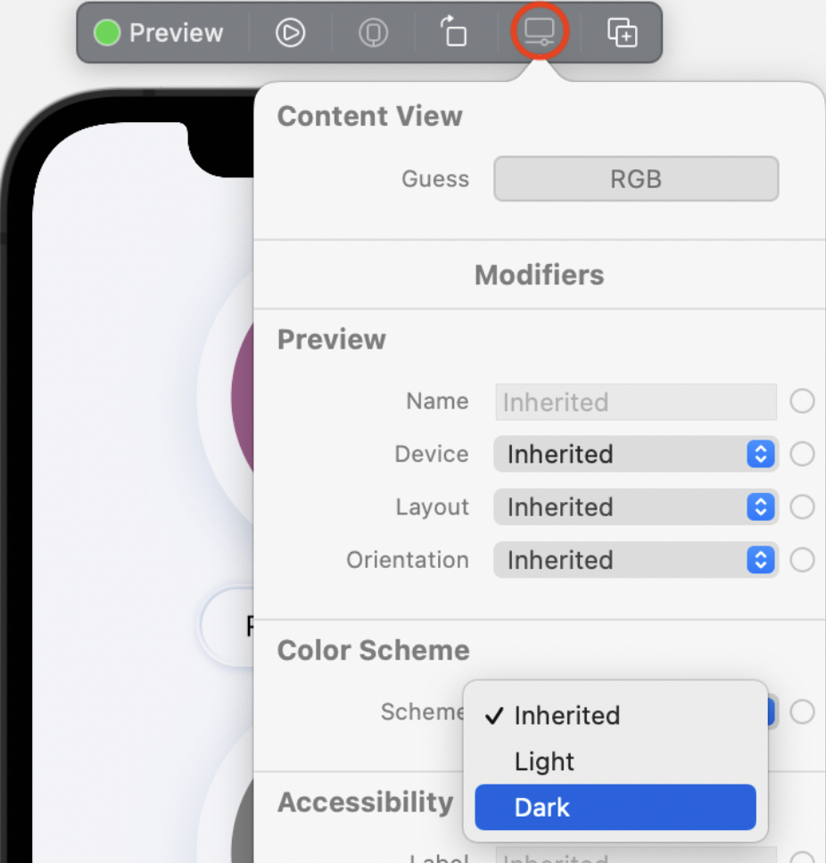
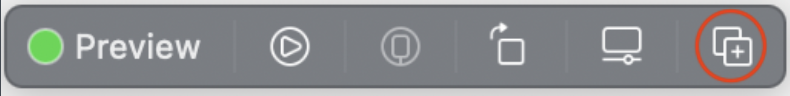
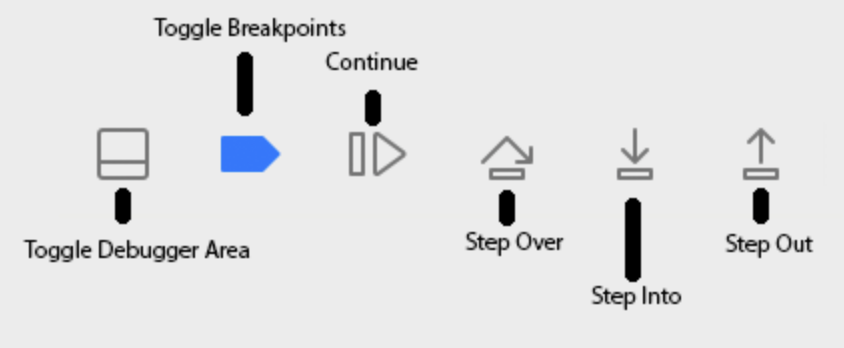
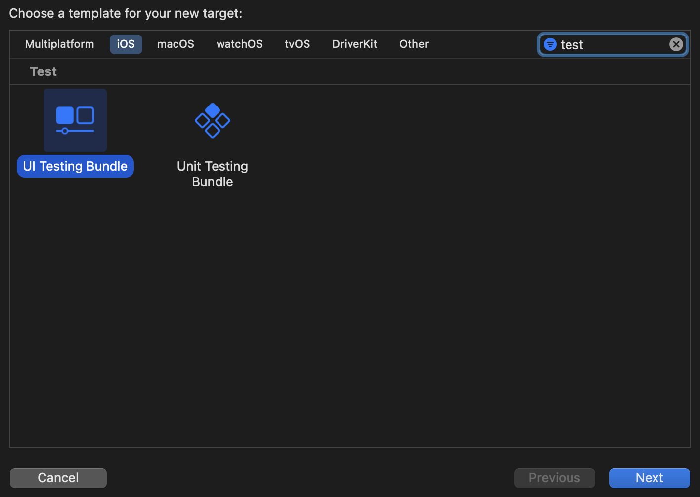
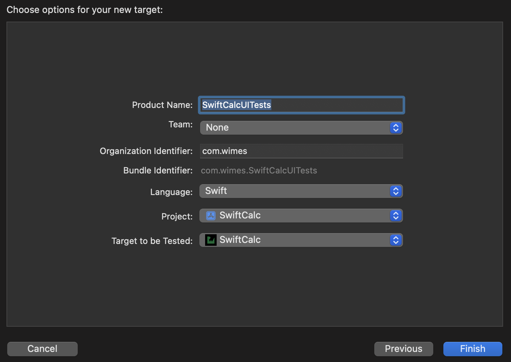
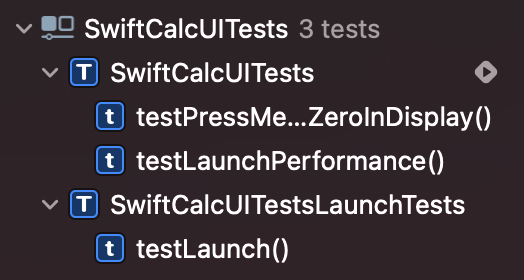
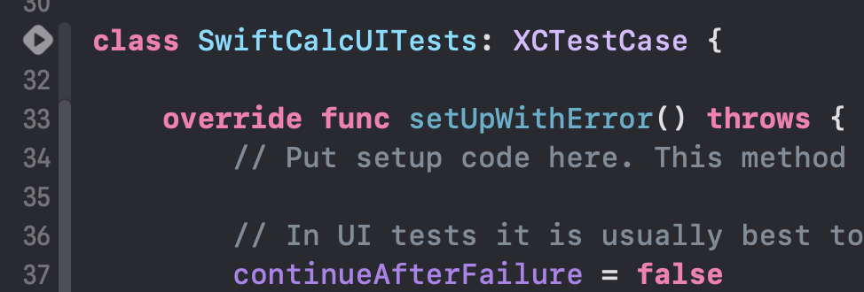

# SwiftUI by Tutorials

> Reference: https://www.raywenderlich.com/books/swiftui-by-tutorials/

## 2. Getting Start

* `@main` auttribute는 해당 struct가 app의 진입점을 표시한다.
* tip: Xcode canvas에서 resume의 short cut은 `option-cammand-p` 이다.
* SwiftUI는 선언적이다. UI가 어떻게 보이는지 선언하고 SwiftUI는 선언한 코드를 완료하는 효율적인 코드로 변환해준다.
* SwiftUI는 재사용가능한 매개변수화 된 View가 권장된다.
* SwiftUI 용어 정리
  * modifier: UIKit의 요소의 프로퍼티를 설정하는 것과 대치되는 것 SwiftUI에서는 modifier라고 한다.(backgroundColor, Font, padding 등)
  * container views : UIKit에서 StackView를 떠올려보면 쉽게 이해가능. HStack, VStack 등을 이용해 app의 UI를 생성해주고 담는 그릇이라고 생각하면 됨
* `$` : `guest.red`는 read-only한 value이다. 그러나 `$guess.red` 는 read-write binding이다. user가 해당 value를 변경시킬 때마다 업데이트할 때 필요한 symbol이다.
  * https://stackoverflow.com/questions/56551131/what-does-the-dollar-sign-do-in-this-example
* View내부에서 사용할 binding value가 필요하다면, `@State`, View와 View사이에서 binding value가 필요하다면 `@Binding` 을 사용한다.
  * `@Binding` value는 상위 view에서 초기값을 받고, 부모 view의 `@State`같은 값을 양방향으로 연결되도록 해준다.

## 3. Diving Deeper Into SwiftUI

* modifier인 `fill(_:style:)` 은 Shape에만 적용할 수 있다. (순서에 유의)

* `ButtonStyle` 은 Button의 label과 사용자가 버튼을 눌렀을 때 Configuration을 통해 label의 Bool값(눌렀으니 true)를 전달한다.

* container인 `Group`은 무언가를 수행하는 것이 아님.
  View content를 위한 affordance(행동유동성)임.
  예를 들어 VStack에 11개 이상의 View가 잇다면 Error남.
  이때 Group을 이용해서 10개를 한 그룹, 나머지 1개를 한 그룹으로 만들어서 사용한다.
  여러개의 content type의 instance들을 단일 unit으로 만들어 준다.

* Preview > Color Scheme > Dark로 Dark모드를 설정할 수 있다.
  

* 또한 실행하고 나서도 Deubg 도구 모음 에서도 Envrionment Override > Appearance에서도 Dark모드를 설정할 수 있다.
  

* VStack 의 sub view에 모든 텍스트의 폰트를 변겨할 수 있다.

  ```swift
  VStack{
    ...
  }
  .font(.headline)
  ```

  그러나 특정 view만큼은 `.headline` 폰트를 설정하고 싶지 않을 때 아래와 같이 하면 HStack 내부의 모든 view는 `headline`이 아닌 `.subheadline` 폰트를 사용한다.

  ```swift
  VStack{
    ...
    HStack{
      
    }
    .font(.subheadline)
  }
  .font(.headline)
  ```

* preview device를 변경하고 싶다면 아래처럼 할 수 있다.

  ```swift
  Contentview()
  	.previewDevice("iPhone 8")
  ```

* 절대 크기가 아닌 상대 크기를 사용하려면 `GeometryReader`로 화면크기를 가져와서 설정을 해줘야 한다.
  아래 처럼 사용할 수 있다.

  ```swift
  let circleSize: CGFloat = 0.275
  ...
  
  GeometryReader { proxy in
  	ZStack{
      ColorCircle(
        rgb: ...,
        // 전체 화면 height값의 0.275배가 Circle의 크기로 설정
        size: proxy.size.height * circleSize
      )
      ...
    }
  }
  ```

* Preview를 한번에 여러개 볼 수 있다.
  Canvas의 Preview에서 아래 버튼을 클릭하면 
  
  `PreviewProvider` 에서 `Group` 으로 묶인 View들을 볼 수 있다.
  원하는 Device 별로 설정해주면 된다.

  ```swift
  struct ContentView_Previews: PreviewProvider {
    static var previews: some View {
        Group {
            ContentView(guess: RGB())
                .previewDevice("iPhone 13 Pro")
            ContentView(guess: RGB())
                .previewDevice("iPhone 8")
            ContentView(guess: RGB())
                .previewDevice("iPhone 13 Mini")
        }
    }
  }
  ```


## 4. Test & Debugging

* 일반적인 Test의 복잡성

  * UI테스트 > 통합(intergration) 테스트 > 단위(unit) 테스트

* 디버그를 위해 중단점을 추가하고 실행했는데 앱이 중단되지 않으면 해당 인터페이스에 요소가 포함되지 않았음을 알 수 있다.

* 디버그 바
  

  * Step Over: 메서드를 포함하여 현재 코드 줄을 실행
  * Step Into: 현재 코드 줄도 실행하지만 메서드 호출이 있는 경우 해당 메서드 내부의 첫 번째 코드 줄에서 일시 중지 된다.
  * Step Out: 메서드의 끝까지 코드를 실행한다.

* 디버그 콘솔의 `lldb` 프롬프트에서 다음 명령어를 수행한다.
  `po _pendingOperation`
  `po` 를 이용해서 instance의 상태를 검사할 수 있다. 변수 이름의 시작부분에 있는 under bar(_)에 유의하자. SwiftUI View내에서 변수 이름에 under bar를 접두어를 붙여야 한다. 
  아래처럼 코드에 적힌 `pendingOperatio` 변수의 내용이 표시된다.
  

* UI 테스트를 하려면 

  * File > New > Target... > iOS > UI Testing Bundle > Next
    

  * Test할 Project를 선택하고 Finish를 누른다.
    

  * Project hierachy에 SwiftCalcUItests라는 새 그룹을 볼 수 있다.
    그룹 내부에 있는 ***Tests.swift 파일을 열어서 보도록 한다.
    `XCTest`가 import되어 있고, 모든 테스트 클래스가 동작을 상속하는 `XCTestCase`을 상속하고 있다.

    ```swift
    import XCTest
    
    class SwiftCalcUITests: XCTestCase {
      ...
    }
    ```

  * Xcode ui test 템플릿에서 제공되는 4가지 기본 메서드도 볼 수 있다. 처음 두가지 메서드는 중요하다.

    * 테스트 프로세스는 클래스의 각 테스트 메소드 앞에 `setUpWithError()`를 호출 한 다음 
      각 테스트 방법이 완료된 후 `tearDownWithError()`를 호출한다.

    * 기억하자: 테스트는 알려진 input에 예상되는 ouput을 생성하지는지 확인 하는 것이다.
      `setUpWithError()` 는 각 테스트 방법이 시작되기 전에 앱이 이 알려진 상태에 있는지 확인하는데 사용한다.
      `tearDownWithError()` 는 다음 테스트를 위해 알려진 시작 조건으로 돌아갈 수 있도록 각 테스트 후에 초기화 하는데 사용한다.

    * `setUpWithError()`를 보면 아래와 같은 코드가 default로 적혀 있다.

      ```swift
      continueAfterFailure = false
      ```

      이는 오류가 발생하면 테스트를 중지한다. false로 설정하면 실패 후 테스트가 종료, true이면 keep going

  * Xcode ui test 템플릿에서 제공되는 세번째 method는 `testExample()` 이다.

    * sample 테스트가 이루어지는 곳.
    * method 이름 옆에 회색 다이아몬드가 있고, 이는 Xcode가 테스트로 인식하고 있다는 의미이다.
    * test의 이름은 "test"로 시작해야 한다. (안하면 무시하고 건너뜀)

  * UI테스트는 "지금 막 시작된"상태의 앱이므로, 앱이 막 시작된 것처럼 각 테스트를 작성할 수 있다.
    실행할 때마다 앱 상태가 재설정된다는 의미가 아님.
    `setUpWithError()`및 `tearDownWithError()` 메서드를 사용하여 각 테스트 전에 앱이 알려진 특정 상태인지 확인하고 테스트 중에 변경된 사항을 정리한다.
    테스트가 실행될 때 설정, 데이터, 위치, 기타 정보가 있을 것으로 예상되는 경우 해당 정보를 설정해야 한다.

  * UI 테스트를 시작하는 방법

    * Xcode에서 Command+6을 눌러 왼쪽의 Hierachy에 Test Navigator로 이동할 수 있다.
      여기서 method 이름위로 마우스를 올리면 회색 재생표시를 눌러 테스트 가능
      
    * 코드 상에서 왼쪽 회색 다이아몬드에 마우스를 올리면 회색 재생표시를 눌러 테스트 가능
      

  * ㅇ

