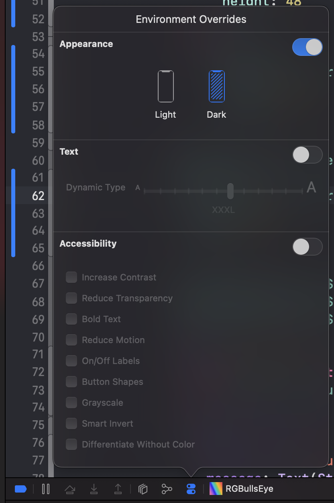
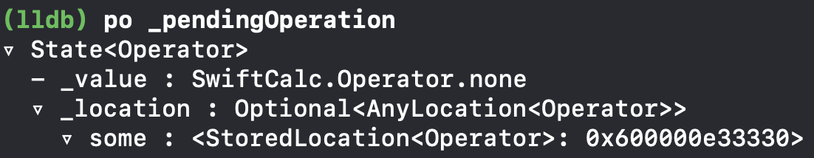

# SwiftUI by Tutorials

> Reference: https://www.raywenderlich.com/books/swiftui-by-tutorials/

## 2. Getting Start

* `@main` auttribute는 해당 struct가 app의 진입점을 표시한다.
* tip: Xcode canvas에서 resume의 short cut은 `option-cammand-p` 이다.
* SwiftUI는 선언적이다. UI가 어떻게 보이는지 선언하고 SwiftUI는 선언한 코드를 완료하는 효율적인 코드로 변환해준다.
* SwiftUI는 재사용가능한 매개변수화 된 View가 권장된다.
* SwiftUI 용어 정리
  * modifier: UIKit의 요소의 프로퍼티를 설정하는 것과 대치되는 것 SwiftUI에서는 modifier라고 한다.(backgroundColor, Font, padding 등)
  * container views : UIKit에서 StackView를 떠올려보면 쉽게 이해가능. HStack, VStack 등을 이용해 app의 UI를 생성해주고 담는 그릇이라고 생각하면 됨
* `$` : `guest.red`는 read-only한 value이다. 그러나 `$guess.red` 는 read-write binding이다. user가 해당 value를 변경시킬 때마다 업데이트할 때 필요한 symbol이다.
  * https://stackoverflow.com/questions/56551131/what-does-the-dollar-sign-do-in-this-example
* View내부에서 사용할 binding value가 필요하다면, `@State`, View와 View사이에서 binding value가 필요하다면 `@Binding` 을 사용한다.
  * `@Binding` value는 상위 view에서 초기값을 받고, 부모 view의 `@State`같은 값을 양방향으로 연결되도록 해준다.

## 3. Diving Deeper Into SwiftUI

* modifier인 `fill(_:style:)` 은 Shape에만 적용할 수 있다. (순서에 유의)

* `ButtonStyle` 은 Button의 label과 사용자가 버튼을 눌렀을 때 Configuration을 통해 label의 Bool값(눌렀으니 true)를 전달한다.

* container인 `Group`은 무언가를 수행하는 것이 아님.
  View content를 위한 affordance(행동유동성)임.
  예를 들어 VStack에 11개 이상의 View가 잇다면 Error남.
  이때 Group을 이용해서 10개를 한 그룹, 나머지 1개를 한 그룹으로 만들어서 사용한다.
  여러개의 content type의 instance들을 단일 unit으로 만들어 준다.

* Preview > Color Scheme > Dark로 Dark모드를 설정할 수 있다.
  
  
  
* 또한 실행하고 나서도 Deubg 도구 모음 에서도 Envrionment Override > Appearance에서도 Dark모드를 설정할 수 있다.
  
  
  
* VStack 의 sub view에 모든 텍스트의 폰트를 변겨할 수 있다.

  ```swift
  VStack{
    ...
  }
  .font(.headline)
  ```

  그러나 특정 view만큼은 `.headline` 폰트를 설정하고 싶지 않을 때 아래와 같이 하면 HStack 내부의 모든 view는 `headline`이 아닌 `.subheadline` 폰트를 사용한다.

  ```swift
  VStack{
    ...
    HStack{
      
    }
    .font(.subheadline)
  }
  .font(.headline)
  ```

* preview device를 변경하고 싶다면 아래처럼 할 수 있다.

  ```swift
  Contentview()
  	.previewDevice("iPhone 8")
  ```

* 절대 크기가 아닌 상대 크기를 사용하려면 `GeometryReader`로 화면크기를 가져와서 설정을 해줘야 한다.
  아래 처럼 사용할 수 있다.

  ```swift
  let circleSize: CGFloat = 0.275
  ...
  
  GeometryReader { proxy in
  	ZStack{
      ColorCircle(
        rgb: ...,
        // 전체 화면 height값의 0.275배가 Circle의 크기로 설정
        size: proxy.size.height * circleSize
      )
      ...
    }
  }
  ```

* Preview를 한번에 여러개 볼 수 있다.
  Canvas의 Preview에서 아래 버튼을 클릭하면 
  
  
  
  `PreviewProvider` 에서 `Group` 으로 묶인 View들을 볼 수 있다.
  원하는 Device 별로 설정해주면 된다.
  
  ```swift
  struct ContentView_Previews: PreviewProvider {
    static var previews: some View {
        Group {
            ContentView(guess: RGB())
                .previewDevice("iPhone 13 Pro")
            ContentView(guess: RGB())
                .previewDevice("iPhone 8")
            ContentView(guess: RGB())
                .previewDevice("iPhone 13 Mini")
        }
    }
  }
  ```

## 4. Test & Debugging

> Reference: https://ntomios.tistory.com/m/32

* 일반적인 Test의 복잡성

  * UI테스트 > 통합(intergration) 테스트 > 단위(unit) 테스트

* 디버그를 위해 중단점을 추가하고 실행했는데 앱이 중단되지 않으면 해당 인터페이스에 요소가 포함되지 않았음을 알 수 있다.

* 디버그 바

  

  * Step Over: 메서드를 포함하여 현재 코드 줄을 실행
  * Step Into: 현재 코드 줄도 실행하지만 메서드 호출이 있는 경우 해당 메서드 내부의 첫 번째 코드 줄에서 일시 중지 된다.
  * Step Out: 메서드의 끝까지 코드를 실행한다.

* 디버그 콘솔의 `lldb` 프롬프트에서 다음 명령어를 수행한다.
  `po _pendingOperation`
  `po` 를 이용해서 instance의 상태를 검사할 수 있다. 변수 이름의 시작부분에 있는 under bar(_)에 유의하자. SwiftUI View내에서 변수 이름에 under bar를 접두어를 붙여야 한다. 
  아래처럼 코드에 적힌 `pendingOperatio` 변수의 내용이 표시된다.

  

* UI 테스트를 하려면 

  * File > New > Target... > iOS > UI Testing Bundle > Next
    
    
    
  * Test할 Project를 선택하고 Finish를 누른다.
    
    
    
  * Project hierachy에 SwiftCalcUItests라는 새 그룹을 볼 수 있다.
    그룹 내부에 있는 ***Tests.swift 파일을 열어서 보도록 한다.
    `XCTest`가 import되어 있고, 모든 테스트 클래스가 동작을 상속하는 `XCTestCase`을 상속하고 있다.

    ```swift
    import XCTest
    
    class SwiftCalcUITests: XCTestCase {
      ...
    }
    ```

  * Xcode ui test 템플릿에서 제공되는 4가지 기본 메서드도 볼 수 있다. 처음 두가지 메서드는 중요하다.

    * 테스트 프로세스는 클래스의 각 테스트 메소드 앞에 `setUpWithError()`를 호출 한 다음 
      각 테스트 방법이 완료된 후 `tearDownWithError()`를 호출한다.

    * 기억하자: 테스트는 알려진 input에 예상되는 ouput을 생성하지는지 확인 하는 것이다.
      `setUpWithError()` 는 각 테스트 방법이 시작되기 전에 앱이 이 알려진 상태에 있는지 확인하는데 사용한다.
      `tearDownWithError()` 는 다음 테스트를 위해 알려진 시작 조건으로 돌아갈 수 있도록 각 테스트 후에 초기화 하는데 사용한다.

    * `setUpWithError()`를 보면 아래와 같은 코드가 default로 적혀 있다.

      ```swift
      continueAfterFailure = false
      ```

      이는 오류가 발생하면 테스트를 중지한다. false로 설정하면 실패 후 테스트가 종료, true이면 keep going

  * Xcode ui test 템플릿에서 제공되는 세번째 method는 `testExample()` 이다.

    * sample 테스트가 이루어지는 곳.
    * method 이름 옆에 회색 다이아몬드가 있고, 이는 Xcode가 테스트로 인식하고 있다는 의미이다.
    * test의 이름은 "test"로 시작해야 한다. (안하면 무시하고 건너뜀)

  * UI테스트는 "지금 막 시작된"상태의 앱이므로, 앱이 막 시작된 것처럼 각 테스트를 작성할 수 있다.
    실행할 때마다 앱 상태가 재설정된다는 의미가 아님.
    `setUpWithError()`및 `tearDownWithError()` 메서드를 사용하여 각 테스트 전에 앱이 알려진 특정 상태인지 확인하고 테스트 중에 변경된 사항을 정리한다.
    테스트가 실행될 때 설정, 데이터, 위치, 기타 정보가 있을 것으로 예상되는 경우 해당 정보를 설정해야 한다.

* UI 테스트를 시작하는 방법

  * Xcode에서 Command+6을 눌러 왼쪽의 Hierachy에 Test Navigator로 이동할 수 있다.
    여기서 method 이름위로 마우스를 올리면 회색 재생표시를 눌러 테스트 가능

    

  * 코드 상에서 왼쪽 회색 다이아몬드에 마우스를 올리면 회색 재생표시를 눌러 테스트 가능

    

  * `app.launch()` 다음 줄에 중단점을 걸고 테스트를 실행하면 lldb 명령프롬프트가 출력되면서 멈춘다.
    이때 `po app` 명령을 입력하면 아래와 같은 형태로 출력이 된다.

    

    XCUIElement의 하위 클래스인 XCUIApplication으로 선언한 `app` 객체를 검사하고 있다. 모든 UI 테스트에서 이 객체로 작업하게 된다.

    `app` 객체는 앱의 모든 UI 요소의 트리를 보여준다. 이러한 각 요소도 XCUIElement 타입이다. 표시되는 트리에서 항목을 선택하기 위해 앱 개체에 대해 필터 쿼리를 실행하여 `app`의 UI 요소에 액세스할 수 있다.

* UI 요소에 접근 방법

  * 아래 명령어를 보자

    ```swift
    let memoryButton = app.buttons["M+"]
    memoryButton.tap()
    ```

    `XCuIAPplication`에는 각 UI 객체에 대한 요소 집합이 들어 있다. 
    이 쿼리는 앱의 `.buttons`에 대해서만 필터링한다. 그런 다음 `m+`의 label이 있는 요소로 필터링한다.

    SwiftUI 앱은 플랫폼의 기본 요소로 렌더링된다. 그들은 새로운 구성 요소가 아님.
    SwiftUI는 인터페이스를 정의하는 새로운 방법을 제공하지만 여전히 플랫폼의 기존 요소를 사용한다. SwiftUI `Button`은 iOS에서는 `UIButton`이 되고 macOS에서는 `NSButton`이 된다.
    이 앱에서 필터는 이전에 `po app`의 출력에서 본 다음 label과 일치한다.
    

    `Button`객체가 있으면 `Button`의 `tap()`을 호출한다.
    이 메서드는 버튼을 탭하는 사람을 시뮬레이션한다.

    이대로 실행하면 app이 실행되고 button을 탭하고 해당 테스트는 끝이 난다.

* UI 읽기

  이전에 Button의 label을 이용해 "M+" Button을 찾았다.
  그렇다면 특정 인터페이스요소나 label이 실시간으로 변경되는 인터페이스에는 접근은 어떻게 하는가?

  인터페이스 요소에 속성을 추가하면 된다.

  ```swift
  Text("0")
  	// 아래 accessibilityIdentifier(_:)를 추가하면 
  	// Text("0")를 test 환경에서 "display"라는 이름으로 접근할 수 있다.
  	.accessibilityIdentifier("display")
  ```

* 테스트 코드 작성

  ```swift
  func testPressMemoryPlusAtAppStartShowZeroInDisplay() throws{
   let app = XCUIApplication()
    app.launch()
  
    let memoryButton = app.buttons["M+"]
    memoryButton.tap()
  
    // staticTexts으로  accessbilityIdentifier(_:)를 이용해 등록한 요소를 찾을 수 있다.
    // return값은 대부분의 UI요소와 마찬가지로 XCUIElement이다.
    let display = app.staticTexts["display"]
    // label값을 리턴받는다.
    let displayText = display.label
    // 해당 label이 원하는 결과인 "0"과 같은지 확인
    XCTAssert(displayText == "0") 
  }
  ```

  위코드를 실행켰을 때 통과라면 초록색 체크표시, 그렇지 않다면 빨간색 x표시가 나오게 된다.

  

  

* 더 복잡한 테스트 추가

  아래 코드처럼 각 버튼을 클릭하고 display ui요소의 값을 점검할 수 있다.

  ```swift
  func testAddingTwoDigits(){
    let app = XCUIApplication()
    app.launch()
  
    let threeButton = app.buttons["3"]
    threeButton.tap()
  
    let addButton = app.buttons["+"]
    addButton.tap()
  
    let fiveButton = app.buttons["5"]
    fiveButton.tap()
  
    let equalButton = app.buttons["="]
    equalButton.tap()
  
    let display = app.staticTexts["display"]
    let displayText = display.label
    XCTAssert(displayText == "8")
  }
  ```

  위 코드를 수행했을 때 test fail이 나온다.

  `XCTAssert()`문에 중단점을 걸고 `po displayText` 를 해보니 아래 처럼 나온다.

  

  unit test에서는 8이라는 값이 통과가 되지만, ui test에서는 그렇지 못하다. 

  이 처럼 background에서 발생하는 요소의 값을 그대로 적는 것이 아닌 ui에서 출력되는 값을 그대로 적어줘야 한다. ui테스트는 이같은 상황을 주의해야 한다.

* User Interaction 시뮬레이션

  아래코드는 ui요소를 스와이프하면 지워지는 제스처에 대한 ui test이다.

  ```swift
  func testSwipeToClearMemory(){
    let app = XCUIApplication()
    app.launch()
  
    let threeButton = app.buttons["3"]
    threeButton.tap()
    let fiveButton = app.buttons["5"]
    fiveButton.tap()
  
    let memoryButton = app.buttons["M+"]
    memoryButton.tap()
  
    let memoryDisplay = app.staticTexts["memoryDisplay"]
  
    // exists는 해당 요소가 존재할 때 true이다.
    XCTAssert(memoryDisplay.exists)
    // swipeLeft 제스처를 수행한다.
    memoryDisplay.swipeLeft()
    // XCTAssertFalse는 parameter가 false일 경우 통과이다.
    // 즉, 스와이프 이후 memoryDisplay가 삭제되야 하므로 XCTAssertFalse를 사용한다.
    XCTAssertFalse(memoryDisplay.exists)
  }
  ```

  이 밖에도 ui test를 위한 자주 사용하는 프로퍼티나 메서드가 존재한다

  * `.isHittable`:  요소가 존재하고, 사용자가 현재 위치에서 클릭, 탭 혹은 누를 수 있을 경우 hittable 하다.
    스크린을 벗어난 요소는 존재할 수 있으나 hittable하지 않다.
  * `.typeText()`: 이 메서드는 사용자가 "호출 control"에 텍스트를 입력하는 것처럼 동작
    (사용자가 입력하는 것처럼 작동한다.)
  * `.press(forDuration:)`: 지정된 시간 동안 한 손가락 터치를 수행할 수 있다.
  * `.press(forDuration:thenDragTo:)`: 스와이프 메서드는 제스처의 속도를 보장하지 않는다. 이 방법을 사용하여 더 정확한 드래그 동작을 수행할 수 있다.
  * `.waitForExistence():요소가 화면에 즉시 나타나지 않아 일시 중지가 필요한 경우 유용하다.

* 여러 플랫폼 테스트

  SwiftUI의 특징 중 하나는 Apple Multiple Platform이 있다. iOS 전용으로 만든 앱은 아주 적은 작업으로 macOS앱이 될 수 있다.그러나 앱과 테스트가 모든 플랫폼에서 제대로 동작하기 위해서는 주의해야 할 사항이 있다.

  mac에는 swipeLeft가 없다.
  모든 작업이 모든 운영체제에서 1:1로 상응하는 것이 아니다.

  이때 조건부 컴파일 블록을 사용하여 해결하도록 한다.

  ```swift
  // 멀티플랫폼인 mac catalyst는 테스트에서 제외
  #if !targetEnvironment(macCatalyst)
  let app = XCUIApplication()
  app.launch()
  ...
  XCTAssert(memoryDisplay.exists)
  memoryDisplay.swipeLeft()
  XCTAssertFalse(memoryDisplay.exists)
  #endif
  
  // 특정 운영체제를 제외할 수도있음. iOS, iPadOS, macOS, watchOS, tvOS, Linux 중 하나를 넣으면 된다.
  #if !os(watchOS)
  // your XCTest code
  #endif
  ```

## 5. Intro to Controls: Text & Image

* 오른쪽에 있는 inspector나, canvas에서 option + command로 해당 오브젝트를 클릭해 modifier를 적용할 수 있다.

  

  

* SiwftUI가 제공하는 modifier에는 두가지 범주가 있다.

  * 모든 `View`에서 사용할 수 있는 프로토콜과 함께 번들로 제공되는 modifier
  * 해당 유형의 인스턴스에만 사용할 수 있는 특정 타입의 modifier

  아래 처럼 modifier가 어떤 것들이 있는지 찾아볼 수 있다.

  

* 과연 modifier가 효율적인가?

  모든 modifier는 새로운 `View`를 리턴하고 있는데, 이 프로세스가 실제로 효율적인가에 대한 의문이 생긴다.

  SwiftUI는 modifier를 호출할 때마다 새로운 `View`에 이전 `View`를 포함한다.
  즉, `View` 스택을 생성하는 재귀 프로세스이다.
  직관적으로 이것은 자원 낭비처럼 보일 수 있다. 그러나 사실 SiwftUI가 이 스택을 View의 실제 랜더링에 사용되는 효율적인 데이터 구조로 평면화(flat)한다.

  즉, `View` 효율성에 미칠 염려없이 자유롭게 사용가능하다.

* modifier의 적용 순서가 중요한가?

  대부분의 경우에는 NO이지만, 일단은 답은 YES이다.

  예를 들어 modifier로 굵게 적용한다음 빨간색으로 만드는 경우,

  ```swift
  Text("Welcome to Kuchi")
    .bold()
    .foregroundColor(.red)
  ```

  먼저 빨간색으로 만든 다음 굵게 표시하는 경우

  ```swift
  Text("Welcome to Kuchi")
    .foregroundColor(.red)
    .bold()
  ```

  둘 차이를 느끼지 못할 것이다.

  

  그러나 배경색을 적용한 다음 padding을 적용하는 것과 padding을 적용하고 배경색을 적용하는 것은 서로 다른 결과가 나타난다.

  ```swift
  Text("Welcome to Kuchi")
    .background(Color.red)
    .padding()
  ```

  ```swift
  Text("Welcome to Kuchi")
    .padding()
    .background(Color.red)
  ```

  

  배경색을 적용하는 View가 경우에 따라 다를 수 있기 때문이다. modifier를 적용하면 새로운 `View`를 리턴하기 때문에 어떤 View를 기준으로 modifier를 적용하냐에 따라 다르다는 얘기.

  ```swift
  Text("Welcome to Kuchi")
    .background(Color.yellow)
    .padding()
    .background(Color.red)
  ```

  

* modifier를 적용하지 않고 이미지를 생성하면 SiwftUI는 이미지를 기본 해상도로 랜더링하고 이미지의 종횡비를 유지한다.

* 이미지의 크기를 조정하려면 inset 및 resizing mode라는 두 가지 매개변수를 사용하는 `resizable` modifier를 적용해야 한다. resizing mode는 `.tile` 또는 `.stretch`일 수 있다.

  * 매개변수를 제공하지 않으면 SwiftUI는 네 방향(top, bottom, leading, trailling) 및 `.stretch` resizaing mode 모두에 대해 inset이 없다고 가정한다.

  아래 코드를 보자. width와 height을 30 frame에 이미지를 넣었다.

  ```swift
  Image(systemName: "table")
  	.frame(width: 30, height: 30)
  ```

  그러나 실행시키면 이미지는 원래 크기이고 preview에서 이미지를 클릭해보면 30/30 크기만큼 테두리가 보인다. View의 크기는 늘었지만, 이미지자체의 크기는 그대로인 상황.
  

  `frame` 앞에 `resizable` modifier를 붙여준다.

  ```swift
  Image(systemName: "table")
    .resizable()
    .frame(width: 30, height: 30)
  ```

  > **참고**
  >
  > 이미지에 포인트로 절대 크기를 지정했다. 그러나 접근성을 위해 SwiftUI가 이미지 또는 일반적인 UI cotent 크기를 조정하는 방법을 결정하는 것이 좋다.
  >
  > 이에 대한 내용은 나중에 배우도록 하자.

* 이미지 modifier(수정자)적용 예

  ```swift
  Image(systemName: "table")
    .resizable()
    .frame(width: 30, height: 30)
  	// 모서리 반경을 이미지 크기의 절반으로 설정
    .cornerRadius(30/2)
  	// 얇은 회색 테두리를 추가
    .overlay(Circle().stroke(Color.gray, lineWidth: 1))
  	// 밝은 회색 배경색을 추가
  	.background(Color(white: 0.9))
  	// Circle Shape를 사용하여 결과 이미지를 잘라 넘어간 색상배경을 제거
    .clipShape(Circle())
  	// 전경색을 빨간색으로 설정
    .foregroundColor(.red)
  ```

  

* 특별한 경우를 제외하고는 `View` 의 body는 하나의 subview만 허용가능하다.

* 이미지 수정자 적용 예2

  ```swift
  // 추가하는 image 이름, Assets.xcassets 에 있는 이미지 이름을 통해 가져온다.
  Image("welcome-background", bundle: nil)
  	// 크기를 조정할 수 있도록 한다.
    .resizable()
  	// 원본 비율을 기준으로 부모내에서 완전히 보이도록 이미지를 최대화한다.
    .scaledToFit()
  	// 기본적으로 1 : 1 인 종횡비를 설정한다.
  	// ContentMode를 .Fill으로 설정하면 이미지가 전체 상위 뷰를 채우므로 이미지의 일부가 뷰의 경계를 초과하여 확장된다.
    .aspectRatio(1/1, contentMode: .fill)
  	// safearea inset을 무시하고 safearea 외부로 view를 확장하여 전체 상위 공간을 차지하도록 한다.
    // 현재 모든 가장자리를 무시하지만 가장자리별로 구성할 수도 있다. 그렇게 하려면 무시할 가장자리 배열을 전한다 (.top, .bottom, .leading, .trailing) 
  	// 뿐만 아니라 두 개의 수직 및 두 개의 수평 가장자리를 각각 결합하는 .vertical 및 .horizontal도 전달한다.
    .edgesIgnoringSafeArea(.all)
  	// 이미지의 채도를 줄인다.
    .saturation(0.5)
  	// 블러족용
    .blur(radius: 5)
  	// 투명도 적용
    .opacity(0.08)
  ```

  

  위 코드에서는 중복 수정자가 있다.

  `.scaledFit` 수정자인데, 이미 `.resizable`을 사용하여 부모에 맞게 이미지를 만든 다음 .aspectRatio가 대신 부모를 채우도록 이미지를 만든다. `.scaledToFit` 수정자를 주석 처리하면 최종 결과가 변경되지 않는 것을 볼 수 있다.

  `scaledToFit`과 `aspectRatio` switch하면 어떻게 될까? 결과물이 달라질까?

  `.scaledTofit`은 이전 행에서 설정된 채우기 모드를 무시한다. 따라서 중복 수정자가된다. 그러나 종횡비를 2로 변경하면?

  ```swift
  .aspectRatio(2 / 1, contentMode: .fill)
  ```

  이 경우 결과는 상당히 다르다. 높이를 변경하지 않고 너비를 2배로 만들기 때문

  

  즉, 이 종횡비 변경을 되돌릴 수 있으며 중복 되는 코드인`.scaledTofit`를 안전하게 삭제할 수 있다.
  그런 다음 코드가 다음과 같다.

  ```swift
  Image("welcome-background", bundle: nil)
    .resizable()
    .scaledToFit()
    .aspectRatio(1/1, contentMode: .fill)
    .edgesIgnoringSafeArea(.all)
    .saturation(0.5)
    .blur(radius: 5)
    .opacity(0.08)
  ```

* 텍스트 분할

  아래의 코드를

  ```swift
  VStack {
    Text("Welcome to")
      .font(.system(size: 30))
      .bold()
      .foregroundColor(.red)
      .multilineTextAlignment(.center)
      .lineLimit(2)
    Text("Kuchi")
      .font(.system(size: 30))
      .bold()
      .foregroundColor(.red)
      .multilineTextAlignment(.center)
      .lineLimit(2)
  }
  ```

  이렇게 리펙토링할 수 있다. (font랑 bold는 `Text`전용 수정자임. `View`, `VStack`에는 적용 불가)

  ```swift
  VStack{
    Text("Welcome to")
      .font(.system(size: 30))
      .bold()
    Text("Kuchi")
      .font(.system(size: 30))
      .bold()
  }
  .foregroundColor(.red)
  .multilineTextAlignment(.center)
  .lineLimit(2)
  ```

  위의 두 `Text`를 가운데가 아닌 왼쪽 정렬을 하고자 해서 아래 코드를 `VStack`에 적용해봤다.

  ```swift
  VStack{
    ...
  }
  .foregroundColor(.red)
  // --------여기---------
  .multilineTextAlignment(.leading)
  // --------------------
  .lineLimit(2)
  ```

  그러나 동작하지 않는다.
  이는 `Text`를 두개의 서로 다른 `Text`로 분할하고 각 `Text` 크기가 내용에 따라 조정되기 때문. 따라서 TextAlignment를 변경해도 효과가 없음.

  아래 처럼 하면 된다. 

  ```swift
  VStack(alignment: .leading){
    ...
  }
  .foregroundColor(.red)
  .lineLimit(2)
  ```

  라인 제한도 더 이상 필요하지 않다. 그냥 제거해도 되지만 `Text`를 여러 줄에 걸쳐 자유롭게 만들 수 있다. 이 경우 거의 발생하지 않지만 다음과 같이 변경하여 각 `Text`View가 한줄에만 보여줄 수 있도록 1로 변경해준다.

  ```swift
  VStack(alignment: .leading){
    ...
  }
  .foregroundColor(.red)
  .lineLimit(1)
  ```

* SwiftUI 3.0에서 부터는 Text에 md 문법이 지원된다.

  ```swift
  Text("**Welcome to**")
  	.font(.headline)
  Text("**Kuchi**")
  	.font(.largeTitle)
  ```

  와

  ```swift
  Text("Welcome to")
    .font(.headline)
    .bold()
    Text("Kuchi")
    .font(.largeTitle)
    .bold()
  ```

  는 동일한 결과를 출력한다.

* Label: `Image`와 `Text` 결합

  SwiftUI에서 `Image`와 `Text`의 결합은 매우 쉽다. `HStack`이나 `Vstack` 을 이용해도 되지만 작업을 쉽게하기 위해 `Label`을 이용한다.

  ```swift
  Label("Welcome", systemImage: "hand.wave")
  ```

  위 코드는 아래 결과를 출력한다.

  

  또한 `Text` 및 `Image`에 대한 사용자 정의 View를 제공할 수 있다.

  이 이니셜라이저는 title과 icon의 두 가지 매개변수를 사용하며 다음과 같다.

  ```swift
  init(title: () -> Title, icon: () -> Icon)
  ```

  아래 코드를 리펙토링해보자

  ```swift
  HStack {
    Image(systemName: "table")
      .resizable()
      .frame(width: 30, height: 30)
      .overlay(Circle().stroke(Color.gray, lineWidth: 1))
      .background(Color(white: 0.9))
      .clipShape(Circle())
      .foregroundColor(.red)
  
    VStack(alignment: .leading) {
      Text("Welcome to")
        .font(.headline)
        .bold()
      Text("Kuchi")
        .font(.largeTitle)
        .bold()
    }
    .foregroundColor(.red)
    .lineLimit(1)
    .padding(.horizontal)        
  }
  ```

  `Image`는 `Label`의 icon 매개 변수로, VStack (수정자와 함께)은 title 매개 변수로 이동한다.

  ```swift
  Label {
    // Text component
    VStack(alignment: .leading) {
      Text("Welcome to")
        .font(.headline)
        .bold()
      Text("Kuchi")
        .font(.largeTitle)
        .bold()
    }
    .foregroundColor(.red)
    .lineLimit(2)
    .multilineTextAlignment(.leading)
    .padding(.horizontal)
  } icon: {
    // Image component
    Image(systemName: "table")
      .resizable()
      .frame(width: 30, height: 30)
      .overlay(Circle().stroke(Color.gray, lineWidth: 1))
      .background(Color(white: 0.9))
      .clipShape(Circle())
      .foregroundColor(.red)
  }
  ```

  위 코드를 적용하면 아이콘과 글자가 세로로 정렬되지 않았다는 것을 볼 수 있다.

  

  위 문제를 해결하려면 `Label`이 제공해주는 스타일을 적용해야 한다는 것이다. 문제는 기본적으로 사용가능한 것이 우리의 요구사항에 맞지 않다는 것이다.

  * `DefaultLabelStyle`: 스타일을 지정하지 않은 기본값. title, icon을 표시
  * `IconOnlyLabelStyle`: icon만 표시
  * `TitleOnlyLabelStyle`: title만 표시

  다행인것은 LabelStyle을 직접 구현할 수 있다.

  `LabelStyle` 프로토콜을 채택하는 구조체를 구현하면 된다. 아래 메서드를 구현하면 된다.

  ```swift
  func makeBody(configuration: Self.Configuration) -> Self.Body
  ```

  커스텀 `LabelStyle`을 만들자

  ```swift
  struct HorizontallyAlignedLabelStyle: LabelStyle {
      func makeBody(configuration: Configuration) -> some View {
          HStack{
              configuration.icon
              configuration.title
          }
      }
  }
  ```

  그리고 `Label` 에 적용

  ```swift
  Label{
    ...
  }
  .labelStyle(HorizontallyAlignedLabelStyle())
  ```


