# SwiftUI by Tutorials

> Reference: https://www.raywenderlich.com/books/swiftui-by-tutorials/

## 2. Getting Start

* `@main` auttribute는 해당 struct가 app의 진입점을 표시한다.
* tip: Xcode canvas에서 resume의 short cut은 `option-cammand-p` 이다.
* SwiftUI는 선언적이다. UI가 어떻게 보이는지 선언하고 SwiftUI는 선언한 코드를 완료하는 효율적인 코드로 변환해준다.
* SwiftUI는 재사용가능한 매개변수화 된 View가 권장된다.
* SwiftUI 용어 정리
  * modifier: UIKit의 요소의 프로퍼티를 설정하는 것과 대치되는 것 SwiftUI에서는 modifier라고 한다.(backgroundColor, Font, padding 등)
  * container views : UIKit에서 StackView를 떠올려보면 쉽게 이해가능. HStack, VStack 등을 이용해 app의 UI를 생성해주고 담는 그릇이라고 생각하면 됨
* `$` : `guest.red`는 read-only한 value이다. 그러나 `$guess.red` 는 read-write binding이다. user가 해당 value를 변경시킬 때마다 업데이트할 때 필요한 symbol이다.
  * https://stackoverflow.com/questions/56551131/what-does-the-dollar-sign-do-in-this-example
* View내부에서 사용할 binding value가 필요하다면, `@State`, View와 View사이에서 binding value가 필요하다면 `@Binding` 을 사용한다.
  * `@Binding` value는 상위 view에서 초기값을 받고, 부모 view의 `@State`같은 값을 양방향으로 연결되도록 해준다.

## 3. Diving Deeper Into SwiftUI

* modifier인 `fill(_:style:)` 은 Shape에만 적용할 수 있다. (순서에 유의)

* `ButtonStyle` 은 Button의 label과 사용자가 버튼을 눌렀을 때 Configuration을 통해 label의 Bool값(눌렀으니 true)를 전달한다.

* container인 `Group`은 무언가를 수행하는 것이 아님.
  View content를 위한 affordance(행동유동성)임.
  예를 들어 VStack에 11개 이상의 View가 잇다면 Error남.
  이때 Group을 이용해서 10개를 한 그룹, 나머지 1개를 한 그룹으로 만들어서 사용한다.
  여러개의 content type의 instance들을 단일 unit으로 만들어 준다.

* Preview > Color Scheme > Dark로 Dark모드를 설정할 수 있다.
  
  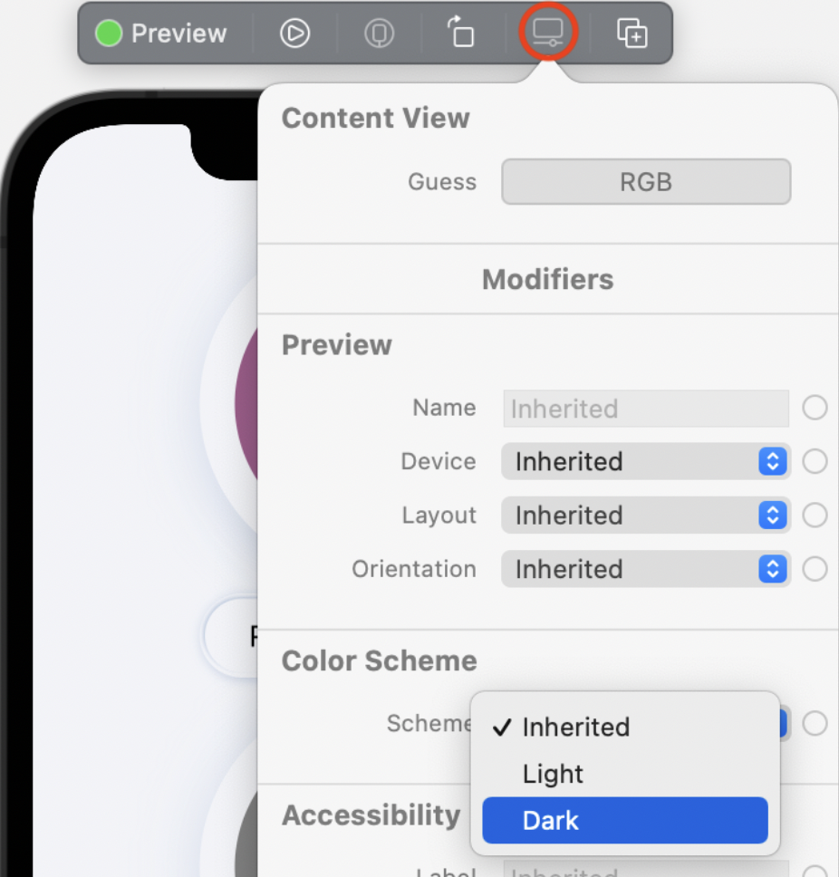
  
* 또한 실행하고 나서도 Deubg 도구 모음 에서도 Envrionment Override > Appearance에서도 Dark모드를 설정할 수 있다.
  
  
  
* VStack 의 sub view에 모든 텍스트의 폰트를 변겨할 수 있다.

  ```swift
  VStack{
    ...
  }
  .font(.headline)
  ```

  그러나 특정 view만큼은 `.headline` 폰트를 설정하고 싶지 않을 때 아래와 같이 하면 HStack 내부의 모든 view는 `headline`이 아닌 `.subheadline` 폰트를 사용한다.

  ```swift
  VStack{
    ...
    HStack{
      
    }
    .font(.subheadline)
  }
  .font(.headline)
  ```

* preview device를 변경하고 싶다면 아래처럼 할 수 있다.

  ```swift
  Contentview()
  	.previewDevice("iPhone 8")
  ```

* 절대 크기가 아닌 상대 크기를 사용하려면 `GeometryReader`로 화면크기를 가져와서 설정을 해줘야 한다.
  아래 처럼 사용할 수 있다.

  ```swift
  let circleSize: CGFloat = 0.275
  ...
  
  GeometryReader { proxy in
  	ZStack{
      ColorCircle(
        rgb: ...,
        // 전체 화면 height값의 0.275배가 Circle의 크기로 설정
        size: proxy.size.height * circleSize
      )
      ...
    }
  }
  ```

* Preview를 한번에 여러개 볼 수 있다.
  Canvas의 Preview에서 아래 버튼을 클릭하면 
  
  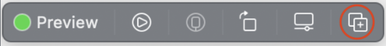
  
  `PreviewProvider` 에서 `Group` 으로 묶인 View들을 볼 수 있다.
  원하는 Device 별로 설정해주면 된다.
  
  ```swift
  struct ContentView_Previews: PreviewProvider {
    static var previews: some View {
        Group {
            ContentView(guess: RGB())
                .previewDevice("iPhone 13 Pro")
            ContentView(guess: RGB())
                .previewDevice("iPhone 8")
            ContentView(guess: RGB())
                .previewDevice("iPhone 13 Mini")
        }
    }
  }
  ```

## 4. Test & Debugging

> Reference: https://ntomios.tistory.com/m/32

* 일반적인 Test의 복잡성

  * UI테스트 > 통합(intergration) 테스트 > 단위(unit) 테스트

* 디버그를 위해 중단점을 추가하고 실행했는데 앱이 중단되지 않으면 해당 인터페이스에 요소가 포함되지 않았음을 알 수 있다.

* 디버그 바

  

  * Step Over: 메서드를 포함하여 현재 코드 줄을 실행
  * Step Into: 현재 코드 줄도 실행하지만 메서드 호출이 있는 경우 해당 메서드 내부의 첫 번째 코드 줄에서 일시 중지 된다.
  * Step Out: 메서드의 끝까지 코드를 실행한다.

* 디버그 콘솔의 `lldb` 프롬프트에서 다음 명령어를 수행한다.
  `po _pendingOperation`
  `po` 를 이용해서 instance의 상태를 검사할 수 있다. 변수 이름의 시작부분에 있는 under bar(_)에 유의하자. SwiftUI View내에서 변수 이름에 under bar를 접두어를 붙여야 한다. 
  아래처럼 코드에 적힌 `pendingOperatio` 변수의 내용이 표시된다.

  

* UI 테스트를 하려면 

  * File > New > Target... > iOS > UI Testing Bundle > Next
    
    
    
  * Test할 Project를 선택하고 Finish를 누른다.
    
    
    
  * Project hierachy에 SwiftCalcUItests라는 새 그룹을 볼 수 있다.
    그룹 내부에 있는 ***Tests.swift 파일을 열어서 보도록 한다.
    `XCTest`가 import되어 있고, 모든 테스트 클래스가 동작을 상속하는 `XCTestCase`을 상속하고 있다.

    ```swift
    import XCTest
    
    class SwiftCalcUITests: XCTestCase {
      ...
    }
    ```

  * Xcode ui test 템플릿에서 제공되는 4가지 기본 메서드도 볼 수 있다. 처음 두가지 메서드는 중요하다.

    * 테스트 프로세스는 클래스의 각 테스트 메소드 앞에 `setUpWithError()`를 호출 한 다음 
      각 테스트 방법이 완료된 후 `tearDownWithError()`를 호출한다.

    * 기억하자: 테스트는 알려진 input에 예상되는 ouput을 생성하지는지 확인 하는 것이다.
      `setUpWithError()` 는 각 테스트 방법이 시작되기 전에 앱이 이 알려진 상태에 있는지 확인하는데 사용한다.
      `tearDownWithError()` 는 다음 테스트를 위해 알려진 시작 조건으로 돌아갈 수 있도록 각 테스트 후에 초기화 하는데 사용한다.

    * `setUpWithError()`를 보면 아래와 같은 코드가 default로 적혀 있다.

      ```swift
      continueAfterFailure = false
      ```

      이는 오류가 발생하면 테스트를 중지한다. false로 설정하면 실패 후 테스트가 종료, true이면 keep going

  * Xcode ui test 템플릿에서 제공되는 세번째 method는 `testExample()` 이다.

    * sample 테스트가 이루어지는 곳.
    * method 이름 옆에 회색 다이아몬드가 있고, 이는 Xcode가 테스트로 인식하고 있다는 의미이다.
    * test의 이름은 "test"로 시작해야 한다. (안하면 무시하고 건너뜀)

  * UI테스트는 "지금 막 시작된"상태의 앱이므로, 앱이 막 시작된 것처럼 각 테스트를 작성할 수 있다.
    실행할 때마다 앱 상태가 재설정된다는 의미가 아님.
    `setUpWithError()`및 `tearDownWithError()` 메서드를 사용하여 각 테스트 전에 앱이 알려진 특정 상태인지 확인하고 테스트 중에 변경된 사항을 정리한다.
    테스트가 실행될 때 설정, 데이터, 위치, 기타 정보가 있을 것으로 예상되는 경우 해당 정보를 설정해야 한다.

* UI 테스트를 시작하는 방법

  * Xcode에서 Command+6을 눌러 왼쪽의 Hierachy에 Test Navigator로 이동할 수 있다.
    여기서 method 이름위로 마우스를 올리면 회색 재생표시를 눌러 테스트 가능

    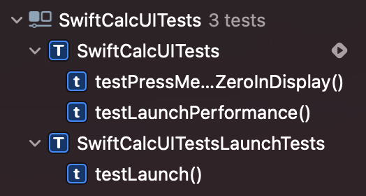

  * 코드 상에서 왼쪽 회색 다이아몬드에 마우스를 올리면 회색 재생표시를 눌러 테스트 가능

    

  * `app.launch()` 다음 줄에 중단점을 걸고 테스트를 실행하면 lldb 명령프롬프트가 출력되면서 멈춘다.
    이때 `po app` 명령을 입력하면 아래와 같은 형태로 출력이 된다.

    

    XCUIElement의 하위 클래스인 XCUIApplication으로 선언한 `app` 객체를 검사하고 있다. 모든 UI 테스트에서 이 객체로 작업하게 된다.

    `app` 객체는 앱의 모든 UI 요소의 트리를 보여준다. 이러한 각 요소도 XCUIElement 타입이다. 표시되는 트리에서 항목을 선택하기 위해 앱 개체에 대해 필터 쿼리를 실행하여 `app`의 UI 요소에 액세스할 수 있다.

* UI 요소에 접근 방법

  * 아래 명령어를 보자

    ```swift
    let memoryButton = app.buttons["M+"]
    memoryButton.tap()
    ```

    `XCuIAPplication`에는 각 UI 객체에 대한 요소 집합이 들어 있다. 
    이 쿼리는 앱의 `.buttons`에 대해서만 필터링한다. 그런 다음 `m+`의 label이 있는 요소로 필터링한다.

    SwiftUI 앱은 플랫폼의 기본 요소로 렌더링된다. 그들은 새로운 구성 요소가 아님.
    SwiftUI는 인터페이스를 정의하는 새로운 방법을 제공하지만 여전히 플랫폼의 기존 요소를 사용한다. SwiftUI `Button`은 iOS에서는 `UIButton`이 되고 macOS에서는 `NSButton`이 된다.
    이 앱에서 필터는 이전에 `po app`의 출력에서 본 다음 label과 일치한다.
    

    `Button`객체가 있으면 `Button`의 `tap()`을 호출한다.
    이 메서드는 버튼을 탭하는 사람을 시뮬레이션한다.

    이대로 실행하면 app이 실행되고 button을 탭하고 해당 테스트는 끝이 난다.

* UI 읽기

  이전에 Button의 label을 이용해 "M+" Button을 찾았다.
  그렇다면 특정 인터페이스요소나 label이 실시간으로 변경되는 인터페이스에는 접근은 어떻게 하는가?

  인터페이스 요소에 속성을 추가하면 된다.

  ```swift
  Text("0")
  	// 아래 accessibilityIdentifier(_:)를 추가하면 
  	// Text("0")를 test 환경에서 "display"라는 이름으로 접근할 수 있다.
  	.accessibilityIdentifier("display")
  ```

* 테스트 코드 작성

  ```swift
  func testPressMemoryPlusAtAppStartShowZeroInDisplay() throws{
   let app = XCUIApplication()
    app.launch()
  
    let memoryButton = app.buttons["M+"]
    memoryButton.tap()
  
    // staticTexts으로  accessbilityIdentifier(_:)를 이용해 등록한 요소를 찾을 수 있다.
    // return값은 대부분의 UI요소와 마찬가지로 XCUIElement이다.
    let display = app.staticTexts["display"]
    // label값을 리턴받는다.
    let displayText = display.label
    // 해당 label이 원하는 결과인 "0"과 같은지 확인
    XCTAssert(displayText == "0") 
  }
  ```

  위코드를 실행켰을 때 통과라면 초록색 체크표시, 그렇지 않다면 빨간색 x표시가 나오게 된다.

  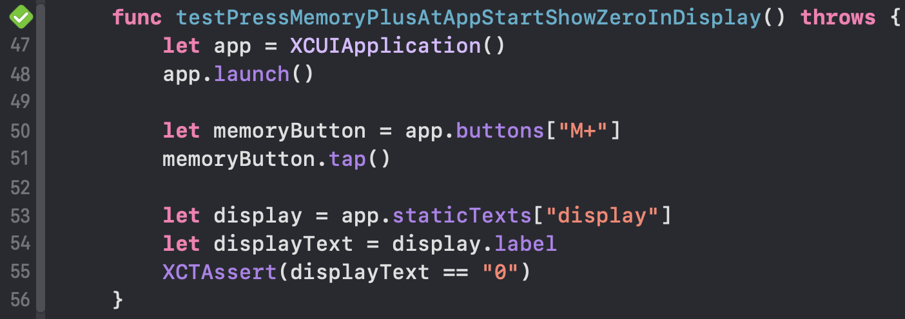

  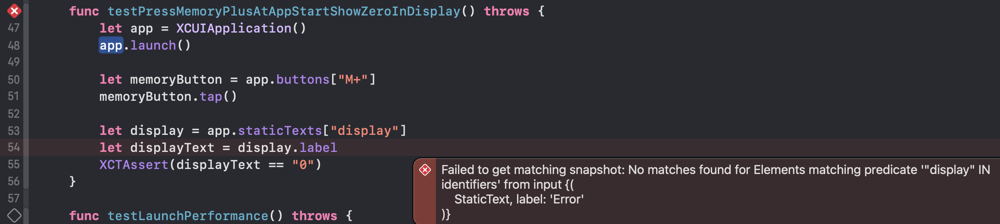

* 더 복잡한 테스트 추가

  아래 코드처럼 각 버튼을 클릭하고 display ui요소의 값을 점검할 수 있다.

  ```swift
  func testAddingTwoDigits(){
    let app = XCUIApplication()
    app.launch()
  
    let threeButton = app.buttons["3"]
    threeButton.tap()
  
    let addButton = app.buttons["+"]
    addButton.tap()
  
    let fiveButton = app.buttons["5"]
    fiveButton.tap()
  
    let equalButton = app.buttons["="]
    equalButton.tap()
  
    let display = app.staticTexts["display"]
    let displayText = display.label
    XCTAssert(displayText == "8")
  }
  ```

  위 코드를 수행했을 때 test fail이 나온다.

  `XCTAssert()`문에 중단점을 걸고 `po displayText` 를 해보니 아래 처럼 나온다.

  

  unit test에서는 8이라는 값이 통과가 되지만, ui test에서는 그렇지 못하다. 

  이 처럼 background에서 발생하는 요소의 값을 그대로 적는 것이 아닌 ui에서 출력되는 값을 그대로 적어줘야 한다. ui테스트는 이같은 상황을 주의해야 한다.

* User Interaction 시뮬레이션

  아래코드는 ui요소를 스와이프하면 지워지는 제스처에 대한 ui test이다.

  ```swift
  func testSwipeToClearMemory(){
    let app = XCUIApplication()
    app.launch()
  
    let threeButton = app.buttons["3"]
    threeButton.tap()
    let fiveButton = app.buttons["5"]
    fiveButton.tap()
  
    let memoryButton = app.buttons["M+"]
    memoryButton.tap()
  
    let memoryDisplay = app.staticTexts["memoryDisplay"]
  
    // exists는 해당 요소가 존재할 때 true이다.
    XCTAssert(memoryDisplay.exists)
    // swipeLeft 제스처를 수행한다.
    memoryDisplay.swipeLeft()
    // XCTAssertFalse는 parameter가 false일 경우 통과이다.
    // 즉, 스와이프 이후 memoryDisplay가 삭제되야 하므로 XCTAssertFalse를 사용한다.
    XCTAssertFalse(memoryDisplay.exists)
  }
  ```

  이 밖에도 ui test를 위한 자주 사용하는 프로퍼티나 메서드가 존재한다

  * `.isHittable`:  요소가 존재하고, 사용자가 현재 위치에서 클릭, 탭 혹은 누를 수 있을 경우 hittable 하다.
    스크린을 벗어난 요소는 존재할 수 있으나 hittable하지 않다.
  * `.typeText()`: 이 메서드는 사용자가 "호출 control"에 텍스트를 입력하는 것처럼 동작
    (사용자가 입력하는 것처럼 작동한다.)
  * `.press(forDuration:)`: 지정된 시간 동안 한 손가락 터치를 수행할 수 있다.
  * `.press(forDuration:thenDragTo:)`: 스와이프 메서드는 제스처의 속도를 보장하지 않는다. 이 방법을 사용하여 더 정확한 드래그 동작을 수행할 수 있다.
  * `.waitForExistence():요소가 화면에 즉시 나타나지 않아 일시 중지가 필요한 경우 유용하다.

* 여러 플랫폼 테스트

  SwiftUI의 특징 중 하나는 Apple Multiple Platform이 있다. iOS 전용으로 만든 앱은 아주 적은 작업으로 macOS앱이 될 수 있다.그러나 앱과 테스트가 모든 플랫폼에서 제대로 동작하기 위해서는 주의해야 할 사항이 있다.

  mac에는 swipeLeft가 없다.
  모든 작업이 모든 운영체제에서 1:1로 상응하는 것이 아니다.

  이때 조건부 컴파일 블록을 사용하여 해결하도록 한다.

  ```swift
  // 멀티플랫폼인 mac catalyst는 테스트에서 제외
  #if !targetEnvironment(macCatalyst)
  let app = XCUIApplication()
  app.launch()
  ...
  XCTAssert(memoryDisplay.exists)
  memoryDisplay.swipeLeft()
  XCTAssertFalse(memoryDisplay.exists)
  #endif
  
  // 특정 운영체제를 제외할 수도있음. iOS, iPadOS, macOS, watchOS, tvOS, Linux 중 하나를 넣으면 된다.
  #if !os(watchOS)
  // your XCTest code
  #endif
  ```

## 5. Intro to Controls: Text & Image

* 일반적으로 많이 사용되는 Control인 `Text`와 `Image` 에 대해 보도록 한다.

* 오른쪽에 있는 inspector나, canvas에서 option + command로 해당 오브젝트를 클릭해 modifier를 적용할 수 있다.

  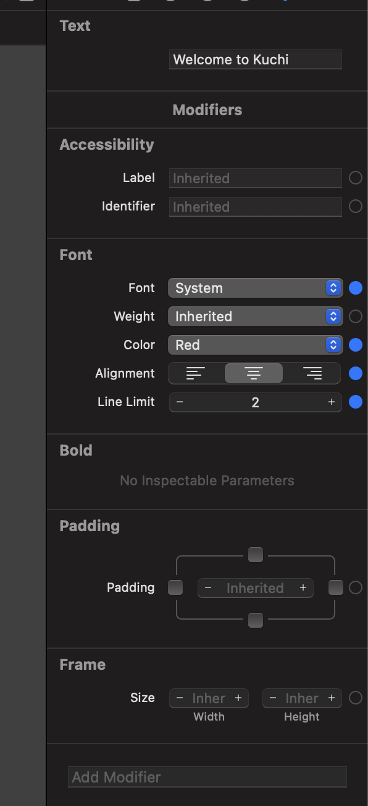

  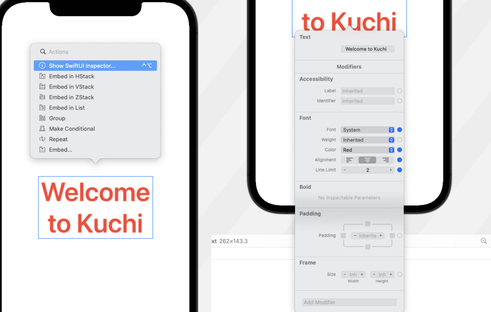

* SiwftUI가 제공하는 modifier에는 두가지 범주가 있다.

  * 모든 `View`에서 사용할 수 있는 프로토콜과 함께 번들로 제공되는 modifier
  * 해당 유형의 인스턴스에만 사용할 수 있는 특정 타입의 modifier

  아래 처럼 modifier가 어떤 것들이 있는지 찾아볼 수 있다.

  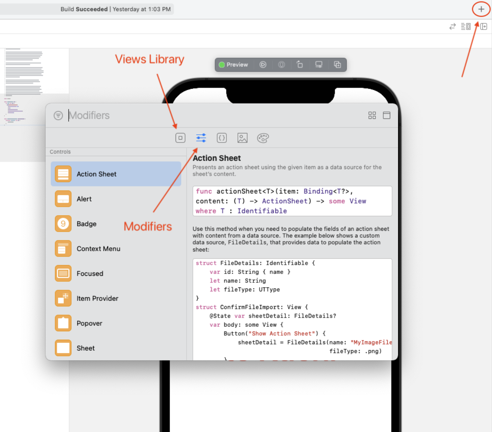

* 과연 modifier가 효율적인가?

  모든 modifier는 새로운 `View`를 리턴하고 있는데, 이 프로세스가 실제로 효율적인가에 대한 의문이 생긴다.

  SwiftUI는 modifier를 호출할 때마다 새로운 `View`에 이전 `View`를 포함한다.
  즉, `View` 스택을 생성하는 재귀 프로세스이다.
  직관적으로 이것은 자원 낭비처럼 보일 수 있다. 그러나 사실 SiwftUI가 이 스택을 View의 실제 랜더링에 사용되는 효율적인 데이터 구조로 평면화(flat)한다.

  즉, `View` 효율성에 미칠 염려없이 자유롭게 사용가능하다.

* modifier의 적용 순서가 중요한가?

  대부분의 경우에는 NO이지만, 일단은 답은 YES이다.

  예를 들어 modifier로 굵게 적용한다음 빨간색으로 만드는 경우,

  ```swift
  Text("Welcome to Kuchi")
    .bold()
    .foregroundColor(.red)
  ```

  먼저 빨간색으로 만든 다음 굵게 표시하는 경우

  ```swift
  Text("Welcome to Kuchi")
    .foregroundColor(.red)
    .bold()
  ```

  둘 차이를 느끼지 못할 것이다.

  

  그러나 배경색을 적용한 다음 padding을 적용하는 것과 padding을 적용하고 배경색을 적용하는 것은 서로 다른 결과가 나타난다.

  ```swift
  Text("Welcome to Kuchi")
    .background(Color.red)
    .padding()
  ```

  ```swift
  Text("Welcome to Kuchi")
    .padding()
    .background(Color.red)
  ```

  

  배경색을 적용하는 View가 경우에 따라 다를 수 있기 때문이다. modifier를 적용하면 새로운 `View`를 리턴하기 때문에 어떤 View를 기준으로 modifier를 적용하냐에 따라 다르다는 얘기.

  ```swift
  Text("Welcome to Kuchi")
    .background(Color.yellow)
    .padding()
    .background(Color.red)
  ```

  

* modifier를 적용하지 않고 이미지를 생성하면 SiwftUI는 이미지를 기본 해상도로 랜더링하고 이미지의 종횡비를 유지한다.

* 이미지의 크기를 조정하려면 inset 및 resizing mode라는 두 가지 매개변수를 사용하는 `resizable` modifier를 적용해야 한다. resizing mode는 `.tile` 또는 `.stretch`일 수 있다.

  * 매개변수를 제공하지 않으면 SwiftUI는 네 방향(top, bottom, leading, trailling) 및 `.stretch` resizaing mode 모두에 대해 inset이 없다고 가정한다.

  아래 코드를 보자. width와 height을 30 frame에 이미지를 넣었다.

  ```swift
  Image(systemName: "table")
  	.frame(width: 30, height: 30)
  ```

  그러나 실행시키면 이미지는 원래 크기이고 preview에서 이미지를 클릭해보면 30/30 크기만큼 테두리가 보인다. View의 크기는 늘었지만, 이미지자체의 크기는 그대로인 상황.
  

  `frame` 앞에 `resizable` modifier를 붙여준다.

  ```swift
  Image(systemName: "table")
    .resizable()
    .frame(width: 30, height: 30)
  ```

  > **참고**
  >
  > 이미지에 포인트로 절대 크기를 지정했다. 그러나 접근성을 위해 SwiftUI가 이미지 또는 일반적인 UI cotent 크기를 조정하는 방법을 결정하는 것이 좋다.
  >
  > 이에 대한 내용은 나중에 배우도록 하자.

* 이미지 modifier(수정자)적용 예

  ```swift
  Image(systemName: "table")
    .resizable()
    .frame(width: 30, height: 30)
  	// 모서리 반경을 이미지 크기의 절반으로 설정
    .cornerRadius(30/2)
  	// 얇은 회색 테두리를 추가
    .overlay(Circle().stroke(Color.gray, lineWidth: 1))
  	// 밝은 회색 배경색을 추가
  	.background(Color(white: 0.9))
  	// Circle Shape를 사용하여 결과 이미지를 잘라 넘어간 색상배경을 제거
    .clipShape(Circle())
  	// 전경색을 빨간색으로 설정
    .foregroundColor(.red)
  ```

  

* 특별한 경우를 제외하고는 `View` 의 body는 하나의 subview만 허용가능하다.

* 이미지 수정자 적용 예2

  ```swift
  // 추가하는 image 이름, Assets.xcassets 에 있는 이미지 이름을 통해 가져온다.
  Image("welcome-background", bundle: nil)
  	// 크기를 조정할 수 있도록 한다.
    .resizable()
  	// 원본 비율을 기준으로 부모내에서 완전히 보이도록 이미지를 최대화한다.
    .scaledToFit()
  	// 기본적으로 1 : 1 인 종횡비를 설정한다.
  	// ContentMode를 .Fill으로 설정하면 이미지가 전체 상위 뷰를 채우므로 이미지의 일부가 뷰의 경계를 초과하여 확장된다.
    .aspectRatio(1/1, contentMode: .fill)
  	// safearea inset을 무시하고 safearea 외부로 view를 확장하여 전체 상위 공간을 차지하도록 한다.
    // 현재 모든 가장자리를 무시하지만 가장자리별로 구성할 수도 있다. 그렇게 하려면 무시할 가장자리 배열을 전한다 (.top, .bottom, .leading, .trailing) 
  	// 뿐만 아니라 두 개의 수직 및 두 개의 수평 가장자리를 각각 결합하는 .vertical 및 .horizontal도 전달한다.
    .edgesIgnoringSafeArea(.all)
  	// 이미지의 채도를 줄인다.
    .saturation(0.5)
  	// 블러족용
    .blur(radius: 5)
  	// 투명도 적용
    .opacity(0.08)
  ```

  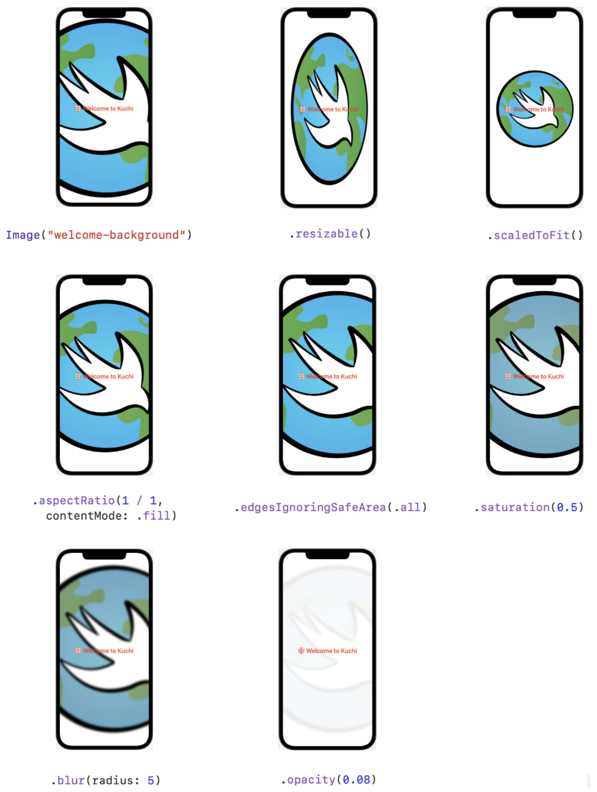

  위 코드에서는 중복 수정자가 있다.

  `.scaledFit` 수정자인데, 이미 `.resizable`을 사용하여 부모에 맞게 이미지를 만든 다음 .aspectRatio가 대신 부모를 채우도록 이미지를 만든다. `.scaledToFit` 수정자를 주석 처리하면 최종 결과가 변경되지 않는 것을 볼 수 있다.

  `scaledToFit`과 `aspectRatio` switch하면 어떻게 될까? 결과물이 달라질까?

  `.scaledTofit`은 이전 행에서 설정된 채우기 모드를 무시한다. 따라서 중복 수정자가된다. 그러나 종횡비를 2로 변경하면?

  ```swift
  .aspectRatio(2 / 1, contentMode: .fill)
  ```

  이 경우 결과는 상당히 다르다. 높이를 변경하지 않고 너비를 2배로 만들기 때문

  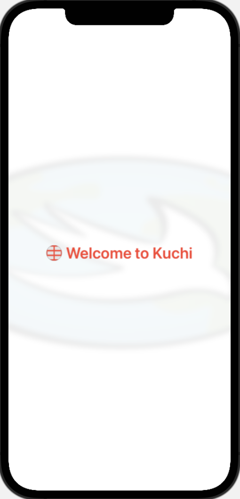

  즉, 이 종횡비 변경을 되돌릴 수 있으며 중복 되는 코드인`.scaledTofit`를 안전하게 삭제할 수 있다.
  그런 다음 코드가 다음과 같다.

  ```swift
  Image("welcome-background", bundle: nil)
    .resizable()
    .scaledToFit()
    .aspectRatio(1/1, contentMode: .fill)
    .edgesIgnoringSafeArea(.all)
    .saturation(0.5)
    .blur(radius: 5)
    .opacity(0.08)
  ```

* 텍스트 분할

  아래의 코드를

  ```swift
  VStack {
    Text("Welcome to")
      .font(.system(size: 30))
      .bold()
      .foregroundColor(.red)
      .multilineTextAlignment(.center)
      .lineLimit(2)
    Text("Kuchi")
      .font(.system(size: 30))
      .bold()
      .foregroundColor(.red)
      .multilineTextAlignment(.center)
      .lineLimit(2)
  }
  ```

  이렇게 리펙토링할 수 있다. (font랑 bold는 `Text`전용 수정자임. `View`, `VStack`에는 적용 불가)

  ```swift
  VStack{
    Text("Welcome to")
      .font(.system(size: 30))
      .bold()
    Text("Kuchi")
      .font(.system(size: 30))
      .bold()
  }
  .foregroundColor(.red)
  .multilineTextAlignment(.center)
  .lineLimit(2)
  ```

  위의 두 `Text`를 가운데가 아닌 왼쪽 정렬을 하고자 해서 아래 코드를 `VStack`에 적용해봤다.

  ```swift
  VStack{
    ...
  }
  .foregroundColor(.red)
  // --------여기---------
  .multilineTextAlignment(.leading)
  // --------------------
  .lineLimit(2)
  ```

  그러나 동작하지 않는다.
  이는 `Text`를 두개의 서로 다른 `Text`로 분할하고 각 `Text` 크기가 내용에 따라 조정되기 때문. 따라서 TextAlignment를 변경해도 효과가 없음.

  아래 처럼 하면 된다. 

  ```swift
  VStack(alignment: .leading){
    ...
  }
  .foregroundColor(.red)
  .lineLimit(2)
  ```

  라인 제한도 더 이상 필요하지 않다. 그냥 제거해도 되지만 `Text`를 여러 줄에 걸쳐 자유롭게 만들 수 있다. 이 경우 거의 발생하지 않지만 다음과 같이 변경하여 각 `Text`View가 한줄에만 보여줄 수 있도록 1로 변경해준다.

  ```swift
  VStack(alignment: .leading){
    ...
  }
  .foregroundColor(.red)
  .lineLimit(1)
  ```

* SwiftUI 3.0에서 부터는 Text에 md 문법이 지원된다.

  ```swift
  Text("**Welcome to**")
  	.font(.headline)
  Text("**Kuchi**")
  	.font(.largeTitle)
  ```

  와

  ```swift
  Text("Welcome to")
    .font(.headline)
    .bold()
    Text("Kuchi")
    .font(.largeTitle)
    .bold()
  ```

  는 동일한 결과를 출력한다.

* Label: `Image`와 `Text` 결합

  SwiftUI에서 `Image`와 `Text`의 결합은 매우 쉽다. `HStack`이나 `Vstack` 을 이용해도 되지만 작업을 쉽게하기 위해 `Label`을 이용한다.

  ```swift
  Label("Welcome", systemImage: "hand.wave")
  ```

  위 코드는 아래 결과를 출력한다.

  

  또한 `Text` 및 `Image`에 대한 사용자 정의 View를 제공할 수 있다.

  이 이니셜라이저는 title과 icon의 두 가지 매개변수를 사용하며 다음과 같다.

  ```swift
  init(title: () -> Title, icon: () -> Icon)
  ```

  아래 코드를 리펙토링해보자

  ```swift
  HStack {
    Image(systemName: "table")
      .resizable()
      .frame(width: 30, height: 30)
      .overlay(Circle().stroke(Color.gray, lineWidth: 1))
      .background(Color(white: 0.9))
      .clipShape(Circle())
      .foregroundColor(.red)
  
    VStack(alignment: .leading) {
      Text("Welcome to")
        .font(.headline)
        .bold()
      Text("Kuchi")
        .font(.largeTitle)
        .bold()
    }
    .foregroundColor(.red)
    .lineLimit(1)
    .padding(.horizontal)        
  }
  ```

  `Image`는 `Label`의 icon 매개 변수로, VStack (수정자와 함께)은 title 매개 변수로 이동한다.

  ```swift
  Label {
    // Text component
    VStack(alignment: .leading) {
      Text("Welcome to")
        .font(.headline)
        .bold()
      Text("Kuchi")
        .font(.largeTitle)
        .bold()
    }
    .foregroundColor(.red)
    .lineLimit(2)
    .multilineTextAlignment(.leading)
    .padding(.horizontal)
  } icon: {
    // Image component
    Image(systemName: "table")
      .resizable()
      .frame(width: 30, height: 30)
      .overlay(Circle().stroke(Color.gray, lineWidth: 1))
      .background(Color(white: 0.9))
      .clipShape(Circle())
      .foregroundColor(.red)
  }
  ```

  위 코드를 적용하면 아이콘과 글자가 세로로 정렬되지 않았다는 것을 볼 수 있다.

  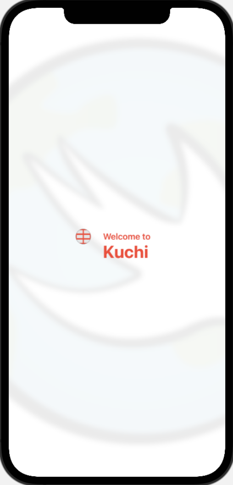

  위 문제를 해결하려면 `Label`이 제공해주는 스타일을 적용해야 한다는 것이다. 문제는 기본적으로 사용가능한 것이 우리의 요구사항에 맞지 않다는 것이다.

  * `DefaultLabelStyle`: 스타일을 지정하지 않은 기본값. title, icon을 표시
  * `IconOnlyLabelStyle`: icon만 표시
  * `TitleOnlyLabelStyle`: title만 표시

  다행인것은 LabelStyle을 직접 구현할 수 있다.

  `LabelStyle` 프로토콜을 채택하는 구조체를 구현하면 된다. 아래 메서드를 구현하면 된다.

  ```swift
  func makeBody(configuration: Self.Configuration) -> Self.Body
  ```

  커스텀 `LabelStyle`을 만들자

  ```swift
  struct HorizontallyAlignedLabelStyle: LabelStyle {
      func makeBody(configuration: Configuration) -> some View {
          HStack{
              configuration.icon
              configuration.title
          }
      }
  }
  ```

  그리고 `Label` 에 적용

  ```swift
  Label{
    ...
  }
  .labelStyle(HorizontallyAlignedLabelStyle())
  ```

## 6. Controls & User Input

* 여기서는 `TextField`, `Button`, `Stepper`등과 같이 사용자 입력에 일반적으로 사용되는 컨트롤에 대해 알아보도록 한다.

* 배경 이미지가 ` .fill` 콘텐츠 모드로 되어 있으면 가능한 한 많은 부모 View를 차지하도록 이미지가 확장된다.

  이때 `TextField`같은 View를 넣으면 아래처럼 배경 이미지 크기에 맞춰서 잡힌다.(너무 길다...)

  

  이를 해결하는 가장 멋진 방법은 `ZStack` 대신에 `.background`수정자를 이용하여 실제 콘텐츠 뒤에 배경 View를 배치하는 것을 피하는 것이다.

  ```swift
  var body: some View {
    VStack {
      WelcomeMessageView()
      TextField("Type your name...", text: $name)
    }
    .background(WelcomeBackgroundImage())
  }
  ```

  근데 이렇게하면 배경이미지가 너무 작게 보이는 문제가 발생한다.

  `VStack`은 전체화면을 사용하는 것이 아니라 content를 렌더링하는 데 필요한 만큼만 사용하기 때문.

  아래 스크린샷의 파란색 테두리가 VStack의 실제 크기이다.

  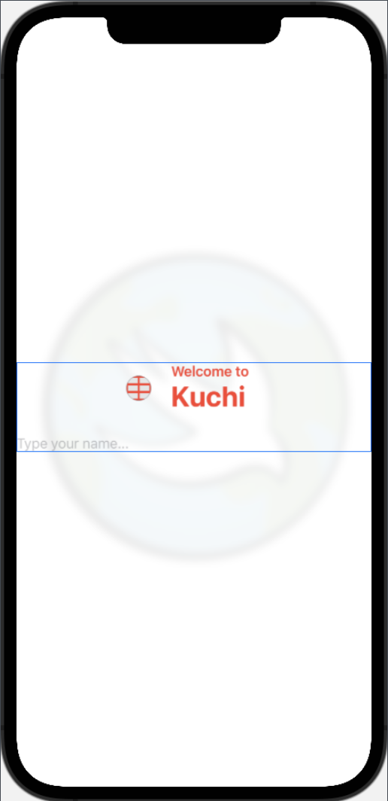

  이 문제를 해결하려면 다음과 같이 `VStack`의 시작 부분과 끝에 두개의 `Spacer`를 추가해준다.

  ```swift
  VStack {
    Spacer()
  
    WelcomeMessageView()
    TextField("Type your name...", text: $name)
  
    Spacer()
  }
  .background(WelcomeBackgroundImage())
  ```

  나중에 `Spacer` 에 좀 더 자세히 배우게 될 것인데, 지금 알아야 할 것은 모든 공간을 사용할 수 있도록 확장시켜준다는 것이다.

* TextField 스타일

  `.textFieldStyle(_:)`을 이용해 textfield 스타일을 지정할 수 있다.

  총4가지가 제공됨.

  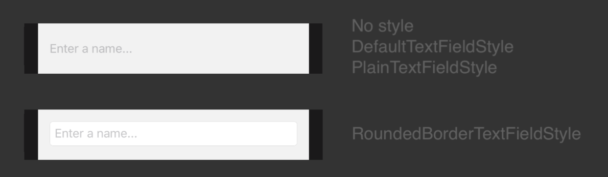

  사실 5번째인 `SquareBorderTextFieldStyle`도 있는데 macOS에서만 사용가능하다.

  NoStyle, DefaultTextFieldstyle, PlainTextFieldStyle 은 차이가 없다.

  RoudnedBorderTextFieldStyle은 모서리가 약간 둥근 테두리가 있다.

  우리가 custom한 TextField를 사용하는 방법은 3가지가 있다. 

  * 필요에 따라 TextField에 수정자를 적용
  * `TextFieldStyle` 프로토콜을 준수하는 type을 정의하여 `TextFieldStyle`을 직접 만든다.
  * `ViewModifier`프로토콜을 준수하는 type을 정의하여 수정자를 직접 만든다.

  여기서는 첫번째 방법을 사용하도록 한다.

  ```swift
  TextField("Type your name...", text: $name)
    .padding(
    	EdgeInsets(top: 8, leading: 16, bottom: 8, trailing: 16)
    )
    .background(Color.white)
    .overlay(RoundedRectangle(cornerRadius: 8)
    					.stroke(lineWidth: 2)
    					.foregroundColor(.blue)
    )
    .shadow(color: Color.gray.opacity(0.4), radius: 3, x: 1, y: 2)
  ```

  아래 스크린샷은 각 수정자의 효과를 보여준다.

  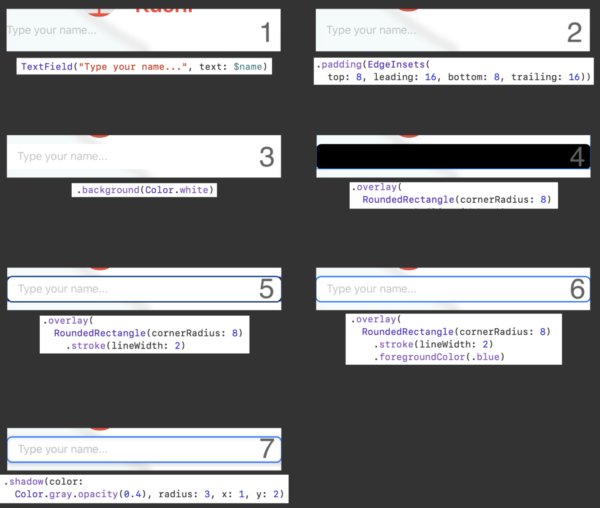

  1. 수정되지 않은 TextField
  2. 세로 16, 가로8의 패딩을 추가
  3. 불투명한 흰색 배경을 추가
  4. 모서리 반경인 8인 둥근 사각형을 사용하여 테두리 오버레이를 만든다.
  5. 테두리만 유지하고 뒤에 내용은 표시되도록 stroke 효과를 추가한다.
  6. 테두디를 파란색을 만든다.
  7. 그림자 추가

* 사용자 정의 TextFieldStyle 을 이용한 방법

  `TextFiledStyle`을 채택하는 struct를 만든다. 구현해야할 메서드는 아래와 같다. 

  ```swift
  public func _body(configuration: TextField<Self._Label>) -> some View
  ```

  구현하면 아래와 같이 할 수 있다.

  ```swift
  struct KuchiTextStyle: TextFieldStyle{
      public func _body(configuration: TextField<Self._Label>) -> some View{
          return configuration
              .padding(
                  EdgeInsets(top: 8, leading: 16, bottom: 8, trailing: 16)
              )
              .background(Color.white)
              .overlay(RoundedRectangle(cornerRadius: 8)
                          .stroke(lineWidth: 2)
                          .foregroundColor(.blue)
              )
              .shadow(color: Color.gray.opacity(0.4), radius: 3, x: 1, y: 2)
      }
  }
  ```

  그리고 Style을 적용하는 코드는 아래와 같다.

  ```swift
  TextField("Type your name...", text: $name)
  	.textFieldStyle(KuchiTextStyle())

* 사용자 지정 수정자를 이용한 방법

  `ViewModifier` 프로토콜을 채택하는 struct를 하나 만든다.

  해당 struct는 아래를 구현해야 한다.

  ```swift
  func body(content: Content) -> some View {
    content
  }
  ```

  일반적으로 수정자를 적용한 View를 리턴한다.

  ```swift
  struct BorderedViewModifier: ViewModifier {
      func body(content: Content) -> some View {
          content
              .padding(
                  EdgeInsets(top: 8, leading: 16, bottom: 8, trailing: 16)
              )
              .background(Color.white)
              .overlay(RoundedRectangle(cornerRadius: 8)
                          .stroke(lineWidth: 2)
                          .foregroundColor(.blue)
              )
              .shadow(color: Color.gray.opacity(0.4), radius: 3, x: 1, y: 2)
      }
  }
  ```

  `ModifiedContent`구조체 인스턴스를 생성하고 거기에 modifier를 적용하는 방식을 써야 한다.

  해당 init은 아래 파라미터를 필요로 하다.

  * content:
  * modifier:

  ```swift
  ModifiedContent(
    content: TextField("Type your name...", text: $name),
    modifier: BorderedViewModifier()
  )
  ```

  근데 이 방법은 구리다. 일반 수정자처럼 `.` 을 이용해서 호출하면 더 좋아보일 것이다.

  `View` extension을 이용해 메서드를 생성하면 된다.

  ```swift
  extension View{
      func bordered() -> some View{
          ModifiedContent(content: self, modifier: BorderedViewModifier())
      }
  }
  ```

  적용하면 다음과 같다.

  ```swift
  TextField("Type your name...", text: $name)
  	.bordered()
  ```

  깔끔

* TextField에서 입력을 할 때 키보드를 보면 return표시 키가 매핑되어 있지만,

  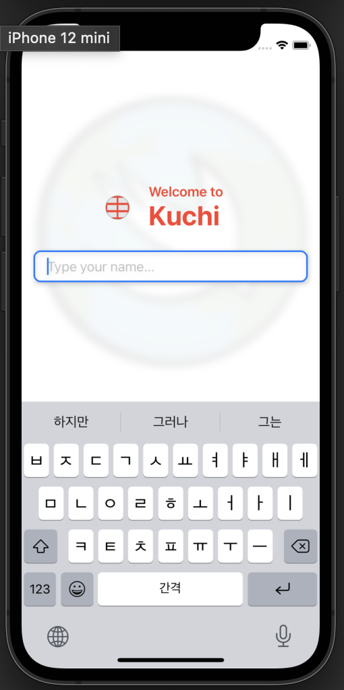

  이동하려는 필드가 더 있는 경우 "next",
  더이상 없는 경우 "done"으로 변경되도록 하고 싶다.

  TextField의 수정자를 사용한다.

  ```swift
  .submitLabel(.done)
  ```

  이렇게 하면 키보드가 "return" 대신 "done(완료)"으로 나오고, 터치시 키보드가 사라지지만, "next"나 "continue" 등등은? 나중에 보도록 하자.

  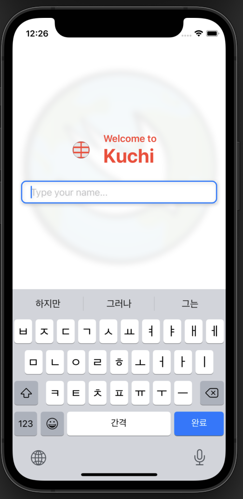

* SwiftUI3.0에서 사용할 수 있는 기능중에 포커스가 있는 컨트롤을 언제든지 지정하고 알 수 있는 기능이 있다.

  이를 사용하려면 `View`에 `Hashable`을 채택하는 property가 있어야 한다.

  ```swift
  struct RegisterView: View {
    // Add this enum
    enum Field: Hashable {
      case name
    }
    @FocusState var focusedField: Field?
    ...
  }
  ```

  enum 케이스와 텍스트 필드 간의 연결을 생성해야 한다. 이것은 양방향 바인딩이므로 다음이 가능하다.

  * enum케이스가 `focusField`에 할당되면 연결된 component가 포커스를 받는다.
  * component가 사용자의 작업에 대한 응답으로 포커스를 얻으면 (사용자 작업에 대한 응답으로) `focusedField` 프로퍼티는 해당 enum 케이스로 설정된다.

  바인딩은 포커스 상태 프로퍼티 바인딩과 component에 연결된 값을 결정하는 값을 취하는 수정자를 사용하여 수행된다.
  다음과 같이 텍스트 필드에 `.focused` 수정자를 추가한다.

  ```swift
  // userManager.profile.name에 입력된 값을 바인딩한다.
  TextField("Type your name...", text: $userManager.profile.name)
    // 해당 텍스트 필드가 포커스되면 focusField를 .name으로 설정
    .focused($focusedField, equals: .name)
  	// 키보드의 return button을 .done으로 변경
    .submitLabel(.done)
    .bordered()
  ```

  이 수정자를 사용하면 SwiftUI에 다음과 같이 알릴 수 있다.

  * `focusField`가 `.name`인 경우 이 텍스트 필드에 포커스를 지정한다.
  * 이 필드가 포커스를 받으면 `focusField`를 `.name`으로 설정한다.

  이렇게 하면 바인딩을 만들었고, 이제 사용을 해야 한다.

  근데 현재는 텍스트필드가 하나만 있으므로 열거형을 사용하는 것은 오버스펙이다. 해당 component를 Bool프로퍼티에 바인딩하도록 하자.

  `Field` 열거형을 삭제하고 `focusField`를 다음과 같이 선언한다.

  > 여기서 FocusState는 iOS15부터 사용가능한 프로퍼티 래퍼이다. 흔히 사용하는 @State와 비슷한데 TextField, SecureField에서만 사용가능한 래퍼이다.

  ```swift
  @FocusState var nameFieldFocused: Bool
  ```

  그리고 `focused(_:)` 부분을 다음으로 수정한다.

  ```swift
  .focused($nameFieldFocused)
  ```

* TextField의 생성자1

  ```swift
  public init<S>(
    _ title: S,
    text: Binding<String>,
    onEditingChanged: @escaping (Bool) -> Void = { _ in },
    onCommit: @escaping () -> Void = {}
  ) where S : StringProtocol
  ```

  * `onEditingChanged`: 편접이 포커스를 얻거나(Bool 파라미터가 true인 경우)포커스를 잃을 때(매개변수가 false인 경우)호출된다.
  * `onCommit`: 사용자가 리턴키를 누르는 것과 같은 커밋 작업을 수행할 때 호출된다. 자동으로 다음 필드로 포커스를 이동하는 것을 처리할 때 유용하다.

* TextField의 생성자2

  ```swift
  public init<S, T>(
    _ title: S,
    value: Binding<T>,
    formatter: Formatter,
    onEditingChanged: @escaping (Bool) -> Void = { _ in },
    onCommit: @escaping () -> Void = {}
  ) where S : StringProtocol
  ```

  위의 생성자1과 다른점

  * `foramtter`: 편집된 값이 문자열과 다른 유형(예: 숫자 또는 날짜)인 경우 사용할 수 있지만 커스텀 포맷터를 만들 수도 있다.
  * value\<T>: Generic타입으로 선언. TextField가 처리하는 type을 결정

* Button의 생성자

  ```swift
  struct Button<Label> where Label : View{
    ...
    init(
      action: @escaping () -> Void,
      @ViewBuilder label: () -> Label
    )  
  }
  ```

  label 매개변수에 적용된 래퍼 `@ViewBuilder`는 클로저가 여러 하위 View를 반환하도록 하는 데 사용된다.

* ButtonStyle또한 TextField처럼 사용자 정의 스타일이 생성이 가능하다. `PrimitiveButtonStyle`을 사용하면 됨.

* `.disabled(_:)를 사용하면 파라미터의 Bool값에 따라 버튼이 활성화되고 비활성화 된다.

*  done을 누르지 않고 특정 Button을 눌러도 키보드 포커스를 해제하는 방법

  이전에 만들었던 코드를 보면

  ```swift
  @FocusState var nameFieldFocused: Bool
  ```

  `nameFieldFocused` 변수에 의해 TextField의 focus가 해제/활성화 되도록 만들었다.

  ```swift
  TextField("Type your name...", text: $userManager.profile.name)
    .focused($nameFieldFocused)
    .submitLabel(.done)
    .bordered()
  ```

  간단하다. Button을 눌렀을 때 action에서 `nameFieldFocused`를 false로 변경해주면 된다.

  ```swift
  func registerUser(){
    nameFieldFocused = false
    ....
  }
  ```

  반대로 완료(`submitLabel(.done)`) 버튼 클릭 시 Button을 누른 효과를 보고싶다면 

  `onSubmit(_:)` 수정자를 사용하면 된다.

  ```swift
  TextField("Type your name...", text: $userManager.profile.name)
    .focused($nameFieldFocused)
    .submitLabel(.done)
    // 키보드의 submit 버튼 클릭 시 registerUser라는 method실행
    .onSubmit(registerUser)
    .bordered()
  

* 기타 컨트롤들

  아래 컨트롤들의 생성자는 여러개 중에 가장 일반적인 거를 꼽은 것

  * Sidler

    * initializer

      ```swift
      public init<S, V>(
        _ title: S,
        value: Binding<V>,
        in bounds: ClosedRange<V>,
        step: V.Stride = 1,
        onEditingChanged: @escaping (Bool) -> Void = { _ in }
      ) where S : StringProtocol, V : Strideable
      ```

      * vlaue: 바인딩 값
      * bounds: 범위
      * step: 각 단계의 간격
      * onEditingChanged: 편집이 시작되거나 끝날 때 호출되는 선택적 클로저

    * 예제 코드

      ```swift
      @State var amount: Double = 0
      ...
      
      VStack {
        HStack {
          Text("0")
          Slider(
            value: $amount,
            in: 0.0 ... 10.0,
            step: 0.5
          )
          Text("10")
        }
        Text("\(amount)")
      }
      ```

      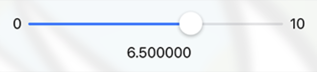

  * Stepper

    * 생성자

      ```swift
      public init<S, V>(
        _ title: S,
        value: Binding<V>,
        in bounds: ClosedRange<V>,
        step: V.Stride = 1,
        onEditingChanged: @escaping (Bool) -> Void = { _ in }
      ) where S : StringProtocol, V : Strideable
      ```

      * title: 일반적으로 현재 바인딩된 값을 포함하는 title
      * value: 바인딩 값
      * bounds: 범위
      * step: 각 단계의 간격
      * onEditingChanged: 편집이 시작되거나 끝날 때 호출되는 선택적 클로저

    * 예제

      ```swift
      @State var quantity = 0.0
      ...
      
      Stepper(
        "Quantity: \(quantity)",
        value: $quantity,
        in: 0 ... 10,
        step: 0.5
      )
      ```

      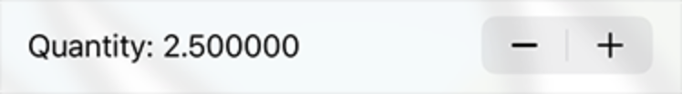

  * SecureField

    * 생성자

      ```swift
      public init<S>(
        _ title: S,
        text: Binding<String>,
        onCommit: @escaping () -> Void = {}
      ) where S : StringProtocol
      ```

      * title: 입력이 없을 때 컨트롤 내부에 표시되는 text
      * text: 텍스트 바인딩
      * onCommit: 사용자가 return키를 누르는 것과 같은 작업을 수행될 때 호출되는 클로저

    * 예제

      ```swift
      @State var password = ""
      ...
      
      SecureField.init("Password", text: $password)
        .textFieldStyle(RoundedBorderTextFieldStyle())
      ```

      

## 7. Introducing Stacks & Containers

* Uikit 및 AppKit에서는 오토 레이아웃을 사용하여 View를 제한하는 데 사용되었음.
  일반적인 규칙은 예를 들어 정적으로 크기가 설정되어 있지 않으면 부모가 제약 조건을 추가하여 자식의 크기를 결정했음.

  그러나 SwiftUI에서는 자식은 부모가 제안한 크기에 따라 크기를 선택한다.

  예를들어 View 내부에 Text있다 가정했을 때 Text는 상위 View가 렌더링 될 때 제안 된 크기가 제공됩니다.
  그러나 Text는 표시 할 크기를 계산하고 해당 Text에 맞는 크기와 추가 패딩을 선택할 수있는 크기를 선택한다.

  > * Q) 제안과 제약...? 강제와 비강제의 차이일 뿐 부모에 의해 선택되는 건데..? 무슨 차이일까...?
  > * A)

* 단일 자식이 있는 View의 레이아웃

  아래 코드를 보자

  ```swift
  Text("A great and warm welcome to Kuchi")
    .background(Color.red)
  ```

  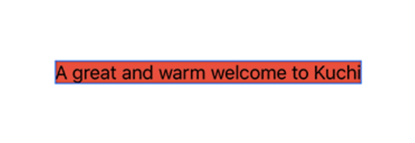

  content 크기에 맞게 프레임 크기가 설정되는 것을 볼 수 있음.
  부모 View와 자식View의 크기를 결정하기 위해 SwiftUI가 적용한 규칙은 다음과 같다.

  1. 부모 View는 사용가능한 프레임을 결정한다.
  2. 부모 View는 자식 View에 크기를 제안한다.
  3. 부모View의 제안에 따라 자식 View가 크기를 선택한다.
  4. 부모 View는 자식View를 포함하도록 자체 크기를 조정한다.

  이 프로세스는 루트 View에서 시작하여 View계층 구조의 마지막 Leaf View까지 재귀적이다.

  위 동작을 확인하기 위한 코드

  ```swift
  Text("A great and warm welcome to Kuchi")
    .background(Color.red)
  	// 고정 프레임 설정
    .frame(width: 150, height: 50, alignment: .center)
    .background(Color.yellow)
  ```

  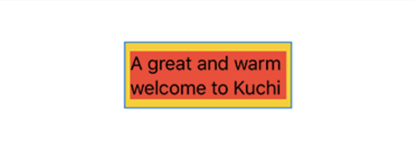

  위에는 한줄이고 여기는 두줄로된 텍스트이다.

  Text에 `.frame` 수정자가 작성된 뷰의 크기와 다른 크기가 있음을 알 수 있다. 위에서 설명한 네 가지 규칙이 여기에 적용되기 때문

  1. 프레임 뷰는 150 × 50의 고정된 크기
  2. 프레임 뷰는 Text의 크기를 제안합니다
  3. Text는 그 크기 내에 Text를 표시하는 방법을 찾지만 (가능한 경우)  자르지 않고도 최소값을 사용한다.

  프레임 뷰에는 이미 정의된 크기가 있으므로 규칙4를 건너뛴다. 텍스트가 잘림없이 최대 150포인트로 한 줄에 그릴 수 없기 때문에 Text가 자동으로 안의 글씨를 표시한다.

  width를 300으로 해보면 한줄에 표시됨.

  ```swift
  .frame(width: 300, height: 100, alignment: .center)
  ```

  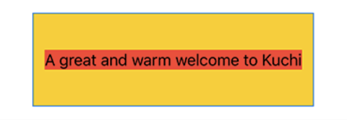

  반대로 width나 height를 더 줄이면 그 크기에 맞춰 Text는 모든 정보를 표시할 수 없다.

  ```swift
  .frame(width: 100, height: 20, alignment: .center)
  ```

  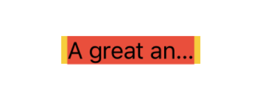

  `.minimumScaleFactor` 수정자를 사용해 텍스트 크기를 줄이는 방법을 쓸 수 있음.

  ```swift
  Text("A great and warm welcome to Kuchi")
    .background(Color.red)
    .frame(width: 100, height: 50, alignment: .center)
    // Add this scale factor
    .minimumScaleFactor(0.5)
    .background(Color.yellow)
  ```

  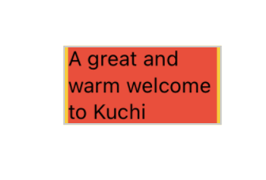

  일반적으로 component는 항상 부모가 제안한 크기 내에서 content를 맞추려고 한다. 

  이는 SwiftUI에서 각 View가 자체 크기를 선택하는 개념을 뒷받침한다. 부모가 제안한 것을 고려하고 최선을 다해 해당 제안에 적응하려고 시도하지만 항상 View가 어떤 타입의 component인지에 따라 다르다.

  예를 들어 이미지에서, 다른 제약 조건이없는 경우 original 해상도로 렌더링된다.

  ```swift
  Image("welcome-background")
    .background(Color.red)
  	// 고정 frame을 넣었다.
    .frame(width: 100, height: 50, alignment: .center)
    .background(Color.yellow)
  ```

  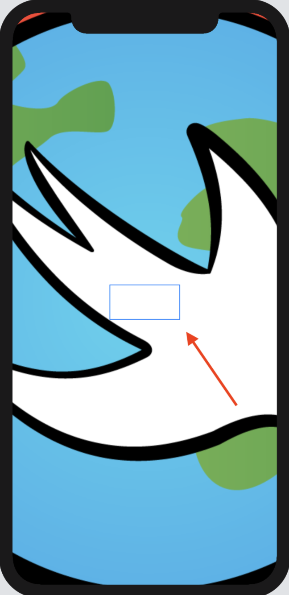

  빨간색 화살표는 고정 프레임을 표시하고 있지만 이미지가 original 해상도로 렌더링되었음.

  `.resizable`을 이용해 부모가 제공하는 공간을 차지하기 위해 이미지가 자동으로 확대 또는 축소 되도록 할 수 있다.

  ```swift
  Image("welcome-background")
    .resizable()
  	.background(Color.red)
    .frame(width: 100, height: 50, alignment: .center)
    .background(Color.yellow)
  ```

  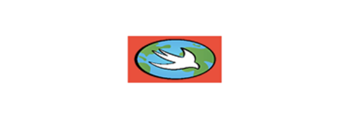

  따라서 결국 부모가 자식에게 크기를 "억지로 제한"할 수 있는 방법이 없다. 부모가 할 수 있는 일은 크기를 제안하고 궁극적으로 선택한 프레임 안에 자식을 제한하는 것이다. 그러나 이는 자식이 더 작거나 더 큰 크기를 선택하는 능력에 영향을 미치지 않는다.

  `Text`와 같은 일부 component는 부모가 제안한 크기에 가장 잘맞는 크기를 선택하여 적응을 시도하고, `Image`와 같은 다른 component는 제안된 크기를 무시한다.

  중간에 다소 중립적인 견해가 있다. 즉, 부모View들은 크기를 선택할 이유가 없음을 의미한다. 부모View들은 그 결정을 자식View에게 넘길 것이고, 단지 부모View들의 자식들을 감싸도록 스스로 크기를 조정한다.

  예를들어 고유 크기가 없는 `.padding`수정자의 경우 단순히 하위 크기를 가져오고 4개의 가장자리 각각에 지정된 패딩을 추가하고 이 내용을 포함하는 자식 뷰를 만든다.

* Container View의 Layout

  Containter View에서 두개 이상의 하위 View가 포함된 경우 하위 View의 크기를 정하는 규칙

  1. 컨테이너 뷰는 일반적으로 상위 뷰가 제안한 크기인 사용 가능한 프레임을 결정한다.
  2. 컨테이너 뷰는 가장 제한적인 제약 조건이 있는 하위 뷰를 선택하거나, 동등한 제약 조건의 경우 가장 작은 크기를 가진 하위 뷰를 선택한다.
  3. 컨테이너 뷰는 하위 뷰에 크기를 제안한다. 제안된 크기는 사용가능한 크기를 나머지 하위 뷰의 수로 균등하게 나눈다.
  4. 상위 뷰의 제안에 따라 하위 뷰가 크기를 선택한다.
  5. 컨테이너 뷰는 사용가능한 프레에서 하위 뷰에서 선택한 크기를 빼고 2번 단계로 돌아간다. 모든 하위 뷰가 처리될 때 까지

  ```swift
  HStack {
    Text("A great and warm welcome to Kuchi")
      .background(Color.red)
    Text("A great and warm welcome to Kuchi")
      .background(Color.red)
  }
  .background(Color.yellow)
  ```

  위 코드의 결과로 같은 크기의 Text가 생성되는 것을 예상했지만 결과는 그렇지 않다.

  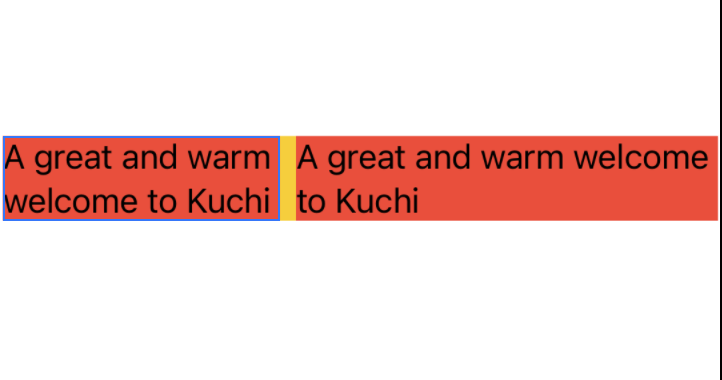

  이유는?

  1. 스택 뷰는 부모 뷰로 부터 제안된 크기를 받아 동일한 두 부분으로 나눈다.
  2. 스택뷰의 자식 중 하나에게 첫번째 크기를 제안한다. 두 `Text`모두 동일한 크기이므로 왼쪽에 있는 첫 번째 자식`Text`에게 먼저 제안한다.
  3. 텍스트를 두줄로 표시해야 하고 두 줄의 길이가 비슷하도록 서식을 지정할 수 있기 때문에 제안된 크기보다 적게 필요함.
  4. 스택은 첫 번째에서 가져온 크기를 제외하고 나머지 결과 크기를 두번째 `Text`에 제안한다.
  5. 제안된 모든 나머지 크기를 `Text`가 사용하도록 결정한다.

  따라서 두번째 `Text`의 'm'문자를 'n'으로 변경하면 두번째 `Text`의 크기가 작아지므로 가장 먼저 제안을 받는 자식뷰는 두번째 `Text`가 될테고 아래와 같은 그림이 나온다.

  ```swift
  Text("A great and warm welcome to Kuchi")
    .background(Color.red)
  Text("A great and warn welcome to Kuchi") // <- Replace `m` with
                                            //    `n` in `warm`
    .background(Color.red)
  ```

  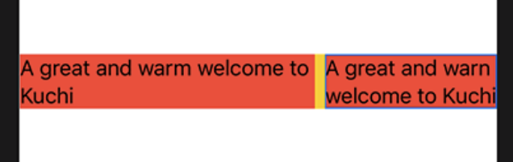

* 위에서 봤듯이 동등한 제약조건의 경우 크기가 가장 뷰가 먼저 크기를 제안받게 된다.

  이 순서를 변경할 수 있음.

  * 수정자를 통해 View동작을 변경

    * `Image` 는 부모가 제안한 크기를 무시하기 때문에 적응력(제안했을 때 받아들이는 거)이 가장 낮은 component중 하나이다. 그러나 `resizable` 수정자를 사용하면 제안한 모든 크기를 맹목적으로 수락할 수 있다.
    * 제안된 크기에 가장 잘 맞도록 텍스트 형식을 지정하고 줄 바꿈하기 때문에 적응력이 매우 뛰어나다.
      그러나 `lineLimit`수정잘르 통해 최대 줄 수를 제한시킬 경우 적응력이 떨어진다.

  * View의 레이아웃 우선순위를 강제로 변경

    * `layoutPriority`수정자를 사용하여 레이아웃 우선순위를 변경할 수도 있다.

    * `Double`타입의 양수 또는 음수 값을 준다.

    * 명시적으로 우선순위를 주지 않는 경우 우선순위 값이 0이라고 생각하면 된다.

    * `Stack`은 가장 높은 값에서 시작해서 가장 낮은 값 순으로 뷰를 처리한다.

    * 예시

      ```swift
      HStack{
        Text("A great and warm welcome to Kuchi")
        .background(Color.red)
        Text("A great and warm welcome to Kuchi")
        .background(Color.red)
        Text("A great and warm welcome to Kuchi")
        .background(Color.red)
      }
      .background(Color.yellow)
      ```

      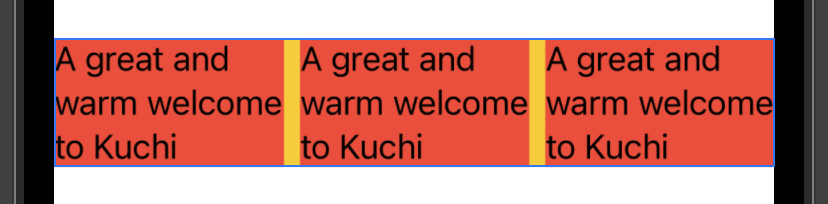

      

      ```swift
      HStack {
        Text("A great and warm welcome to Kuchi")
          .background(Color.red)
      
        Text("A great and warm welcome to Kuchi")
          .layoutPriority(1)
          .background(Color.red)
      
        Text("A great and warm welcome to Kuchi")
          .background(Color.red)
      }
      ```

      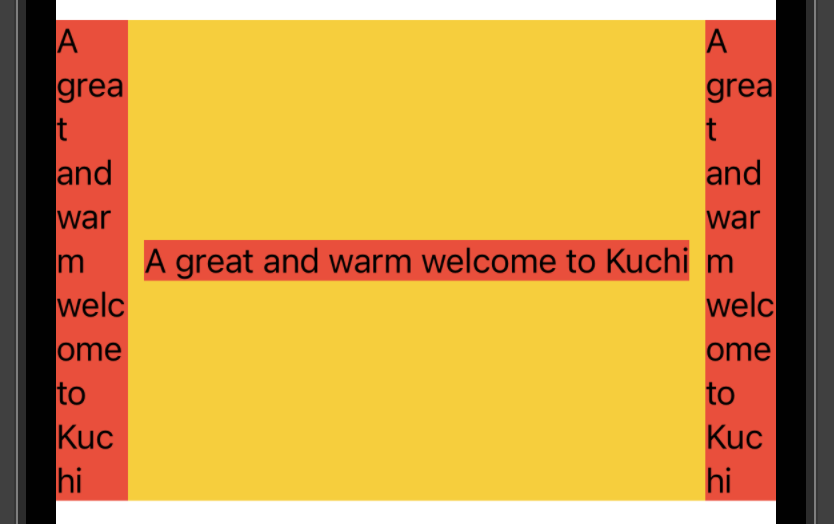

      

      ```swift
      HStack {
        Text("A great and warm welcome to Kuchi")
          .layoutPriority(-1)
          .background(Color.red)
      
        Text("A great and warm welcome to Kuchi")
          .layoutPriority(1)
          .background(Color.red)
      
        Text("A great and warm welcome to Kuchi")
          .background(Color.red)
      }
      ```

      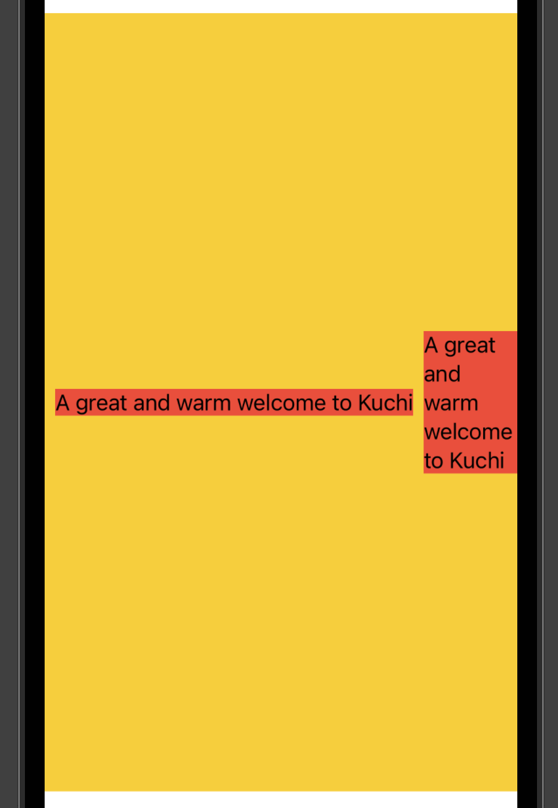

      마지막을 보면 가장 왼쪽 Text(priority 가 -1)는 보이지 않는다. 그런데, 세로로 엄청 길다. 이를 보고 유추할 수 있는건 우선순위에서 밀려서 너비를 갖지 못하고 각 문자를 표시하기 위해 Text의 크기를 세로로 늘린 모습.

      > 왼쪽 Text가 보이지 않는데 Text내부에 있는 글자 때문임. SwiftUI는 (전부 다 한글자로만 표시하는게 아니라면)띄어쓰기 단위로 글자를 붙이기 때문에 오른쪽 Text의 문자열 배열이 어쩔 수없이 띄어쓰기 단위로 크기가 잡히기 때문에 왼쪽 Text가 나올 수가 없음. 
      >
      > 그냥 "A great and warm welcome to Kuchi" 를 "A great a warm welcome to Kuchi" 이런식으로 글자를 줄여보면 알게됨.
      
      또한 기본 padding 때문에 너비를 차지하고 있음. HStack의 spacing을 0으로 만들면 보임.
      
      ```swift
      HStack(spacing: 0) {
        Text("A great and warm welcome to Kuchi")
        ...
      }
      ```
      
      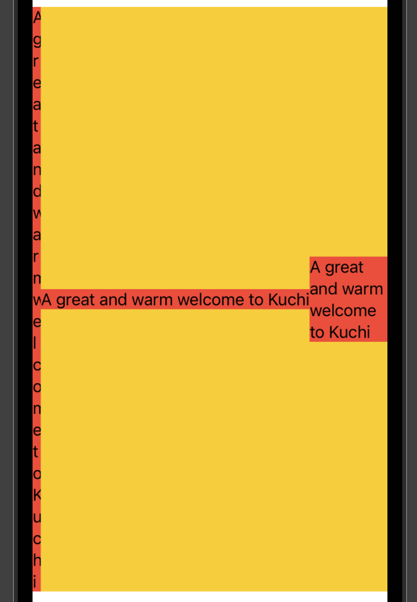

  * HStack, VStack 정렬에서 매우 유용한 두가지가 있음.

    * firstTextBaseline: 텍스트의 위를 기준으로 View를 정렬
    * lastTextBaseline: 텍스트의 아래를 기준으로 View를 정렬

    뭔소리냐면

    ```swift
    var body: some View {
      HStack() {
        Text("Welcome to Kuchi").font(.caption)
        Text("Welcome to Kuchi").font(.title)
        Button(action: {}, label: { Text("OK").font(.body) })
      }
    }
    ```

    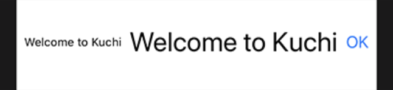

    들쭉 날쭉임.

    

    그렇다고 

    ```swift
    HStack(alignment: .bottom) {
    ```

    bottom을 사용한다고 해도 이상함. (각 View의 크기가 다르다 보니 padding도 달라서 bottom을 적용해도 미묘하게 기준선이 다르다.)

    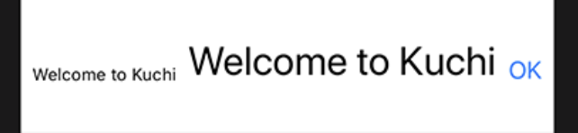

    

    이때 사용하는게 firstTextBaseline임.

    ```swift
    HStack(alignment: .firstTextBaseline) {
    ```

    

    깔끔하게 문자열의 하단을 기준으로 정렬해줌.

* ZStack에는 layoutPriority가 적용되지 않음.

* Spacer는 content의 크기를 뺀 나머지를 차지해주는 View임
  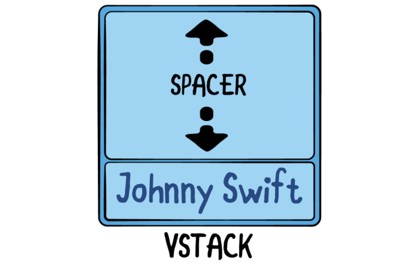

* `@ViewBuilder`가 적용된 프로퍼티 `body`는 반환된 뷰가 둘 이상의 뷰로 구성될 수 있음을 나타낸다.
  하나의 뷰만 반환된다고 해도  두 개의 뷰가 선언되어있으면 필욯다. 하나 `if`에, 다른 하나는 `else`'에 있을 경우가 있잔슴.

  ```swift
  @ViewBuilder
  var body: some View {
    if userViewModel.isRegistered {
      WelcomeView()
    } else {
      RegisterView()
    }
  }
  ```

* UIKit에서 사용하던 ReusableCell처럼 스크롤뷰에서 cell을 재사용할 때 쓰는 것이 있음.

  LazyVStack, LazyHStack lazy라는 단어가 붙은 것을 보아 사용할 때만 메모리에 로드한다는 것을 유추할 수 있음.

  `ScrollView`, `LazyVStack`, `ForEach`로 UIKit의 TableView를 구현할 수 있다.

  일단 LazyVStack의 생성자

  ```swift
  init(
    _ data: Data,
    id: KeyPath<Data.Element, ID>,
    content: @escaping (Data.Element) -> Content
  )
  ```

  * data: 반복할 컬렉션
  * id: 각 컬렉션의 각 요소를 고유하게 식별할 수 있는 요소, KeyPath로 되어 있음. Hashable을 준수해야 함
  * content: 표시할 내용을 담은 클로저

  사용 예시

  ```swift
  ScrollView {
    LazyVStack {
      ForEach(history, id: \.self) { element in
        getElement(element)
      }
    }
  }
  ```

  위에 헤더를 달고싶다면

  ```swift
  Section {
    ForEach(history, id: \.self){ element in
  		getElement(element)
  	}
  } header: {
    header
  }
  ```

  근데 header가 스크롤하면 같이 내려감 이럴 때는 LazyVStack의 pinnedViews매개변수를 이용

  ```swift
  LazyVStack(spacing: 0, pinnedViews: [.sectionHeaders]){
    Section {
      ForEach(history, id: \.self){ element in
  			getElement(element)
      }
    } header: {
      header
    }
  }
  ```

  

