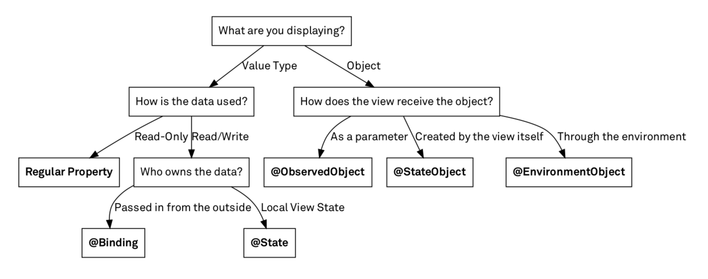

# Section3. State & Data Flow

> Reference
>
> * https://www.raywenderlich.com/books/swiftui-by-tutorials
> * https://www.hohyeonmoon.com/blog/swiftui-data-flow/

## 8. State & Data Flow - Part1

* SwiftUI의 장점은

  * UI가 functional하다는 것.
  * 상황을 엉망으로 만들 수 있는 중간 단계가 없으며
  * 특정 조건에 따라 View가 표시되어야 하는지 여부를 결정하기 위해 여러번 확인할 필요가 없음.
  * 상태변경이 있을 때 UI를 수동으로 새로 고치는 것을 기억할 필요가 없음.

* `State`는 SwiftUI에 있는 값을 읽고 쓸 수 있는 프로퍼티 래퍼 이다.

  * SwiftUI는 State로 선언한 모든 프로퍼티의 메모리를 관리한다. State 값이 변경되면 View가 다시 업데이트 한다.
  * 주어진 View에 대한 "single source of turth"로 State를 사용함.

* 아래 두개는 같은 동작

  ```swift
  var _numberOfAnswered = State<Int>(initialValue: 0)
  ...
  self._numberOfAnswered.wrappedValue += 1
  ...
  Text("\(_numberOfAnswered.wrappedValue)")
  ```

  ```swift
  @State var numberOfAnswered = 0
  ...
  self.numberOfAnswered += 1
  ...
  Text("\(numberOfAnswered)")
  ```

* SwiftUI의 방식은 데이터가 아닌 레퍼런스를 소유하고 있다.

  SwiftUI는 선언적 접근 방식을 사용하고 State 프로퍼티의 반응형 특성을 활용하여 State 프로퍼티가 변경될 때 UI를 자동으로 업데이트한다.

  SwiftUI는 데이터를 소유하지 않는다. 다른 곳에 저장된 데이터에 대한 레퍼런스를 소유한다. 이를 통해 SwiftUI는 모델이 변경될 때 UI를 자동적으로 업데이트가 가능한 것. 어떤 component가 모델을 참조하는지 알고 있기 때문에 모델이 변경될 때 업데이트할 UI부분을 파악할 수 있다.

  이를 이용해 Binding을 사용한다.

* `Binding<T>`

  데이터를 저장하는 속성과 데이터를 표시하고 변경하는 View간의 양방향 연결임. 바인딩은 데이터를 직접 저장하는 대신 다른 곳에 저장된 "source of truth" 에 프로퍼티를 연결한다.

* 아래 코드가 의미하는 바

  ```swift
  var name: State<String> = State(initialValue: "")
  ...
  TextField("Type your name...", text: name.projectedValue)
  ```

  1. 사용자가 텍스트를 수정하면 `TextField`는 `name` State 프로퍼티의 바인딩을 사용하여 기본 데이터를 업데이트한다.
  2. 데이터가 변경되면 `name` State 프로퍼티는 데이터를 참조하는 모든 UI component에 대한 업데이트를 트리거한다.
  3. 텍스트 View는 업데이트 요청을 수신하고 이름의 wrapValue에 포함된 값을 다시 렌더링하여 내용을 업데이트한다.

  위 코드를 좀 더 깔끔하게 쓰면 아래와 같다.

  ```swift
  @State var name: String = ""
  TextField("Type your name...", text: $name)
  ```

  `@State`와 `$` 를 사

* single source of truth

  이 책을 포함하여 SwiftUI를 논의하는 모든 곳에서 이 용어를 볼 수 있다.
  데이터는 단일 entity만 소유해야 하고 다른 모든 entity는 복사본이 아니라 동일한 데이터에 엑세스해야 한다는 뜻임.

  값 타입을 전달하면 원본에 영향을 주지 않음.

  이는 State를 변경할 때 해당 변경 사항이 UI를 자동적으로 업데이트를 시킬 수 없다.따라서 데이터의 이동이 일어날 때마다 데이터의 참조를 전달한다.

  SwiftUI에서는 single source를 연결한 동작이 있는 참조 타입으로 생각하면 된다.

## 9. State & Data Flow - Part2

* observation 방법

  이전에 봤듯이 source of truth(원본을 갖고 있는 값)가 소유한 데이터를 전달하고 State가 데이터 자체를 추가를 소유한다.
  -> 잘못된 생각

  여러 state로 구성된 모델(구조체같은 값 유형)이 있고 이를 State 변수로 사용하려는 경우를 생각하면 효율적이지 못하다.

  모델(구조체)의 프로퍼티를 변경하면 해당 프로퍼티를 참조하는 UI만 고쳐야 하는데, 이러면  모델을 수정하면 구조체를 참조하는 모든 위치에서 업데이트된다.

  그렇다고 해서 구조체를 사용하지 말라는 뜻은 아님. 관련이 없는 프로퍼티를 동일한 모델에 두는 것을 피해야 함.
  게다가 모델을 참조 타입(클래스)로 구현하면 동작하지 않음. 프로퍼티가 참조유형인 경우 새로운 참조를 할당하는 경우에만 변경트리거가 발생되기 때문. 인스턴스를 변경해도 프로퍼티 자체가 변경되지 않기때문에 결국에은 UI 업데이트 트리거가 동작하지 않는다.

  그러면 class를 통한 UI업데이트는 절대 불가능한가?

  -> 아니다.

* ObservableObject

  ```swift
  final class UserManager: ObservableObject {
    @Published
    var profile: Profile = Profile()
  
    @Published
    var settings: Settings = Settings()
  
    @Published
    var isRegistered: Bool
    ...
  }
  ```

  ObservableObject는 class를 observation하게 만들어 준다. 

  @Published는 @State와 비슷한 역할을 한다. 해당 변수가 업데이트가 되면 업데이트 트리거를 발생시킨다.

  또한 해당 class는 publisher가 되며  `objectWillChange`프로퍼티를 정의해야한다.(이는 컴파일러가 알아서 해줌)

* 하나의 ViewModel이 업데이트될 때 2개의 View에서 각각 업데이트 트리거를 받고 싶다. 

  ```swift
  class XXXViewModel: ObservableObject{
    @Published var a: Int = 0
  }
  
  struct AView: View{
    @ObservedObject var vm = XXXViewModel()
    var body: some View{
      BView()
    }
  }
  
  struct BView: View{
    @ObservedObject var vm = XXXViewModel()
    var body: some View{...}
  }
  ```

  위 코드와 같은 상황인데, 하나의 ViewModel과 그것을 갖고 있는 서로다른 2개의 View이다. 이 상황에서는 서로다른 sources of truth를 가지고 있음. 하나만 갖고 있어야 함.

  위 방법으로 singleton을 떠올렸지만 이는 좋은 방법이 아님.
  그럼 AView에서 BView를 열고 있으니, init 파라미터로 주는건? 마찬가지로 별로임.
  SwiftUI에서 제공하는 Environment와 Object 개념을 사용하면 됨.

  의존성 주입이 아니라, 가방같은 곳에 객체를 넣고 필요할 때마다 꺼내는 방법임.
  가방은 Environment, 개체는 EnvrionmentObject이다.

  위 방법을 제공하기 위해 SwiftUI에서 2가지를 사용한다.

  * `environmentObject(_:)` 수정자
    * 를 사용하여 Environment에 개체를 주입한다.
  * `@EnvironmentObject` 프로퍼티
    * 를 사용하여 environment에서 개체(실제로는 개체에 대한 참조)를 가져와 프로퍼티에 저장

  이 경우 개체를 Envrionemnt에 주입하면 현재 view에서 하위 view에 접근할 수 있지만, 하위 view에서 상위 view로는 엑세스 할 수 없음.

  이런식으로 App의 Root인 XXXApp.swift에서 주입을 하면 된다.

  이러면 `StarterView`의 계층 구조에 있는 모든 View는 이제 해당 인스턴스에 엑세스할 수 있다.

  ```swift
  var body: some Scene {
    WindowGroup {
      StarterView()
        .environmentObject(userManager)
        .environmentObject(ChallengesViewModel())
    }
  }
  ```

  > 주의: 명명되지 않은 인스턴스를 Envrionemnt에 주입하고 있음. `@EnvronmentObject`를 사용하여 가져올 때 인스턴스 타입을 지정하기만 하면 된다. 이는 타입당 하나의 인스턴스만 Environment에 주입할 수 있음을 의미함. 다른 인스턴스를 주입하면 첫번째 인스턴스를 대체한다.
  >
  > * Q) 무슨 말일까...

  `StarterView`에 두개의 인스턴스를 주입하고 있다. `StaterView`에서 해당 인스턴스를 쓰려면 해당 타입에 맞는 `@EnvironmentObject` 프로퍼티를 선언해줘야 함. 바꿔말하면 (StarterView에서만)사용하고 싶지않다면 선언안하면 됨.

  ```swift
  struct StarterView: View{
    @EnvironmentObject var userManager: UserManager
    var body: some View{
      WelcomeView()
    }
  }
  
  ...
  
  struct WelcomeView: View{
    @EnvironmentObject var userManager: UserManager
    @EnvironmentObject var challengesViewModel: ChallengesViewModel
    ...
  }
  ```

  App -> StarterView -> WelcomeView 계층구조이다. StarterView에서는 userManager만 사용하고 있고, WelcomeView에서는 모두 사용하고 있다.

* 상위 View에서 하위 View로 변수를 바인딩하려면...

  ```swift
  struct 상위View: View{
    @State var 상위변수: Int = 0
    var body: some View{
      하위View(하위변수: $상위변수)
    }
  }
  ...
  struct 하위View: View{
    @Binding var 하위변수: Int
    ...
  }
  ```

  상위 변수는 @State, 하위변수는 @Binding을 사용한다.

* get-only value를 바인딩으로 넘길 땐... 

  ```swift
  class VM: ObservableObject{
    var array = [Int]()
  	var a: Int { return array.count } // Array.count 는 get-only property이다.
  }
  
  struct AView: View{
    @EnvironmentObject var vm: VM
    var body: some View{
      // BView(b: $vm.a) // VM.a 가 get-only property이기 때문에 넘길 수 없다. 아래처럼 변경하면 된다.
      BView(b: .constant(vm.a))
    }
  }
  ```

* 개체 소유권

  ```swift
  // 1
  struct SomeView: View {
    @ObservedObject var userManager = UserManager()
    ...
  }
  // 2
  struct SomeView: View {
    @ObservedObject var userManager: UserManager
  
    init(userManager: UserManager) {
      self.userManager = userManager
    }
  }
  ```

  * 1의 경우 `SomeView`인스턴스가 생성될 때마다 `userManager`가 인스턴스화됨. 이는 UI 렌더링도 포함. 값 유형이기 때문에 다시 렌더링된다는 건 새 인스턴스를 만드는 것을 의미함.
  * 2의 경우 `SomeView`의 생성과 상관없다.

  ```swift
  // 1
  struct SomeOtherView: View {
    var body: some View {
      SomeView(userManager: UserManager())
    }
  }
  // 2
  struct SomeOtherView: View {
    let userManager = UserManager()
    var body: some View {
      SomeView(userManager: userManager)
    }
  }
  ```

  * 1의 경우 `SomeView`가 인스턴스화 될 때마다 `UserManager`의 인스턴스가 생성된다.
  * 2의 경우 `UserManager`는 한 번만 인스턴스화되며 `SomeView`의 모든 새로운 인스턴스에는 동일한 인스턴스가 항상  전달된다.(재사용)

  일반적으로 이니셜라이저를 통해 ObservedObject를 전달하는 것은 필요한 경우가 아니라면 좋은 방법이 아님. 
  View에 ObservedObject의 접근권한이 필요한 경우 해당 View를 사용하년 모든 부모 View는 인스턴스를 만들어서 참조를 유지하고, 이것을 이니셜라이저에 전달해야 한다.

  Swiftui 2.0 이후 ObservedObject의 소유자이지만 ObservedObject가 뷰 수명주기를 따르지 않아야하는이 유형의 문제를 해결할 새로운 방법이 있다.
  즉, 소유하는 View가 얼마나 많이 mutated되 던지 간에 한 번만 인스턴스화해야한다.

  > Reference: https://eunjin3786.tistory.com/410

  SwiftUI는 언제든지 뷰를 다시 만들 수 있음. 그래서 주어진 inputs을 가지고 뷰를 이니셜라이징하면 항상 동일한 뷰가 된다.

  따라서 뷰 안에서 ObservedObject를 생성하는 것은 안전하지 않다.

  이럴때 @StateObject를 사용한다.

  ```swift
  class Book: ObservableObject{
    @Published var title = "Great Expectations"
    let identifier = UUID()
  }
  
  struct LibraryView: View{
    @StateObject var book = Book()
    var body: some View{
      BookView(book: book)
    }
  }
  
  struct BookView: View{
    @ObservedObject var book: Book
    var body: some View{
      BookEditView(book: book)
    }
  }
  
  struct BookEditView: View{
    @ObservedObject var book: Book
    ...
  }
  ```

  @StateObject는 @ObservedObject 처럼 동작한다.
  차이점은 SwiftUI가 몇번이나 다시 View를 렌더링하던지 상관없이 view instance에 대해 single object instance를 만들고 관리한다는 점이다.

  위에 처럼 @ObservedObject 프로퍼티에 @StateObject를 넘길 수 있다.

  

  주의할 점 SwiftUI는 각각의 뷰 인스턴스에 대하여 distinct object instance(별개의 객체)를 생성할 수 있다.

  그래서 아래의 예제에서 각각의 LibraryView는 unique한 Book(StateObject) Instance를 같는다.

  ```swift
  VStack{
    LibraryView()
    LibraryView()
  }
  ```

  또한 top level App instance나 App의 Scene instance중 하나에서 state object를 만들 수 있음.

  이러면 App내에서 하나의 인스턴스만을 보장한다.

  ```swift
  @main
  struct BookReader: App{
    @StateObject var library = Library()
    ...
  }
  ```

* @Envrionemnt

  SwiftUI는 시스템 관리 EnvironmentValue으로 동일한 Envionment를 자동으로 채운다. (https://developer.apple.com/documentation/swiftui/environmentvalues 에서 확인 가능)

  예를 들어 사용중인 화면 모드(dark, light 모드)를 지정하는 속성이 그렇게 구현되어 있다. 프로퍼티 값이 변경되면 프로퍼티를 사용하는 곳 마다 UI업데이트를 트리거 한다.

* 화면 전환 대응

  enum 타입인 VerticalSizeClass를 사용한다.
  device 와 orientation 의 "vertical size class"가 `.compact`인지 `.regular`인지 여부를 나타낸다.

  ```swift
  @Environment(\.verticalSizeClass) var verticalSizeClass
  ```

  프로퍼티 이름을 마음대로 지을 수 있지만 혼동을 피하기 위해 KeyPath에 지정된 원래 이름을 사용하는 것이 좋음.
  타입을 지정할 필요가 없음. 기존 프로퍼티이기 때문에 이미 알고 있음.

  아래 처럼 사용할 수 있다.

  ```swift
  struct AView{
    @Environment(\.verticalSizeClass) var verticalSizeClass
    // 잠재적으로 여러 View를 반환할 수 있기 때문에 @ViewBuilder가 필요
    @ViewBuilder
    var body: some View{
      if verticalSizeClass == .compact{
        HStack{
          ....
        }
      }else{
        VStack{
          ...
        }
      }
    }  
  }
  ```

  상위 뷰에서 Environment를 수동으로 할당할 수 도 있다.

  ```swift
  AView()
  .environment(\.verticalSizeClass, .compact)
  ```

  이러면 AView는 verticalSizeClass가 AView 계층 구조의 모든 하위 뷰에 대해 `.compact` 가 되도록 강제하고 있음.

* 사용자 지정 @Envrionment 만들기

  순서는 다음과 같다.

  1. `EnvironmentKey`에 따라 property key로 사용할 struct타입을 생성
  2. subscript operator를 사용하여 값을 읽고 설정하려면 `EnvionementValues`  extension에 새로 연산 프로퍼티를 추가한다.

  코드로 구현하는 것을 보자.

  ```swift
  struct QuestionsPerSessionKey: EnvironmentKey {
    static var defaultValue: Int = 5
  }
  ```

  * subscript operator와 함께 사용할 key이다.
  * 명시적으로 값을 할당하지 않을 경우 해당 key의 기본값이다.

  다음으로 actual 프로퍼티를 정의한다.

  ```swift
  extension EnvironmentValues{
      var questionsPerSession: Int{
          get {self[QuestionsPerSessionKey.self]}
          set {self[QuestionsPerSessionKey.self] = newValue}
      }
  }
  ```

  EnvionemntValues를 만들고,
  `questionsPerSession` 연산 프로퍼티를 추가
  `QuesionsPerSessionKey`타입을 사용하여 읽기 쓰기 모두에 대해 접근 가능하도록 한다.

  ```swift
  struct AView: View{
    @Environment(\.questionsPerSession) var questionsPerSession
    ...
  }
  ...
  struct SomeView: View{
   ...
  	Aview()
  		.environment(\.questionsPerSession, 7) 
  }
  ```

  이런식으로 구현

  @State, @Binding, @EnvironmentObject, @StateObject, @ObservedObject 관계를 간략하게 정리하면 아래와 같다.
  
  

## 10. More User Input & App Storage

* Binding되어 있는 변수가 업데이트될 때 이벤트를 캐치해서 어떠한 동작을 만들고 싶을 때

  * e.g.) 토글 바인딩 변수가 변경될 때마다 특정 메서드 호출

    ```swift
    Toggle("Daily Reminder", isOn:
           Binding(
             // source of truth 값을 반환
             get: {dailyReminderEnabled},
             set: {newValue in
                   // 일반 value를 "source of truh"로 래핑
                   dailyReminderEnabled = newValue
                   // 원하는 메서드 호출
                   configureNotification()
                  }
           )
          )
    ```

    SwiftUI에서는 더 간단하게 표현이 가능하다.

    ```swift
    Toggle("Daily Reminder", isOn: $dailyReminderEnabled)
      .onChange(
        // dailyRemindertime이 변경되면
        of: dailyReminderTime,
        // 클로저 호출
        perform: {_ in configureNotification()}
      )
    ```

* Binding해서 쓸 수 있는 UserDefaults. -> `@AppStorage` 프로퍼티 래퍼

  사용 예시

  ```swift
  @AppStorage("numberOfQuestions") var numberOfQuestions = 6
  
  ...
  
  Stepper(
    "Number of Questions \(numberOfQuestions)",
    value: $numberOfQuestions,
    // 3 ~ 20 제한
    in: 3...20
  )
  ```

  @AppStorage를 선언할 때 key값을 저장하고 Binding변수처럼 사용하면 된다.

* UserDefaults에 저장가능한 타입

  * 기본 타입: Int, Double, String, Bool
    * enum에 Int 채택해서 사용해도 가능
  * 복잡한 타입: Data, URL
  * RawRepresentable채택한 모든 타입

* dark/light 모드 설정 시 유저가 설정한 내용을 @AppStorage를 이용해 UserDefaults에 저장

  모든 View에 적용하기 위해 최상위 `App`의 최상위View에 `preferredColorScheme(_:)` 로 설정

  ```swift
  @AppStorage("appearance")
  var appearance: Appearance = .automatic
  
  ...
  
  WindowGroup {
    StarterView()
    ...
    .preferredColorScheme(appearance.getColorScheme())
  }
  ```

  위에 있는 `Appearance`는 커스텀 인스턴스임.

* AppStorage는 App전체 대상으로 저장. 이와 다르게 지역성을 갖는, 즉, 해당 장면에 대해 local storage에 저장한다면, `SceneStorage` 가 유용하다.

## 11. Gesture

* Binding타입 변수에 저장을 하려면

  ```swift
  @Binding var cardColor: Color
  
  ...
  _cardColor = someColor
  ```

  `_cardColor`는 Binding cardColor이다.

* 
