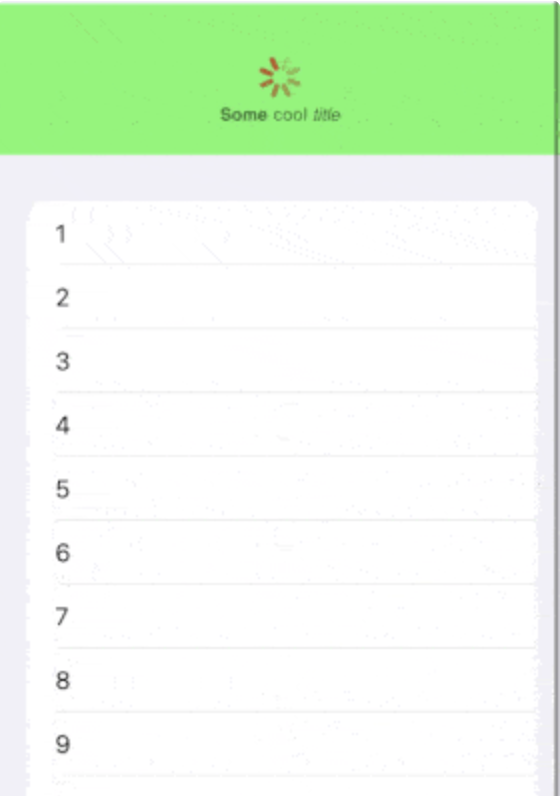

# Section4. Navigation & Data Display

> **Reference**
>
> * https://www.raywenderlich.com/books/swiftui-by-tutorials
> * LazyV(H)Stack vs V(H)Stack
>   * https://seons-dev.tistory.com/62
> * custom indicator refreshable
>   * https://swiftuirecipes.com/blog/styling-refreshable-list-progress-indicator-in-swiftui

## 13. Navigation

* 모든 플랫폼(iPadOS, iOS, ....)에서 통일화된 NavigationStyle을 원한다면 NavigationView에 `.navigationViewStyle(StackNavigationViewStyle())`을 추가한다.

  ```swift
  NavigationView{
    ...
  }
  .navigationViewStyle(StackNavigationViewStyle())
  ```

* ```swift
  VStack{
    ...
  }
  .frame(maxWidth: .infinity, ...)
  ```

  가능한 수평공간을 모두 채움

* Environment가  view 계층 구조를 통해 흐르도록 하려면 이를 NavigationView 내부의 View가 아니라 NavigationView에 추가해야 한다.

  ```swift
  NavigationView{
  	...  
  }
  .envrionmentObject(...)
  ```


## 14. Lists

* LazyVStack, LazyHStack

  | LazyV(H)Stack                                                | V(H)Stack                                                    |
  | ------------------------------------------------------------ | ------------------------------------------------------------ |
  | 리소스 낭비를 줄이기 위해 콘텐츠가 뷰를 로드한다. 콘텐츠가 필요함에 따라 뷰가 로드되는 형식 | 스크롤을 하기 전부터 콘텐츠 양에 따라서 전부 다 로드         |
  | 자동으로 여유공간을 차지하지만<br /> | 일반 Stack에서는 그렇지 않음.<br /> |

* Programmatically 스크롤 위치 설정

  ```swift
  ScrollViewReader{ scrollProxy in
  	...
  }
  .onAppear{
    ...
    // ScrollViewProxy의 scrollTo(_:)를 호출하여 다음 항공편의 ID로 스크롤한다.
    // View 중간에 배치하는 것이 보기에 좋으므로 anchor를 center로 설정해준다.
    scrollProxy.scrollTo(nextFlightId, anchor: .center)
  }
  ```

## 15. Advanced Lists

* List항목에 Swipe 동작 추가

  ```swift
  .swipeActions(edge: .leading) { View(...) }
  ```

  를 이용

  `edge`파라미터는 스와이프 동작을 배치할 위치를 설정(`.leading`이면 왼쪽에 생겨야 하니까 오른쪽으로 밀어야 함)

  closure는 사용자가 살짝 스와이프할 때 표시할 View를 제공한다.

  사용 예)

  ```swift
  struct SomeListView: View{
    var id: [Int]
    @State var highlightedIds: [Int]
    
  	func rowHighlighted(_ flightId: Int) -> Bool{
      // 전달된 정수에 대해 배열을 탐색, 들어있으면 true
      highlightedIds.contains{$0 == id}
    }
    
    var body: some View{
      List{
        ...
      }
      // 각 행에 대해 배경색 지정
      .listRowBackground(
        rowHighlighted(id) ? Color.yellow.opacity(0.6) : Color.clear
      )
      /* swipe 액션 추가 */
      .swipeActions(edge: .leading){
        HighlightActionView(id: id, highlightedIds: $highlightedIds)
      }
      
      ...
      
    }
  }
  ```

  ````swift
  struct HighlightActionView: View{
    var id: Int
    @Binding var highlightedIds: [Int]
    
    var body: some View{
      Button{
        toggleHighlight()
      } label: {
        Image(systemName: "highlighter")
      }
      .tint(Color.yellow)
    }
    
    func toggleHighlight(){
      // highlightedIds에서 flightId와 같은 첫번째 index를 가져옴.
      // 없으면 nil
      let flightIdx = highlightedIds.firstIndex{ $0 == flightId }
      
      // unwrapping 시도
      if let index = flightIdx{
        // 있다면 해당 index 제거
        highlightedIds.remove(at: index)
      }else{
        // 없다면 flightId를 배열에 추가
        highlightedIds.append(flightId)
      }
    }
  }
  ````

* 당겨서 새로고침 pull to refresh

  View에 `refreshable(action:)` 수정자를 사용

  ```swift
  // View에 수정자를 추가하면 새로고침을 할 수 있음
  .refreshable {
    // 사용자가 새로고침을 요청하면 Closure의 작업이 실행된다.
  }
  ```

  custom indicator refreshable 사용 법

  ```swift
  List(1..<20) {
    Text("\($0)")
  }.refreshable {
    await Task.sleep(2_000_000_000)
  }.onAppear {
    UIRefreshControl.appearance().tintColor = UIColor.red
    UIRefreshControl.appearance().backgroundColor = .green.withAlphaComponent(0.5)
    UIRefreshControl.appearance().attributedTitle = try? NSAttributedString(markdown: "**Some** cool *title*")
  }
  ```

  

* 
