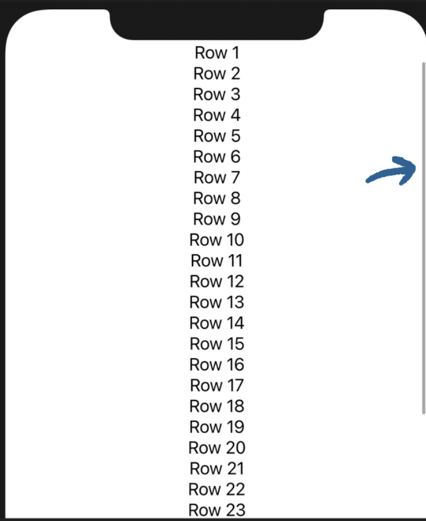
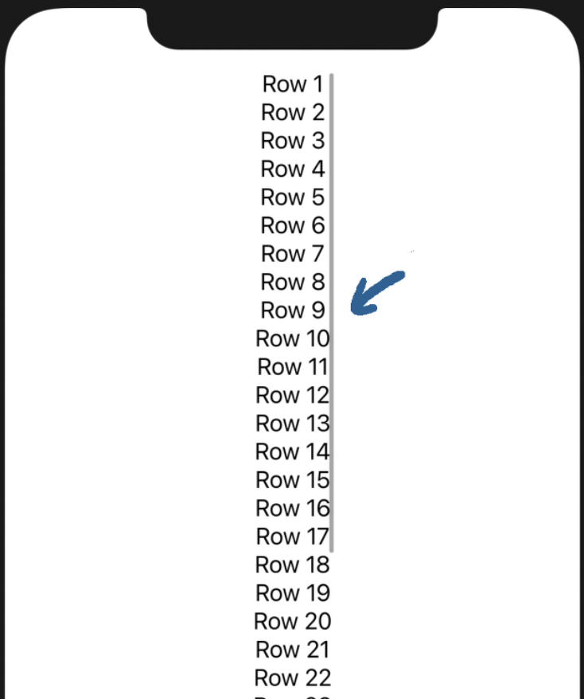

# Section4. Navigation & Data Display

> **Reference**
>
> * https://www.raywenderlich.com/books/swiftui-by-tutorials
> * https://seons-dev.tistory.com/62

## 13. Navigation

* 모든 플랫폼(iPadOS, iOS, ....)에서 통일화된 NavigationStyle을 원한다면 NavigationView에 `.navigationViewStyle(StackNavigationViewStyle())`을 추가한다.

  ```swift
  NavigationView{
    ...
  }
  .navigationViewStyle(StackNavigationViewStyle())
  ```

* ```swift
  VStack{
    ...
  }
  .frame(maxWidth: .infinity, ...)
  ```

  가능한 수평공간을 모두 채움

* Environment가  view 계층 구조를 통해 흐르도록 하려면 이를 NavigationView 내부의 View가 아니라 NavigationView에 추가해야 한다.

  ```swift
  NavigationView{
  	...  
  }
  .envrionmentObject(...)
  ```


## 14. Lists

* LazyVStack, LazyHStack

  | LazyV(H)Stack                                                | V(H)Stack                                                    |
  | ------------------------------------------------------------ | ------------------------------------------------------------ |
  | 리소스 낭비를 줄이기 위해 콘텐츠가 뷰를 로드한다. 콘텐츠가 필요함에 따라 뷰가 로드되는 형식 | 스크롤을 하기 전부터 콘텐츠 양에 따라서 전부 다 로드         |
  | 자동으로 여유공간을 차지하지만<br /> | 일반 Stack에서는 그렇지 않음.<br /> |

* Programmatically 스크롤 위치 설정

  ```swift
  ScrollViewReader{ scrollProxy in
  	...
  }
  .onAppear{
    ...
    // ScrollViewProxy의 scrollTo(_:)를 호출하여 다음 항공편의 ID로 스크롤한다.
    // View 중간에 배치하는 것이 보기에 좋으므로 anchor를 center로 설정해준다.
    scrollProxy.scrollTo(nextFlightId, anchor: .center)
  }
  ```

