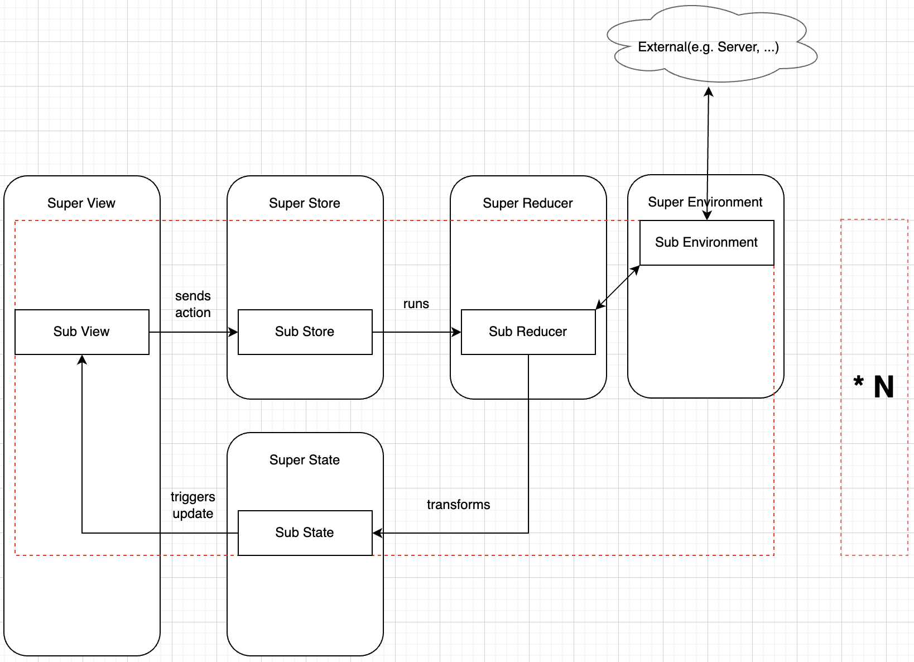

# The Composable Architecture(TCA)

> https://www.raywenderlich.com/24550178-getting-started-with-the-composable-architecture 를 그대로 따라해봄

TCA([ENG](https://github.com/pointfreeco/swift-composable-architecture)/[KOR](https://gist.github.com/pilgwon/ea05e2207ab68bdd1f49dff97b293b17)는 Point-Free에서 만든 아키텍처이다.
상태관리, 구성 및 테스트에 중점을 두었다.

아래 예제는 raywenderlich.com의 public GitHub Repository를 표시하는 앱을 만든다.

## 시작하기

[여기](https://koenig-media.raywenderlich.com/uploads/2021/08/RepoReporter_Materials.zip) 에서 예제 파일을 다운받고 starter 폴더를 열어 RepoReporter를 열어서 실행해본다.

App을 실행하면 아래와 같은 화면이 출력된다. 


User tap은 모두 구현되어 있지만 Repositories, Favorites는 구현되지 않고 비어있는 모습이다.

사용자의 repository들과 Favorite한 Repository를 표현해주는 기능을 구현해주도록 한다.

## TCA 살펴보기

### TCA의 컨셉 및 특징

* State management(상태 관리): App은 일종의 상태로 구성된다. TCA는 상태를 관리하고 공유하는 개념을 제공
* Composition(구성): 이를 통해 개별적으로 더 작은 기능들을 개발하고 함께 "구성"(문맥상 결합이 맞는 듯)하여 전체 앱을 구성할 수 있음. 마치 SwiftUI의 View와 비슷
* Side effects(여기서는 외부 통신 정도로 생각하면 편함): 보통 side effect에 대해 이해하고 테스트하기 어렵다. TCA는 이를 처리하는 방법을 정의하여 이를 해결하려고 한다.
* Testing: TDD는 매우 중요하며 TCA를 사용하면 쉽게할 수 있다.

### TCA의 구성요소

* State: often, 프로퍼티들은 앱의 상태나 기능에 대해 여러 클래스에 대해 분산되어 있다. TCA는 관련 프로퍼티를 단일 타입에 정의한다.(하나의 State에 정의한다는 얘기)
* Action: 사용자가 버튼을 탭할 때, API request/response 될 때 같이 앱에서 발생될 수 있는 모든 이벤트에 대한 열거형
* Environment: App또는 Feature의 모든 dependency를 래핑하는 타입. 간단한 예로 비동기 호출을 하는 API 등.
* Reducer: Action에 따른 현재 State를 변환하는 함수이다.
* Store: UI가 변경 사항을 관찰하고 Action을 보내는 장소. 이러한 Action을 기반으로 reducer를 실행한다.

### TCA의 장점

* 데이터 흐름은 명확하게 정의되고 단방향이다.
* environment에는 모든 dependency가 있다. environment 한 곳에서 외부와의 연결을 정의하고 관리할 수 있다.
  * 이렇게 되면 개발-테스트-라이브 환경 전환에 용이하다.
* TCA의 컨셉 중 Composition 덕분에 별도의 Feature를 만들어 각 기능을 자체적으로 구축, 테스트가 용이. 앱의 특정 한 부분에 집중하고 개별적으로 실행할 수 있음.
* reducer에서만 Action을 처리하여 state를 변환한다. 따라서 기능 테스트는 action으로 reducer를 실행하고 결과를 체크하는 방식

### TCA diagram

내가 이해한 TCA는 아래와 같다.
각 Feature 별 Flow는 View -> Store -> Reducer -> State -> View 로 이어지지고, 여러개의 Feature를 하나로 묶은 Super View?, Super Store? 등 이 존재한다.
각각의 Feature마다 TCA의 구성요소가 존재하는 모습 (TCA에서 말하는 Composition이 여기에 해당)




## View에서 Store에 엑세스

첫번째 단계는 View에서 Store에 엑세스하는 것으로 시작한다.

`RepositoryView.swift` 의 `RepositoryView` 에서 VStack을 `cmmand` 키를 누른 상태에서 클릭하고 `Embed...` 누른다.


``` swift
Container { ... 
```

으로 되어있는 것을 아래의 코드로 변경해준다.(오류가 나오는데 일단 무시한다.)

```swift
WithViewStore(self.store) { viewStore in
```

이제 View 내부에서 store에 접근이 가능하다. `viewStore`에 퐇마된 state에서 데이터를 읽고 Action을 send할 수 있다. Store가 변경될 때마다 View가 자동으로 업데이트 된다.

위와 같은 방법으로 `RepositoryListView`, `FavoritesListView` 의  `ScrollView` 누르고 `WithViewStore` 를 추가해준다.

오류가 나는데 이를 해결 해주도록 한다.

`RepositoryView` 의 맨 위 두 프로퍼티를 제거하고 아래 코드를 추가해준다.

```swift
let store: Store<RepositoryState, RepositoryAction>
let repository: RepositoryModel
```

마찬가지로 `RepositoryListView`, `FavoritesListView` 의 `repositories`, `favoriteRepositories` 프로퍼티를 제거하고 아래 코드를 추가해준다.

```swift
let store: Store<RepositoryState, RepositoryAction>
```


다음으로 방금 교체한 프로퍼티를 사용한 모든 위치를 수정해줘야 한다.

**`RepositoryListView`**

```swift
ForEach(repositories) { repository in
```

를 아래 코드로 변경

```swift
ForEach(viewStore.repositories) { repository in
```

**`FavoritesListView`**

```swift
ForEach(favoriteRepositories) { repository in
```

를 아래 코드로 변경

```swift
ForEach(viewStore.favoriteRepositories) { repository in
```

**`RepositoryView`**

```swift
if favoriteRepositories.contains(repository) {
```

을 아래 코드로 변경

```swift
if viewStore.favoriteRepositories.contains(repository) {
```


그리고 `RepositoryListView`, `FavoritesListView`에서 `RepositoryView`를 초기화 하고 있는 코드도 변경해주도록 한다.

```swift
RepositoryView(repository: repository, favoriteRepositories: [])
```

를 아래 코드로 변경

```swift
RepositoryView(store: store, repository: repository)
```


마지막으로 `RepositoryListView_Previews` 도 변경해준다.

// 생략

## Store에 Action send

Store는 State에 엑세스를 위함 뿐만 아니라 View에서 event를 발생하기 위해서도 사용한다.

`RepositoryView`의 Button 의 다음 부분을 변경해준다.

```swift
action: {return},
```

을 

```swift
action: { viewStore.send(.favoriteButtonTapped(self.repository)) },
```

으로 변경 

마지막으로 `RepositoryListView`의 `ScrollView` 끝에 다음을 추가해준다.

```swift
.onAppear {
  viewStore.send(.onAppear)
}
```

`RepositoryListView` onAppear (View가 화면에 나타낼 때) 마다 store에 새로고침 트리거를 내보낸다. (참고로 .onAppear 는 Action case임. 이따 reducer에서 동작 정의)


## Side effect 처리 (여기서는 외부 통신? 정도로 생각하면 편함)

reducer는 Action을 기반으로 현재 state를 변경한다. 그러나 앱이 우리가 정의한 Action으로만 구성되는 경우는 거의 없음. 따라서 API 요청을 수행하기 위해 외부와 통신할 수 있는 방법이 필요하다.

TCA가 비동기 호출에 사용하는 매커니즘은 `Effect`이다. (비동기 뿐만아니라 다른 것도 지원 가능함. 현재 날짜라던가, 새로운 UUID 같은 non-deterministic 도 포함이라는데 무슨 뜻인지는 모르겠음.)

`Effect` 는 Combine publisher에 몇가지를 추가한 래퍼라고 생각하면 된다.

`RepsitoryEffects.swift` 를 보면 2가지 effect를 볼 수 있다.

* `repositoryEffect(decoder:)`: GitHub API를 호출
* `dummyRepositoryEffect(decoder:)`: development, SwiftUI preview에 사용할 더미 레포지토리를 제공


## Environment로 dependency 관리

reducer는 이러한 effect를 어떻게 사용할 수 있을까? state 및 action 외에도 reducer는 environment에 접근할 수 있다. environment는 `Effect` 타입으로 앱에 있는 모든 dependency를 갖고 있다.

`RepositoryFeature.swift` 의 `RepositoryEnvironment` 에 다음 dependency를 추가

```swift
struct RepositoryEnvironment{
  // GitHub API에 접근하는 것은 Repository Feature의 유일한 외부 dependency이다.
  // Effect로 데이터를 받고 성공은 [RepositoryModel], 실패는 APIError이다.
  var repositoryRequest: ( JSONDecoder ) -> Effect <[ RepositoryModel ], APIError >
  // main thread에서 돌리기 위함.
  var mainQueue: () -> AnySchedulerOf < DispatchQueue >
  // decoder 방법을 정의 JSONDecoder 인스턴스를 반환
  var decoder: () -> JSONDecoder

  // 개발, 테스트를 위한 용도
  static  let dev =  RepositoryEnvironment ( 
    repositoryRequest: dummyRepositoryEffect, 
    mainQueue: { .main }, 
    decoder: { JSONDecoder () })
}
```

프로젝트를 실행하면 여전히 빈화면이 나오는데 reducer를 구현하지 않았다. environment에서 받은 데이터를 store에 연결을 해줘야 한다.


## Reducer를 이용한 State 변환

`Reducer`는 아래처럼 정의되어 있다.

```swift
private let reducer: (inout State, Action, Environment) -> Effect<Action, Never>
```

집중해야 할건 파라미터인데 

State는 주어진 Action에 따라 reducer에 의해 수정되기 때문에 inout 매개변수로 되어있다.

reducer는 environment를 사용해 dependency에 접근한다.

return 타입은 redcuer가 다음에 처리되는 Effect를 생성하는 것을 의미한다. 더 이상의 Effect를 실행할 필요가 없으면 redcuer는 `Effect.none` 을 반환한다.

`RepositoryFeature.swift`의 `repositoryReducer`다음과 같이 변경해준다.

```swift
// 해당 reducer는 Repository 관련 State, Action, Environment를 클로저내부에서 접근 가능.
let repositoryReducer = Reducer<
  RepositoryState,
  RepositoryAction,
  RepositoryEnvironment> 
  { state, action, environment in
  // reducer는 주어진 진 action에 따라 다르게 동작한다.~
  switch action {
  // onAppear의 경우 API 통신을 수행
  case .onAppear:
    // 이전에 정의한 RepositoryEnvironment에서 repositoryRequest 메서드 호출
    return environment.repositoryRequest(environment.decoder())
      // receive 했을 때 받는 queue 정의
      .receive(on: environment.mainQueue())
      // receive에서 Effect가 리턴되는데 해당 Effect에서 error 방출될 때 failure Effect로 전달
      .catchToEffect()
      // 새로운 Effect 생성, dataLoadAction
      .map(RepositoryAction.dataLoaded)
  // 수신된 result(repository)를 추출하고 State 업데이트 한다.
  
  case .dataLoaded(let result):
    switch result {
    case .success(let repositories):
      state.repositories = repositories
    case .failure(let error):
      break
    }
    // 추가 처리할 내용이 없기 때문에 Effect.none를 반환
    return .none
  // repository favorite를 토글한다.
  case .favoriteButtonTapped(let repository):
    if state.favoriteRepositories.contains(repository) {
      state.favoriteRepositories.removeAll { $0 == repository }
    } else {
      // 주어진 repository가 favorite에 포함되지 않은 경우 State의 favorite repository 목록에 추가
      state.favoriteRepositories.append(repository)
    }
    // 추가 처리할 내용이 없기 때문에 Effect.none를 반환
    return .none
  }
}

```

실행하면 아래와 같은 모습을 볼 수 있다.


* **Q) 근데 실행하면 onAppear가 동작을 안해서 다름 탭 들어갔다가 와야하는데 왜그런거지..?**
  * A)


## Composing Feature

기존에 구현되어 있던 User Feature와 방금 구현한 Repository Feature를 결합할 때이다.

`RootFeature.swift` 를 보면, Repository Feature와 동일한 구조지만 앱 전체에 대한 것이다.
현재는 User Feature만 있는데 이제 Repository Feature까지 추가해줄 차례이다.

### systemEnvironment와 dependency 공유

`repositoryReducer`에서 DispatchQueue 및 JsonDecoder 를 제공한다.( var mainQueue: () -> AnySchedulerOf\<DispatchQueue>, var decoder: () -> JSONDecoder )
`UserFeature.swift` 도 DispatchQueue, JsonDecoder를 제공 중임.

동일한 dependency를 여러번 관리하기는 까다로운 일임. 분리된 Feature간에 동일한 dependency를 공유하는 매커니즘인 `SystemEnvironment`를 보도록 하자

`SystemEnvironment.swift`를 보면 여기에 모든 공유 dependency를 갖고 있다.

우선 `RepositoryFeature.swift` 에 있는 ` RepositoryEnvironment`,  `repositoryReducer`를 수정하는 것으로 시작. 

`RepositoryEnvironment`는 `mainQueue`, `decoder`를 제거하도록 한다.

```swift
struct RepositoryEnvironment {
  var repositoryRequest: (JSONDecoder) -> Effect<[RepositoryModel], APIError>
  static let dev = RepositoryEnvironment(
    repositoryRequest: dummyRepositoryEffect
  )
}
```

`repositoryReducer`는 다음 코드로 변경하도록 한다.

```swift
let repositoryReducer = Reducer<
  RepositoryState,
  RepositoryAction,
  SystemEnvironment<RepositoryEnvironment>
>
```


### State와 Action 결합

이제 모든 Repository Feature의 Stete와 Action을 Root Feature에 추가할 차례이다.
RootFeature는 앱의 기본 탭 바이다. 앱 내부의 두 Feature를 결합하여 단일 기능을 하는 Root Feature를 생성하여 이 Feature의 Steate와 Action을 정의 한다.

`RootFeature.swift` 의 `RootState` 를 아래와 같이 수정

```swift
struct RootState {
  var userState = UserState()
  var repositoryState = RepositoryState()
}
```

`RootAction`

```swift
enum RootAction {
  case userAction(UserAction)
  case repositoryAction(RepositoryAction)
}
```


### View 추가

`RootView.swift`에 `RepositoryListView`를 넣어준다.

첫번째 `Color.clear`를 아래 코드로 변경해준다.

```swift
RepositoryListView(store: self.store.scope(
  state: \.repositoryState,
  action: RootAction.repositoryAction
))
.tabItem {
  Image(systemName: "list.bullet")
  Text("Repositories")
}
```

위 코드는 `RepositoryListView`를 초기화하고 Store에 전달한다. `scope`는 전역 Store를 로컬 Store로 변환하기 때문에 `RepositoryListView` 내부에서 로컬 State, Action에 집중할 수 있다.(전역 State, Action에 엑세스 못함, 한마디로 정보은닉화 해주는 애라고 생각하면 편할 듯.)

두번째 `Color.clear`를 아래 코드로 변경해준다.

```swift
FavoritesListView(store: self.store.scope(
  state: \.repositoryState,
  action: RootAction.repositoryAction
))
.tabItem {
  Image(systemName: "heart.fill")
  Text("Favorites")
}
```


### Composing Reducer

마지막은 `rootReducer` 에 `repositoryReducer`를 추가하는 것이다.

`RootFeature.swift`  를 보자

> 근데 로컬에서 동작하는 redcuer(Staet, Action, Environment)를  global 에서 어떻게 동작하는가?
>
> TCA는 두가지 방법을 제시한다.
>
> * Combine: 많은 reducer를 결합하여 새로운 reducer를 생성, 나열된 순서대로 주어진 각 redcuer를 실행
> * pullback:전역 Stete, Action, Environment 에서 작동할 수 있또록 주어진 reducer를 변환한다. 

`RootFeature.swift` 에 있는 `rootReducer` 를 다음과 같이 변경

```swift
let rootReducer = Reducer<
  RootState,
  RootAction,
  SystemEnvironment<RootEnvironment>
>.combine(
  userReducer.pullback(
    state: \.userState,
    action: /RootAction.userAction,
    environment: { _ in .live(environment: UserEnvironment(userRequest: userEffect)) }),
  // pullback 변환 작업을 수행할 state, action, environment를 넘긴다.
  repositoryReducer.pullback(
    // repositoryReducer 로컬에서 작동한다. key path를 이용해 로컬 state를 넘긴다.
    state: \.repositoryState,
    // case path를 이용하면 전역에서 로컬에 엑세스할 수 있다.
    // case path는 TCA에서 제공되며, 열거형에서 쓰인다. 자세한건 docs를 보자
    // https://github.com/pointfreeco/swift-case-paths
    action: /RootAction.repositoryAction,
    // SystemEnvironment.swift의 SystemEnvironment.live(environment:)를 넘긴다.
    // live(environment:)는 live 환경에서 동작하는 environment를 정의한다.
    // 
    environment: { _ in
        // 공용 environment는 SystemEnvironment에 이미 정의되어 있고 repository Feature의 Environment만 넘기면 된다.
        .live(
          environment: RepositoryEnvironment(repositoryRequest: repositoryEffect))
    })
)
```

앱을 실행하면 Repository Feature와 User Feature가 함께 작동하여 하나의 App을 형성한다.


## Reducer Test

TCA의 목적중 하나는 테스트이다. 테스트할 주요 구성요소는 reducer이다. Action이 주어지면 현재 State를 새로운 State로 변환하기 때문에 테스트 대상으로 적합하다.

2가지 테스트를 진행할 것인데 하나는 Effect가 있는 Action, 하나는 없는 Action.
주어진 Action으로 reducer를 실행하고 결과 상태를 예상되는 결과와 비교한다. 

### Effect가 없는 reducer test

`RepoReporterTests.swift` 에서 `testFavoriteButtonTapped()`에 다음 코드를 작성하도록 한다.

```swift
func testFavoriteButtonTapped() {
  let store = TestStore(
    // test하려는 State와 redcuer
    initialState: RepositoryState(),
    reducer: repositoryReducer,
    // test Effect 및 test scheduler 를 포함하는 environment 생성
    environment: SystemEnvironment(
      environment: RepositoryEnvironment(repositoryRequest: testRepositoryEffect),
      mainQueue: {self.testScheduler.eraseToAnyScheduler()},
      decoder: {JSONDecoder()}
    ))

  guard let testRepo = testRepositories.first else{
    fatalError("Error in test setup")
  }
  // testRepo를 넣은 action을 send(reducer 동작)
  store.send(.favoriteButtonTapped(testRepo)){ state in
		// 예상되는 결과와
		// state.favoriteRepositories.append(testRepo) 의 값이 같아야 통과
		state.favoriteRepositories.append(testRepo)
	}
}
```


### Effect가 있는 reducer test

`testOnAppear()`  를 다음과 같이 채워준다.

```swift
// test 용 store 생성
let store = TestStore(
  initialState: RepositoryState(),
  reducer: repositoryReducer,
  environment: SystemEnvironment(
    environment: RepositoryEnvironment(repositoryRequest: testRepositoryEffect),
    mainQueue: {self.testScheduler.eraseToAnyScheduler()},
    decoder: {JSONDecoder()})
)

// action을 send(reducer 동작)
store.send(.onAppear)
// ??
testScheduler.advance()
// onApear하면 dataLoad에 의해 생성된 state를 비교해야 함.
store.receive(.dataLoaded(.success(testRepositories))){ state in
	// state.repositories와 예상되는 결과를 비교
	state.repositories = self.testRepositories
}
```


### Test fail

`testFavoriteButtonTapped()` 의 클로저에서 다음 코드를 제거하고 테스트를 진행해본다.

```swift
state.favoriteRepositories.append(testRepo)
```

빈값을 비교하려 할테고 결과는 당연히 실패.

TCA는 아래 처럼 실패원인을 한눈에 이해할 수 있도록 제공해준다.


