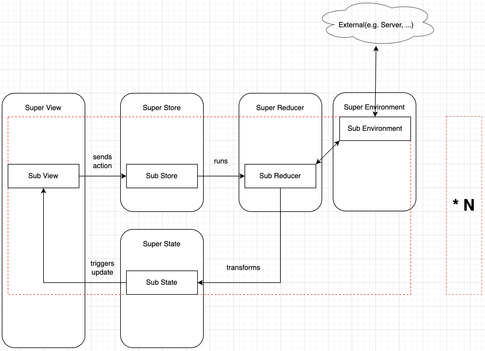
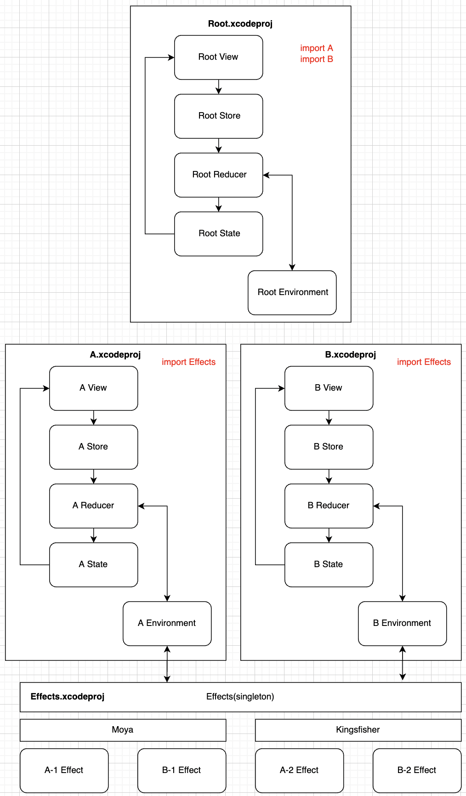

# TCA_101을 보고 나서...

> * https://www.raywenderlich.com/24550178-getting-started-with-the-composable-architecture
> * https://gist.github.com/pilgwon/ea05e2207ab68bdd1f49dff97b293b17

## Concept

* State management(상태 관리): App은 일종의 상태로 구성된다. TCA는 상태를 관리하고 공유하는 개념을 제공
* Composition(구성): 이를 통해 개별적으로 더 작은 기능들을 개발하고 함께 "구성"(문맥상 결합이 맞는 듯)하여 전체 앱을 구성할 수 있음. 마치 SwiftUI의 View와 비슷
* Side effects(여기서는 외부 통신 정도로 생각하면 편함): 보통 side effect에 대해 이해하고 테스트하기 어렵다. TCA는 이를 처리하는 방법을 정의하여 이를 해결하려고 한다.
* Testing: TDD는 매우 중요하며 TCA를 사용하면 쉽게할 수 있다.
* 기존의 MVVM또는 MVC에서 View를 기준으로 해서 VM과 M이 있는게 아니다. TCA는 Feature를 기준으로 해서 묶여있다.

## Architecture

내가 이해한 TCA는 아래와 같다.
각 Feature 별 Flow는 View -> Store -> Reducer -> State -> View 로 이어지지고, 여러개의 Feature를 하나로 묶은 Super View?, Super Store? 등 이 존재한다.
각각의 Feature마다 TCA의 구성요소가 존재하는 모습 (TCA에서 말하는 Composition이 여기에 해당)

## Benefit

* 데이터 흐름은 명확하게 정의되고 단방향이다.
* environment에는 모든 dependency가 있다. environment 한 곳에서 외부와의 연결을 정의하고 관리할 수 있다.
  * 이렇게 되면 개발-테스트-라이브 환경 전환에 용이하다.
* TCA의 컨셉 중 Composition 덕분에 별도의 Feature를 만들어 각 기능을 자체적으로 구축, 테스트가 용이. 앱의 특정 한 부분에 집중하고 개별적으로 실행할 수 있음.
* reducer에서만 Action을 처리하여 state를 변환한다. 따라서 기능 테스트는 action으로 reducer를 실행하고 결과를 체크하는 방식
* SwiftUI 에 매우 적합하다.
  * [SwiftUI의 구조](https://developer.apple.com/documentation/swiftui/state-and-data-flow) 를 보면 Action, State가 존재하고 해당 플로우는 단방향이다.
  * 또한 View의 Composition까지 지원하니 TCA와 매우 적합하다고 볼 수 있다.

## 아쉬운 점

* Feature의 파편화는 양날의 검이다. Feature별로 App을 분할하다 보니 많은 class, struct 파일이 문제일 수도 있다.
  * 여러 Feature가 존재하고 각 Feature마다 State, Action, Environment, Store를 만들어줘야 한다고 생각하면 여러 파일들이 생성되어 관리에 문제가 생길수도 있다.

## 시도해볼만한 것들

내가 생각하는 TCA의 단점은 하나이다. Feature의 파편화에 따른 관리의 복잡함.

이는 [XcodeGen](https://github.com/yonaskolb/XcodeGen) 이나 [Tuist](https://github.com/tuist/tuist)를 이용해 모듈화를 사용하면 될 듯. 

Feature 별로 파편화가 가능하고 각 Feature가 독립적으로 빌드가 가능해 보인다. 이를 이용해서 project에서 협업할 때는 Feature별로 조직을 나누기 용이하고 나중에 해당 Feature들을 모두 결합하여 하나의 App을 만들 수 있다.

이런 느낌???

관련된 공부및 실험은 나중에 해보는 걸로 -> https://github.com/kiryun/Modular-TCA

