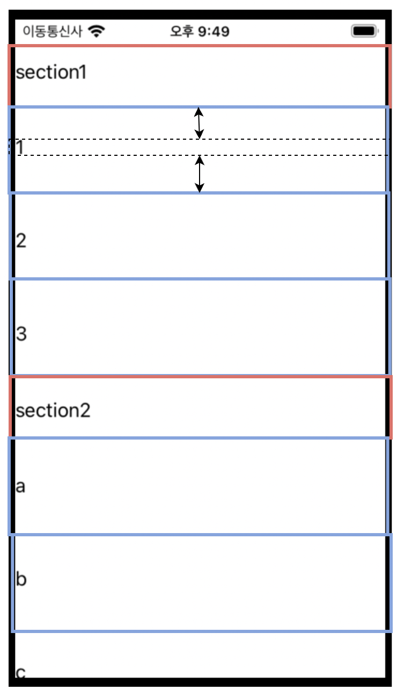

# 복잡한 CollectionView tutorial - section/header/dynamicCellHeight (feat. RxDataSource)

[코드 위치](./MultiSectionCollectionView)

## dependency

* RxDataSources 5.0.2
* RxSwift 6.5.0
* SnapKit 5.0.1

## 만들고자 하는 것



* Section, SectionHeader(빨간색)
  * Section을 나눠서 각 Section의 Header를 설정
* dynamic Cell Height(파란색)
  * Cell내부에 있는 label크기에 따라 cell의 height을 조정

## 구현

### SectionModel

RxDataSource를 이용하기 때문에 SectionModel을 구현해준다.

Section은 총 2개며 각 Section마다 필요한 data는 title 파라미터 이며 String타입 이다.

```swift
import RxDataSources

enum MySectionModel: SectionModelType {
    
    typealias Item = MySectionItem
    
    case section1(items: [MySectionItem])
    case section2(items: [MySectionItem])
    
    var items: [MySectionItem] {
        switch self {
        case .section1(items: let items):
            return items
        case .section2(items: let items):
            return items
        }
    }
    
    init(original: MySectionModel, items: [Item]) {
        switch original {
        case .section1(items: _):
            self = .section1(items: items)
        case .section2(items: _):
            self = .section2(items: items)
        }
    }
}

enum MySectionItem {
    case section1Item(title: String)
    case section2Item(title: String)
}
```

### ViewModel

ViewController측에서 dataSource를 이용해 collectionView의 item을 채울 것 이므로 `[MySectionModel]`타입이 필요하다.

필요한 데이터는 ViewModel에서 방출해 주도록 한다.

첫번째 section에는 1, 2, 3 이 방출되고, 두번째 section에는 a, b, c가 방출된다.

```swift
func bind() {
  Observable.combineLatest(self.section1Relay, self.section2Relay)
  .map{ (a, b) in
       // Q) 이거 좀 구려 보이는데 반복문으로 깔끔하게 하는 방법 없을까?
       var arr = [MySectionModel]()

       let item = a.map{ MySectionModel.Item.section1Item(title: $0) }
       let item2 = b.map{ MySectionModel.Item.section2Item(title: $0) }

       let mySectionModel1 = MySectionModel.section1(items: item)
       let mySectionModel2 = MySectionModel.section2(items: item2)

       arr.append(mySectionModel1)
       arr.append(mySectionModel2)

       return arr
      }
  .bind(to: self.sections)
  .disposed(by: disposeBag)

  self.section1Relay.accept(["1", "2", "3"])
  self.section2Relay.accept(["a", "b", "c"])
}
```

### CollectionViewFlowLayout

CollectionView의 layout을 어떻게 표출할지에 대한 정의가 필요하다.

ViewController에서 `UICollecitonViewFlowLayout`를 채택해서 delegate를 구현해도 되고 `layout.itemsSize` 등을 이용해서 layout을 수정을 할 수 있지만 
`UICollecitonViewFlowLayout` 을 채택한 class를 새로 만들도록 한다.

* [layoutAttributesForElements(in:)](https://developer.apple.com/documentation/uikit/uicollectionviewlayout/1617769-layoutattributesforelements)
  * 호출 시점(정확하지 않음): collectionView가 그려질 때
  * 요약: parameter rect내의 모든 cell과 view에 대한 layout 정보를 가져온다.
  * return: cell또는 view에 대한 layout정보를 나타내는 객체의 배열[`UICollectionViewLayoutAttributes`](https://developer.apple.com/documentation/uikit/uicollectionviewlayoutattributes)이다. 기본 전달값은 nil이다.
* [layoutAttributesForItem(at:)](https://developer.apple.com/documentation/uikit/uicollectionviewlayout/1617797-layoutattributesforitem)
  * 호출 시점(정확하지 않음): collectionView가 그려질 때 ([layoutAttributesForElements(in:)](https://developer.apple.com/documentation/uikit/uicollectionviewlayout/1617769-layoutattributesforelements) 이후 각 cell 마다 호출, 현재 cell이 6개이므로 6번 호출)
  * 요약: 각 cell의 layout 정보를 가져온다.
  * return: cell에 적용할 정보가 포함된 layout 객체

두 개의 override 메서드를 이용한다.

```swift
final class MultiSectionCollectionViewFlowLayout: UICollectionViewFlowLayout {
  override func layoutAttributesForElements(in rect: CGRect) -> [UICollectionViewLayoutAttributes]? {
    print("layoutAttributesForElements")
    // super를 호출하여 layoutAttributes의 값을 획득합니다.
    let layoutAttributeObjects = super.layoutAttributesForElements(in: rect)
    
    layoutAttributeObjects?.forEach { layoutAttributes in
      // cell의 layoutAttributes만 조정하기 위해 representedElementCategory Property를 이용해 cell인지 체크합니다.
      if layoutAttributes.representedElementCategory == .cell {
        // cell인 경우, 그 아이템의 indexPath를 이용해 layoutAttributesForItem을 호출하고 각 cell 마다의 SelfSizing된 frame을 획득합니다.
        if let newFrame = layoutAttributesForItem(at: layoutAttributes.indexPath)?.frame {
          layoutAttributes.frame = newFrame
        }
      }
    }
    
    return layoutAttributeObjects
  }
  
  override func layoutAttributesForItem(at indexPath: IndexPath) -> UICollectionViewLayoutAttributes? {
    print("layoutAttributesForItem")
    guard let collectionView = collectionView else { return nil }
    
    // indexPath를 통해 해당 cell의 layoutAttributes를 얻어옵니다.
    guard let layoutAttirbutes = super.layoutAttributesForItem(at: indexPath) else { return nil }
    
    // collectionView 절반을 차지하도록 width를 계산합니다.
    layoutAttirbutes.frame.size.width = collectionView.safeAreaLayoutGuide.layoutFrame.width
    
    return layoutAttirbutes
  }
}
```

### Cell

그리고 난 후 Cell을 만들어 준다.

주의 할점은 cell 내부에 들어갈 content들은 모두 contentView에 넣어줘야 한다.

```swift
self.contentView.addSubview(label)
```

그리고 constraint를 걸어줘서 화면에서 어떻게 나오는 지 보도록 한다.

```swift
label.snp.makeConstraints { make in
	make.leading.trailing.equalToSuperview()
  make.top.equalToSuperview().offset(30)
  make.bottom.equalToSuperview().offset(-30)
}
```

마지막으로 `preferredLayoutAttributesFitting` 을 구현해준다.

* [preferredLayoutAttributesFitting](https://developer.apple.com/documentation/uikit/uicollectionreusableview/1620132-preferredlayoutattributesfitting)
  * 호출시점:
  * 요약: 수정된 layoutAttributes를 적용하는 함수
    * **이 메서드의 기본 구현은 자체 크기 조정 셀의 변경 사항을 수용하도록 크기 값을 조정합니다. 서브클래스는 이 메서드를 재정의하고 다른 레이아웃 속성을 조정하는 데 사용할 수도 있습니다. 이 메서드를 재정의하고 셀 크기 조정을 원하는 경우 `super`먼저 호출하고 반환된 속성을 직접 수정합니다.**
    * 위의 FlowLayout에서 작성한 함수들을 통해 최종적으로 계산된 layoutAttributes를 적용하는 함수
  * return: cell에 적용할 최종 attributes

```swift
override func preferredLayoutAttributesFitting(_ layoutAttributes: UICollectionViewLayoutAttributes) -> UICollectionViewLayoutAttributes {
  print("preferredLayoutAttributesFitting")
  super.preferredLayoutAttributesFitting(layoutAttributes)

  // Q) 이거 height를 0으로 주던데 왜??
  let targetSize = CGSize(width: layoutAttributes.frame.width, height: 0)

  layoutAttributes.frame.size 
  = contentView.systemLayoutSizeFitting(
    targetSize,
    withHorizontalFittingPriority: .required,
    verticalFittingPriority: .fittingSizeLevel
  )
  return layoutAttributes
}
```

### ViewController

* collectionView layout설정
* collectionView의 cell, supplementaryView 등록
* section footer, header 크기 설정
* collectionView cell의 각 사이를 정해주는 UIEdgeInsets 구현
* collectionView의 자세한 정보를 담고 있는 dataSource를 구현
* collectionView item 구현

collectionView의 layout을 설정해준다.

```swift
private lazy var collectionView: UICollectionView = {
  print("collectionView init")
  let layout = MultiSectionCollectionViewFlowLayout()

  // scroll은 새로 방향
  layout.scrollDirection = .vertical
  // 자동 사이즈
  layout.estimatedItemSize = UICollectionViewFlowLayout.automaticSize
  let collectionView = UICollectionView(frame: .zero, collectionViewLayout: layout)

  return collectionView
}()
```

collectionView의 cell, supplementaryView 등록

```swift
collectionView.register(Section1Cell.self, forCellWithReuseIdentifier: Section1Cell.ID)
collectionView.register(Section2Cell.self, forCellWithReuseIdentifier: Section2Cell.ID)
collectionView.register(Section1HeaderView.self, forSupplementaryViewOfKind: UICollectionView.elementKindSectionHeader, withReuseIdentifier: Section1HeaderView.ID)
```

footer의 크기는 0, header의 크기는 50으로 지정해준다.(section별로 나누고 싶다면 section parameter를 이용한다.)

```swift
func collectionView(
  _ collectionView: UICollectionView,
  layout collectionViewLayout: UICollectionViewLayout,
  referenceSizeForHeaderInSection section: Int
) -> CGSize {
    return CGSize(width: self.view.frame.size.width, height: 50)
}

func collectionView(
    _ collectionView: UICollectionView,
    layout collectionViewLayout: UICollectionViewLayout,
    minimumInteritemSpacingForSectionAt section: Int
  ) -> CGFloat {
    return 0.0
}
```

그리고 cell 사이의 간격은 0으로 지정해준다.

```swift
func collectionView(
    _ collectionView: UICollectionView,
    layout collectionViewLayout: UICollectionViewLayout,
    insetForSectionAt section: Int
  ) -> UIEdgeInsets {
    return UIEdgeInsets(top: 0, left: 0, bottom: 0, right: 0)
}
```

마지막으로 collectionView에 어떤 내용들이 담겨있는지를 정의해준다. dataSource 구현

```swift
private static var dataSource: MySectionDataSource {
  print("dataSource init")
  // cell을 먼저 구현한다.
  let configureCell: (
    CollectionViewSectionedDataSource<MySectionModel>,
    UICollectionView,
    IndexPath,
    MySectionModel.Item
  ) -> UICollectionViewCell = { dataSource, collectionView, indexPath, item in
		print("configureCell")
		// 각 section별로 나눠야 하니까 dataSource[indexPath]를 switch에 넣는다.
    switch dataSource[indexPath] {
    // 첫번째 section안에 들어갈 cell 내용
    // 여기 title은 이전에 구현했던 SectionModelItem에서 받아오는 값이다.
    case .section1Item(title: let title):
    	let cell = collectionView.dequeueReusableCell(withReuseIdentifier: Section1Cell.ID, for: indexPath) as! Section1Cell
      cell.configure(title: title)
      return cell
    case .section2Item(title: let title):
    	let cell = collectionView.dequeueReusableCell(withReuseIdentifier: Section2Cell.ID, for: indexPath)  as! Section2Cell
      cell.configure(title: title)
      return cell
    }
  }

  // supplementrayView(header, footer)를 구현
  let supplementrayView: (
    CollectionViewSectionedDataSource<MySectionModel>,
    UICollectionView,
    String,
    IndexPath
  ) -> UICollectionReusableView = { dataSource, collectionView, kind, indexPath in
  	print("supplementrayView")
    // 각 section별로 나눠야 하니까 dataSource[indexPath]를 switch에 넣는다.
    switch dataSource[indexPath] {
    // 첫번째 section의
    case .section1Item(_):
    	print("supplementrayView.section1Item")
      switch kind {
      // header view
      case UICollectionView.elementKindSectionHeader:
      	let view = collectionView.dequeueReusableSupplementaryView(ofKind: kind, withReuseIdentifier: Section1HeaderView.ID, for: indexPath) as! Section1HeaderView
        view.configure(title: "section1")
        return view
      // footer view
      case UICollectionView.elementKindSectionFooter:
      	break
      default:
      	break
      }
    case .section2Item(_):
    	print("supplementrayView.section2Item")
      switch kind {
      	case UICollectionView.elementKindSectionHeader:
        let view = collectionView.dequeueReusableSupplementaryView(ofKind: kind, withReuseIdentifier: Section1HeaderView.ID, for: indexPath) as! Section1HeaderView
        view.configure(title: "section2")
        return view
       	case UICollectionView.elementKindSectionFooter:
        	break
        default:
        	break
        }
      }

			// 만약 위 switch 중 break으로 떨어지면 UICollectionReusableView를 리턴해줘야 함.
			// 근데 UICollectionReusableView()를 리턴하면 안됨. dequeueReusableSupplementaryView를 이용해서 실체가 있는 view를 만들고 크기를 0으로 줘서 리턴하는 방식을 이용했다.
      let dummyView = collectionView.dequeueReusableSupplementaryView(ofKind: kind, withReuseIdentifier: Section1HeaderView.ID, for: indexPath) as! Section1HeaderView
      dummyView.frame.size.width = 0.0
      dummyView.frame.size.height = 0.0

      return dummyView
    }

  // dataSource 적용 후 리턴
  let dataSource = MySectionDataSource.init(
    configureCell: configureCell,
    configureSupplementaryView: supplementrayView
  )

  return dataSource
}
```

collectionView item 구현

```swift
vm.sections
	// 바로 위에서 구현했던 dataSource를 파라미터로 넘겨준다.
	.bind(to: collectionView.rx.items(dataSource: ViewController.dataSource))
	.disposed(by: disposeBag)
```


## Reference

* https://jhmdevdiary.tistory.com/31
* https://tousu.in/qa/?qa=339865/
* https://corykim0829.github.io/ios/UICollectionViewCell-dynamic-height/#

